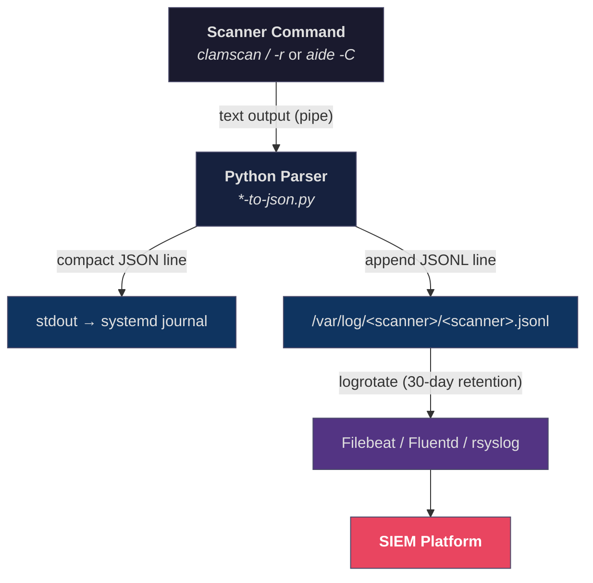

This project provides **Docker-based testing environments and production deployment tooling** for two Linux security scanners — ClamAV (antivirus) and AIDE (file integrity monitoring). The core problem it solves: Linux security scanners output human-readable text, but SIEM platforms require structured, machine-parseable data. This repository bridges that gap by packaging each scanner alongside a Python text-to-JSON parser inside a Docker image, producing **one JSON object per scan** that can be shipped directly to any SIEM via standard log shippers (Filebeat, Fluentd, rsyslog). Every image targets three production Linux distributions — AlmaLinux 9, Amazon Linux 2, and Amazon Linux 2023 — giving you six pre-built, CI-validated scanner images that work identically across your fleet.

Sources: [README.md](README.md#L1-L5), [CLAUDE.md](CLAUDE.md#L1-L9)

---

## The Scanner-to-SIEM Pipeline

Both scanners follow the same architectural pattern, which is the central design principle of this project. A native scanner command emits plain-text output, which is piped into a Python parser. The parser emits **two simultaneous outputs**: a compact JSON line to stdout (captured by the systemd journal) and an append to a JSONL log file (tailed by your SIEM log shipper). This dual-output design means you never lose scan data — if the log file is unavailable due to permissions, stdout still captures the record via `journalctl`.



The Python parsers are deliberately minimal — they use only Python standard library modules (`json`, `re`, `sys`, `socket`, `datetime`), require no pip dependencies, and each produces a single self-contained JSON object enriched with `hostname`, `timestamp` (ISO 8601 UTC), and `scanner` fields that the native scanner outputs lack. This enrichment is critical for SIEM correlation queries: you can group scan results by host, filter by time window, or distinguish ClamAV records from AIDE records in a single JSONL stream.

Sources: [clamscan-to-json.py](clamav/shared/clamscan-to-json.py#L54-L80), [aide-to-json.py](aide/shared/aide-to-json.py#L203-L230), [README.md](README.md#L110-L126)

---

## Scanners at a Glance

The project currently ships two scanners, each addressing a different layer of host security:

| Scanner | Purpose | What It Detects | JSON Parser |
|---------|---------|-----------------|-------------|
| **ClamAV** | Antivirus scanning | Known malware signatures in files | [`clamscan-to-json.py`](clamav/shared/clamscan-to-json.py) |
| **AIDE** | File integrity monitoring | Unauthorized changes to files (permissions, content, ownership) | [`aide-to-json.py`](aide/shared/aide-to-json.py) |

ClamAV answers the question *"does this file contain known malware?"* — it scans filesystem paths against a signature database updated via `freshclam`. AIDE answers a different question: *"has anything on this system changed since the last known-good baseline?"* — it compares cryptographic hashes and metadata of monitored files against a trusted database. Together, they provide complementary coverage: ClamAV catches known threats, AIDE catches any unexpected system modification.

Sources: [README.md](README.md#L8-L13), [CLAUDE.md](CLAUDE.md#L7-L9)

---

## Supported Operating Systems and Version Matrix

Each scanner is packaged as a Docker image for three Linux distributions commonly used in enterprise and cloud environments. The version differences matter because they affect which package source is available, which binary paths are used, and whether the scanner has native JSON output support.

| Operating System | Base Image | Package Manager | ClamAV Version | AIDE Version | Package Source |
|-----------------|------------|-----------------|----------------|--------------|----------------|
| **AlmaLinux 9** (RHEL 9) | `almalinux:9` | `dnf` | 1.5.2 | 0.16 | Cisco Talos RPM / OS repos |
| **Amazon Linux 2** | `amazonlinux:2` | `yum` | 1.4.3 | 0.16.2 | EPEL / OS repos |
| **Amazon Linux 2023** | `amazonlinux:2023` | `dnf` | 1.5.2 | 0.18.6 | Cisco Talos RPM / OS repos |

**A key architectural insight**: none of the ClamAV builds have `--json` compiled in, and only AIDE 0.18.6 (Amazon Linux 2023) supports native JSON output via `report_format=json`. The Python parser is the unifying layer — it produces the same JSON schema regardless of which OS or scanner version is running, so your SIEM ingestion pipeline sees identical data structures from every host in your fleet.

Sources: [README.md](README.md#L53-L59), [README.md](README.md#L162-L173), [CLAUDE.md](CLAUDE.md#L109-L113)

---

## Project Structure

The repository is organized around a clear separation between **shared assets** (parsers, systemd units, logrotate configs that are identical across all OSes) and **OS-specific Dockerfiles** (one per scanner per OS). This means any bug fix to a parser or service unit automatically applies to all six images.

```
linux-security-scanners/
├── clamav/                          # ClamAV scanner tooling
│   ├── shared/                      # ← Cross-platform assets
│   │   ├── clamscan-to-json.py      #    Text-to-JSON parser
│   │   ├── clamav-scan.service      #    Systemd service unit
│   │   ├── clamav-scan.timer        #    Systemd timer (daily)
│   │   └── clamav-jsonl.conf        #    Logrotate config (30 days)
│   ├── almalinux9/
│   │   ├── Dockerfile               # ← OS-specific image
│   │   └── results/                 #    Sample outputs (clamscan.log, clamscan.json)
│   ├── amazonlinux2/
│   │   ├── Dockerfile
│   │   └── results/
│   └── amazonlinux2023/
│       ├── Dockerfile
│       └── results/
│
├── aide/                            # AIDE file integrity tooling
│   ├── shared/                      # ← Cross-platform assets
│   │   ├── aide-to-json.py          #    Text-to-JSON parser
│   │   ├── aide-check.service       #    Systemd service unit
│   │   ├── aide-check.timer         #    Systemd timer (every 4 hours)
│   │   └── aide-jsonl.conf          #    Logrotate config (30 days)
│   ├── almalinux9/
│   │   ├── Dockerfile
│   │   └── results/
│   ├── amazonlinux2/
│   │   ├── Dockerfile
│   │   └── results/
│   └── amazonlinux2023/
│       ├── Dockerfile
│       ├── results/
│       ├── native-json-comparison.md  # AIDE 0.18.6 native JSON analysis
│       └── native-json-demo.sh        # report_format=json reproducer
│
├── scripts/                         # Build, test, and validation tooling
│   ├── run-tests.sh                 #    Build all + run scans + save results
│   ├── generate-report.sh           #    Generate cross-OS comparison report
│   ├── validate-clamav-jsonl.py     #    CI JSONL schema validation
│   ├── validate-aide-jsonl.py       #    CI JSONL schema validation
│   └── test-aide-parser.py          #    AIDE parser unit tests
│
├── .github/workflows/ci.yml         # GitHub Actions CI pipeline
└── .gitattributes                   # LF enforcement for shell scripts
```

Each `shared/` directory contains the parser script, systemd service/timer units, and logrotate configuration — all designed to be `COPY`-ed into the Docker image and also deployed directly to production hosts. The `results/` directories hold sample scan outputs generated by CI, useful for understanding the parser's input and output formats without building images yourself.

Sources: [README.md](README.md#L17-L48), [CLAUDE.md](CLAUDE.md#L16-L52)

---

## What's Inside Each Docker Image

Every Dockerfile follows the same recipe: start from the base OS image, install the scanner and Python 3, copy the shared parser into `/usr/local/bin/`, and perform any one-time initialization. The result is a self-contained image where running a scan and producing JSON is a single pipeline command.

| Component | ClamAV Images | AIDE Images |
|-----------|--------------|-------------|
| Parser location | `/usr/local/bin/clamscan-to-json.py` | `/usr/local/bin/aide-to-json.py` |
| Scanner binary | `/usr/local/bin/clamscan` (Cisco RPM) or `/usr/bin/clamscan` (EPEL) | `/usr/sbin/aide` |
| Scan command | `clamscan -r / \| python3 /usr/local/bin/clamscan-to-json.py` | `aide -C 2>&1 \| python3 /usr/local/bin/aide-to-json.py` |
| JSONL log path | `/var/log/clamav/clamscan.jsonl` | `/var/log/aide/aide.jsonl` |
| One-time init | `freshclam` (download virus definitions) | `aide --init` (create baseline database) |

Sources: [clamav/almalinux9/Dockerfile](clamav/almalinux9/Dockerfile#L1-L32), [aide/almalinux9/Dockerfile](aide/almalinux9/Dockerfile#L1-L10), [clamav-scan.service](clamav/shared/clamav-scan.service#L1-L30), [aide-check.service](aide/shared/aide-check.service#L1-L23)

---

## Production Deployment Assets

Beyond Docker images, the `shared/` directories contain systemd units and logrotate configurations ready for direct deployment to production Linux hosts. These are the same files the Docker images use internally, but they are designed to be installed on bare-metal or VM hosts where scanners run natively.

The **systemd service** units run the scanner command, pipe output through the Python parser, and let systemd capture stdout to the journal. The **timer** units schedule runs at regular intervals with a randomized delay to prevent all hosts in a fleet from scanning simultaneously (the "thundering herd" problem). The **logrotate** configs maintain a 30-day rolling window of JSONL files with compression, ensuring disk usage stays bounded while retaining enough history for incident investigation.

| Asset | ClamAV | AIDE |
|-------|--------|------|
| Service unit | `clamav-scan.service` (daily, 24h timeout) | `aide-check.service` (every 4 hours, 2h timeout) |
| Timer schedule | `OnCalendar=*-*-* 00:00:00` + `RandomizedDelaySec=86400` | `OnCalendar=*-*-* 00/4:00:00` + `RandomizedDelaySec=1800` |
| Logrotate retention | 30 days, compressed | 30 days, compressed |

Sources: [clamav-scan.service](clamav/shared/clamav-scan.service#L1-L30), [clamav-scan.timer](clamav/shared/clamav-scan.timer#L1-L19), [aide-check.service](aide/shared/aide-check.service#L1-L23), [aide-check.timer](aide/shared/aide-check.timer#L1-L12), [clamav-jsonl.conf](clamav/shared/clamav-jsonl.conf#L1-L14), [aide-jsonl.conf](aide/shared/aide-jsonl.conf#L1-L10)

---

## CI Pipeline

Every push or pull request to `master` triggers a GitHub Actions workflow that builds all six Docker images in parallel, runs smoke tests with JSON output validation, and uploads sample results as artifacts. The pipeline also includes dedicated unit tests for the AIDE parser and a verification job for AIDE's native JSON support on Amazon Linux 2023. This ensures that parser changes, scanner version updates, and OS-level package changes are all validated before merging.

Sources: [ci.yml](.github/workflows/ci.yml#L1-L196)

---

## Where to Go Next

This overview has shown you the architectural skeleton. The following pages take you from hands-on experimentation through deep technical understanding:

**Get Started** — build your first image and run a scan:
- [Quick Start: Building Images and Running Your First Scan](2-quick-start-building-images-and-running-your-first-scan) — the fastest path from clone to JSON output
- [Using the Test Runner to Build, Scan, and Generate Reports](3-using-the-test-runner-to-build-scan-and-generate-reports) — automate all six images with one command

**Deep Dive** — understand the internals:
- [Architecture: The Scanner-to-JSON Pipeline Pattern](4-architecture-the-scanner-to-json-pipeline-pattern) — detailed data flow from scanner binary to SIEM
- Scanner-specific pages under *ClamAV Antivirus Scanner* and *AIDE File Integrity Monitor*
- [Project Structure and File Organization](22-project-structure-and-file-organization) — conventions and patterns used across the codebase