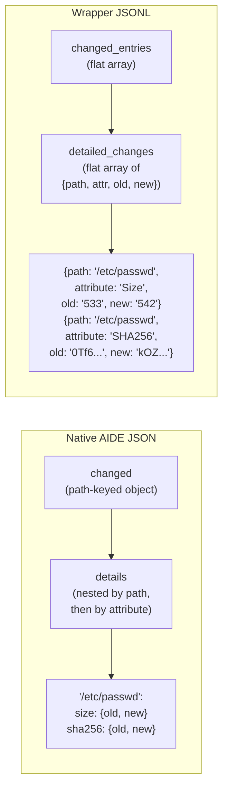

Amazon Linux 2023 ships **AIDE 0.18.6** — the only version in this project's three-OS matrix that supports `report_format=json` natively. This page dissects what native JSON actually produces, how it differs structurally from the Python wrapper pipeline, why the config directive is order-sensitive, and when you might choose one approach over the other. If you need background on AIDE's stateful workflow and version differences across OSes, see [Understanding AIDE Versions, Stateful Workflow, and OS Differences](8-understanding-aide-versions-stateful-workflow-and-os-differences); for the parser internals, see [AIDE JSON Parser: Parsing Multi-Section Integrity Reports (aide-to-json.py)](9-aide-json-parser-parsing-multi-section-integrity-reports-aide-to-json-py).

Sources: [CLAUDE.md](CLAUDE.md#L109-L113), [README.md](aide/README.md#L27-L31)

## The Version Gate: Why Only AL2023 Has Native JSON

The `report_format` config directive was introduced in AIDE **v0.18**. AlmaLinux 9 ships AIDE 0.16 and Amazon Linux 2 ships 0.16.2 — both predate this feature and will reject `report_format=json` with `Configuration error: unknown expression`. Only Amazon Linux 2023's AIDE 0.18.6 recognizes and honors the directive. This version disparity is the foundational reason the Python wrapper exists: it provides a uniform JSON schema across all three operating systems by parsing AIDE's plain-text output, which is identical in structure across all versions.

Sources: [README.md](aide/README.md#L44-L55), [CLAUDE.md](CLAUDE.md#L108-L113)

## The Order-Sensitivity Gotcha

Even on AL2023 where `report_format=json` is supported, the feature has a non-obvious config ordering trap. AIDE applies `report_format` to each `report_url` **at the moment that URL is declared** — not as a global override. The default `/etc/aide.conf` on AL2023 declares two `report_url=` lines near the top (around lines 21–22):

```
report_url=file:@@{LOGDIR}/aide.log
report_url=stdout
```

If you append `report_format=json` to the end of `aide.conf`, both report URLs have already been bound to the default `plain` format. The scan silently produces plain text, and you'd incorrectly conclude the feature is broken. The correct approaches are:

| Approach | Result | Mechanism |
|---|---|---|
| `aide --check -B 'report_format=json'` on CLI | ✅ JSON | `-B` flag overrides config at runtime |
| `report_format=json` inserted **before** `report_url=` lines | ✅ JSON | Format is set before URLs bind |
| `report_format=json` **appended** to end of `aide.conf` | ❌ Plain text (silent) | URLs already bound to `plain` |
| `report_url=stdout?report_format=json` query-string syntax | ❌ `unknown URL-type` error | Not a supported syntax in AIDE |

Sources: [native-json-demo.sh](aide/amazonlinux2023/native-json-demo.sh#L3-L18), [README.md](aide/README.md#L57-L86)

### Reproducing the Behaviour

The project ships a dedicated reproducer script — [native-json-demo.sh](aide/amazonlinux2023/native-json-demo.sh) — that runs all four approaches inside the AL2023 Docker image and prints the first line of each output. The script initializes an AIDE database, tampers `/etc/passwd`, then tests each config variant sequentially. Run it with:

```bash
docker build -t amazonlinux2023-aide:latest -f aide/amazonlinux2023/Dockerfile .
docker run --rm amazonlinux2023-aide:latest bash /usr/local/bin/native-json-demo.sh
```

The script uses a `first_line()` helper function that captures the full `aide --check` output into a variable before extracting the first line — this avoids `SIGPIPE` from piping into `head -1`, which would otherwise trigger `set -e` and abort the script.

Sources: [native-json-demo.sh](aide/amazonlinux2023/native-json-demo.sh#L33-L67), [Dockerfile](aide/amazonlinux2023/Dockerfile#L1-L11)

## Structural Comparison: What Each Output Actually Contains

Both outputs were captured from the same AL2023 Docker image with the same tamper applied (`echo "tampered" >> /etc/passwd`), producing a controlled single-file change. The following table summarizes the structural differences at a glance:

| Aspect | Native `report_format=json` | Python Wrapper (`aide-to-json.py`) |
|--------|-----------------------------|-------------------------------------|
| **Format** | Pretty-printed JSON (687 lines) | Single-line JSONL (1 line per check) |
| **Size** | 18 KB | ~12.5 KB per line |
| **OS Support** | AL2023 only (AIDE 0.18+) | All three OSes (AL9, AL2, AL2023) |
| **Hostname** | No | Yes (`"hostname": "0d15bb47ec3a"`) |
| **Timestamp** | `start_time` / `end_time` (AIDE internal) | ISO 8601 `timestamp` field added at parse time |
| **Scanner tag** | No | Yes (`"scanner": "aide"`) |
| **Outline message** | `"outline"` field | `"outline"` field |
| **Run time** | `run_time_seconds` field | `run_time_seconds` field |
| **JSONL append** | No (prints to stdout) | Yes (appends to `/var/log/aide/aide.jsonl`) |
| **SIEM log-shipper friendly** | No — multi-line breaks line-oriented tailing | Yes — one object per line |
| **Added files** | `"added"` object with flag strings | `"added_entries"` array with flag strings |
| **Changed files** | `"changed"` object with compact flags + `"details"` nested `{old, new}` per attribute | `"changed_entries"` array with flags + `"detailed_changes"` flat array of `{path, attribute, old, new}` |
| **Database hashes** | `"databases"` section with all algorithms | `"databases"` section with all algorithms |
| **Exit code** | 5 (changes detected) | 5 (AIDE's exit code, wrapper doesn't alter it) |

Sources: [native-json-comparison.md](aide/amazonlinux2023/native-json-comparison.md#L10-L26)

## Schema Deep Dive: Native JSON vs Wrapper JSONL

The following diagram illustrates the key structural divergence in how changed-file details are represented:



The native output nests details by path then by attribute — compact for human reading but requires recursive traversal to query. The wrapper flattens each attribute change into its own object, making every change independently addressable by tools like `jq` or SIEM query languages.

Sources: [native-json-comparison.md](aide/amazonlinux2023/native-json-comparison.md#L30-L83)

### Native AIDE JSON Structure (condensed)

```json
{
  "start_time": "2026-04-23 10:36:24 +0000",
  "aide_version": "0.18.6",
  "outline": "AIDE found differences between database and filesystem!!",
  "number_of_entries": { "total": 8299, "added": 1, "removed": 0, "changed": 60 },
  "added": { "/etc/hostname": "f++++++++++++++++" },
  "changed": { "/etc/passwd": "f > ... mc..H..  " },
  "details": {
    "/etc/passwd": {
      "size":       { "old": 533, "new": 542 },
      "sha256":     { "old": "0Tf6i/...", "new": "kOZtzo..." }
    }
  },
  "databases": { "/var/lib/aide/aide.db.gz": { "md5": "...", "sha256": "..." } },
  "end_time": "2026-04-23 10:36:28 +0000",
  "run_time_seconds": 4
}
```

### Wrapper JSONL Structure (condensed)

```json
{
  "result": "changes_detected",
  "outline": "AIDE found differences between database and filesystem!!",
  "summary": { "total_entries": 8299, "added": 1, "removed": 0, "changed": 60 },
  "added_entries": [{ "path": "/etc/hostname", "flags": "f++++++++++++++++" }],
  "changed_entries": [{ "path": "/etc/passwd", "flags": "f > ... mc..H.." }],
  "detailed_changes": [
    { "path": "/etc/passwd", "attribute": "Size", "old": "533", "new": "542" },
    { "path": "/etc/passwd", "attribute": "SHA256", "old": "0Tf6i/...", "new": "kOZtzo..." }
  ],
  "databases": { "/var/lib/aide/aide.db.gz": { "SHA256": "LzvOvz...", "WHIRLPOOL": "Vw8VR3..." } },
  "run_time_seconds": 4,
  "hostname": "0d15bb47ec3a",
  "timestamp": "2026-04-23T10:36:37Z",
  "scanner": "aide"
}
```

Sources: [native-json-comparison.md](aide/amazonlinux2023/native-json-comparison.md#L34-L83)

## Feature Parity Matrix

The wrapper has achieved full feature parity with native JSON for all fields relevant to SIEM ingestion. The only structural difference is representational — path-keyed nested objects versus flat arrays — which affects query ergonomics but not information completeness:

| Feature | Native | Wrapper | Notes |
|---------|--------|---------|-------|
| Added entries with flags | Yes (`"added"` object) | Yes (`"added_entries"` array) | Same data, different container |
| Changed entries with flags | Yes (`"changed"` object) | Yes (`"changed_entries"` array) | Same data, different container |
| Detailed change attributes | Yes (nested by path) | Yes (flat array) | Wrapper is easier to query |
| Database hashes | Yes | Yes | All algorithms preserved |
| Outline message | Yes | Yes | Identical string |
| Run time | Yes | Yes | Same value in seconds |
| Hostname | No | Yes | Wrapper adds `socket.gethostname()` |
| ISO 8601 timestamp | No | Yes | Wrapper adds UTC timestamp at parse time |
| Scanner tag | No | Yes | Wrapper adds `"scanner": "aide"` |
| JSONL single-line format | No | Yes | Native is multi-line / pretty-printed |
| Cross-OS consistency | AL2023 only | All 3 OSes | Wrapper normalizes schema |

Sources: [native-json-comparison.md](aide/amazonlinux2023/native-json-comparison.md#L107-L125), [aide-to-json.py](aide/shared/aide-to-json.py#L203-L226)

## What Native Has That the Wrapper Does Not

There are exactly two structural properties present in native JSON but absent from the wrapper:

1. **Path-keyed `"changed"` object** — native uses file paths as object keys (`"/etc/passwd": "f > ... mc..H.."`), while the wrapper places these into a `"changed_entries"` array. This is a container-style difference; the information is identical.
2. **Path-keyed `"details"` object** — native nests `{old, new}` pairs under each file path (`"/etc/passwd": { "size": { "old": 533, "new": 542 } }`), while the wrapper flattens this into a `"detailed_changes"` array where each element is `{path, attribute, old, new}`. The wrapper's flat representation is deliberately chosen for SIEM query ergonomics.

Neither omission represents a loss of data — they are alternative serializations of the same information.

Sources: [native-json-comparison.md](aide/amazonlinux2023/native-json-comparison.md#L87-L92)

## What the Wrapper Has That Native Does Not

The wrapper adds four SIEM-critical fields that native AIDE JSON does not emit:

1. **`hostname`** — identifies which host produced the result. Essential for multi-host correlation when multiple servers feed the same SIEM index. Added via `socket.gethostname()`.
2. **`timestamp`** — an ISO 8601 UTC timestamp (`"2026-04-23T10:36:37Z"`) added at parse time. Native only has AIDE's internal `start_time`/`end_time` strings, which are not ISO-formatted and lack timezone consistency.
3. **`scanner`** — a fixed `"aide"` tag that identifies the scanner type. When ClamAV and AIDE outputs land in the same SIEM index, this field enables trivial filtering.
4. **JSONL append** — the wrapper writes a single-line JSON object to both stdout and `/var/log/aide/aide.jsonl`. Native JSON is pretty-printed multi-line output that breaks line-oriented log shippers (Filebeat, Fluentd, rsyslog). The log file is managed by [logrotate configuration](aide/shared/aide-jsonl.conf) with 30-day retention.

The wrapper's `main()` function handles the file-append as best-effort: if the log directory doesn't exist or permissions deny access (e.g., during unit tests on development hosts), the `OSError` is silently caught and stdout output remains the primary channel.

Sources: [aide-to-json.py](aide/shared/aide-to-json.py#L203-L226), [aide-jsonl.conf](aide/shared/aide-jsonl.conf#L1-L9), [native-json-comparison.md](aide/amazonlinux2023/native-json-comparison.md#L94-L101)

## Query Ergonomics: Why Flat Arrays Matter

The wrapper's `detailed_changes` flat array is designed for single-pass filtering. Consider querying all changes to `/etc/passwd`:

**Native JSON (nested):**
```bash
jq '.details["/etc/passwd"]' native-output.json
# Returns: { "size": {"old": 533, "new": 542}, "sha256": {...} }
# Further processing needed to normalize
```

**Wrapper JSONL (flat):**
```bash
jq '.detailed_changes[] | select(.path == "/etc/passwd")' wrapper-output.jsonl
# Returns individual objects:
# { "path": "/etc/passwd", "attribute": "Size", "old": "533", "new": "542" }
# { "path": "/etc/passwd", "attribute": "SHA256", "old": "0Tf6...", "new": "kOZ..." }
```

The flat structure maps directly onto SIEM query paradigms where each event is a flat key-value record. No recursive traversal or key enumeration is required. For more query patterns, see [Querying Scanner Output with jq](14-querying-scanner-output-with-jq).

Sources: [native-json-comparison.md](aide/amazonlinux2023/native-json-comparison.md#L99-L100)

## Recommendation

**Use the Python wrapper as the default pipeline for all operating systems.** It provides full feature parity with native JSON output, plus cross-OS consistency, host enrichment (`hostname`, `timestamp`, `scanner`), and the JSONL single-line format required by log shippers. The native `report_format=json` option exists as a **zero-dependency fallback** for Amazon Linux 2023-only environments where installing Python is undesirable — but note that the config order-sensitivity makes it fragile to deploy without careful testing.

For the complete field reference of the wrapper's output, see [AIDE JSON Schema and Output Fields Reference](11-aide-json-schema-and-output-fields-reference). For deployment patterns including systemd timer integration and logrotate configuration, see [JSONL Log Format, Logrotate, and Log Shipper Configuration](12-jsonl-log-format-logrotate-and-log-shipper-configuration) and [Systemd Service and Timer Units for Scheduled Scans](13-systemd-service-and-timer-units-for-scheduled-scans).