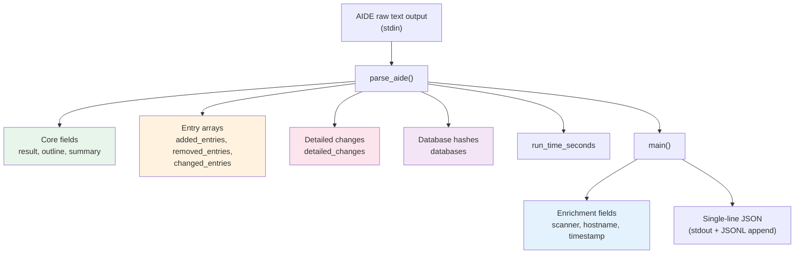

This page provides a **complete field-level reference** for the JSON objects emitted by `aide-to-json.py` — the Python wrapper that transforms AIDE's plain-text integrity reports into single-line JSON for SIEM ingestion. Every field is documented with its type, cardinality, value semantics, and the AIDE text section it originates from. Use this reference when building SIEM queries, writing validation rules, or extending the parser.

Sources: [aide-to-json.py](aide/shared/aide-to-json.py#L1-L231)

## Top-Level Schema Overview

Each AIDE check run produces **exactly one JSON object** written as a single line (JSONL format). The object combines data extracted from AIDE's multi-section text output with enrichment fields added at parse time by the wrapper.



The diagram above shows the two-phase construction: `parse_aide()` extracts structured data from AIDE's text, and `main()` then enriches the result with three SIEM-critical fields (`scanner`, `hostname`, `timestamp`) before serializing to a compact JSON line.

Sources: [aide-to-json.py](aide/shared/aide-to-json.py#L21-L32) · [aide-to-json.py](aide/shared/aide-to-json.py#L203-L216)

## Complete Field Reference

The following table documents every field that can appear in the output JSON. Fields marked **Conditional** are present only when the corresponding data exists in AIDE's output — the parser deletes empty collections and unset values to keep the payload minimal.

| Field | Type | Presence | Description |
|-------|------|----------|-------------|
| `scanner` | `string` | **Always** | Fixed value `"aide"`. Identifies the scanner type when multiple scanner outputs feed the same SIEM index. Added by `main()`, not parsed from AIDE output. |
| `hostname` | `string` | **Always** | Value of `socket.gethostname()` at parse time. Critical for correlating results across multiple hosts in a SIEM. |
| `timestamp` | `string` | **Always** | ISO 8601 UTC timestamp (`YYYY-MM-DDTHH:MM:SSZ`) generated at parse time. This is *not* AIDE's internal timestamp — it marks when the wrapper ran. |
| `result` | `string` | **Always** | `"clean"` when AIDE reports no differences, `"changes_detected"` when differences are found. |
| `outline` | `string` | Conditional | The one-line outcome message from AIDE — either `"AIDE ... found NO differences..."` or `"AIDE found differences between database and filesystem!!"`. Omitted if the parser can't detect one. |
| `summary` | `object` | Conditional | Counts from AIDE's `Summary:` section. See [Summary Object](#summary-object). Omitted if no summary lines are found. |
| `added_entries` | `array` | Conditional | Files detected as new since the last AIDE database init. See [Entry Objects](#entry-objects-added-removed-changed). Omitted when empty. |
| `removed_entries` | `array` | Conditional | Files that disappeared since the last AIDE database init. See [Entry Objects](#entry-objects-added-removed-changed). Omitted when empty. |
| `changed_entries` | `array` | Conditional | Files whose monitored attributes differ from the database. See [Entry Objects](#entry-objects-added-removed-changed). Omitted when empty. |
| `detailed_changes` | `array` | Conditional | Granular per-attribute old/new pairs from AIDE's "Detailed information about changes" section. See [Detailed Change Objects](#detailed-change-objects). Omitted when empty. |
| `databases` | `object` | Conditional | Integrity hashes for the AIDE database files themselves. See [Database Hash Object](#database-hash-object). Omitted when empty. |
| `run_time_seconds` | `integer` | Conditional | Total check duration in seconds, parsed from AIDE's `"End timestamp: ... (run time: Nm Ns)"` line. Omitted if AIDE doesn't emit this line. |

Sources: [aide-to-json.py](aide/shared/aide-to-json.py#L21-L32) · [aide-to-json.py](aide/shared/aide-to-json.py#L203-L216) · [validate-aide-jsonl.py](scripts/validate-aide-jsonl.py#L16-L26)

## Field Deep Dives

### Summary Object

The `summary` object is parsed from AIDE's `Summary:` section. It contains four integer counters:

| Key | Type | Source Pattern |
|-----|------|----------------|
| `total_entries` | `integer` | `Total number of entries:\t<N>` |
| `added` | `integer` | `Added entries:\t\t<N>` |
| `removed` | `integer` | `Removed entries:\t\t<N>` |
| `changed` | `integer` | `Changed entries:\t\t<N>` |

Example from AlmaLinux 9 production output:

```json
"summary": {
  "total_entries": 9312,
  "added": 0,
  "removed": 0,
  "changed": 4
}
```

Sources: [aide-to-json.py](aide/shared/aide-to-json.py#L59-L68)

### Entry Objects (Added, Removed, Changed)

Each entry in the `added_entries`, `removed_entries`, and `changed_entries` arrays is an object with two fields:

| Key | Type | Description |
|-----|------|-------------|
| `path` | `string` | Absolute file path as reported by AIDE. |
| `flags` | `string` | AIDE's change indicator string — encodes file type and which attributes differ. |

**Flag string anatomy:** The first character encodes the file type:

| Char | Type |
|------|------|
| `f` | Regular file |
| `d` | Directory |
| `l` | Symbolic link |
| `b` | Block device |
| `c` | Character device |
| `p` | Named pipe |
| `s` | Unix socket |

For **added** entries, the remainder is all `+` signs (e.g., `f++++++++++++++++`), indicating all monitored attributes are new. For **changed** entries, the flag string contains positional indicators showing *which* attributes differ — for example `f > p..    .C..` shows changes to permissions (`p`) and checksum (`C`). For **removed** entries, all monitored attributes show as removed.

Example showing both added and changed entries from Amazon Linux 2023:

```json
"added_entries": [
  { "path": "/etc/hostname", "flags": "f++++++++++++++++" }
],
"changed_entries": [
  { "path": "/etc/hosts", "flags": "f > ... mci.H.." },
  { "path": "/etc/resolv.conf", "flags": "f > p..    .HA." }
]
```

Sources: [aide-to-json.py](aide/shared/aide-to-json.py#L97-L111)

### Detailed Change Objects

The `detailed_changes` array is a **flat list** of per-attribute old/new pairs — deliberately denormalized for ease of querying with `jq` and SIEM filters. Each object has four fields:

| Key | Type | Description |
|-----|------|-------------|
| `path` | `string` | Absolute file path this change belongs to. Repeated across multiple entries for the same file. |
| `attribute` | `string` | Name of the changed attribute (e.g., `Size`, `Perm`, `SHA256`, `ACL`). |
| `old` | `string` | Value from the AIDE database (baseline). |
| `new` | `string` | Value from the live filesystem at check time. |

**Common attribute names** observed across all three supported OSes:

| Attribute | Value Format | Description |
|-----------|-------------|-------------|
| `Size` | Integer string | File size in bytes |
| `Perm` | `"-rw-r--r--"` style | Unix permission string |
| `Mtime` | `"YYYY-MM-DD HH:MM:SS +ZZZZ"` | Modification timestamp |
| `Ctime` | `"YYYY-MM-DD HH:MM:SS +ZZZZ"` | Inode change timestamp |
| `Atime` | `"YYYY-MM-DD HH:MM:SS +ZZZZ"` | Access timestamp |
| `Inode` | Integer string | Inode number |
| `Linkcount` | Integer string | Hard link count |
| `UID` | Integer string | Owner user ID |
| `GID` | Integer string | Owner group ID |
| `SHA256` | Base64 string | SHA-256 hash (may span multiple lines in AIDE output) |
| `SHA512` | Base64 string | SHA-512 hash (may span multiple lines in AIDE output) |
| `ACL` | Space-separated `A:` entries | POSIX ACL entries (multi-line in AIDE output, joined with spaces) |
| `XAttrs` | Extended attribute entries | Extended file attributes (multi-line, joined with spaces) |

Example from AlmaLinux 9 showing multiple attribute changes for the same file:

```json
"detailed_changes": [
  { "path": "/etc/resolv.conf", "attribute": "Size",   "old": "24",          "new": "222" },
  { "path": "/etc/resolv.conf", "attribute": "Perm",   "old": "-rw-r--r--",  "new": "-rwxrwxrwx" },
  { "path": "/etc/resolv.conf", "attribute": "SHA512", "old": "3UdehPxb...", "new": "gbwQk3n0..." },
  { "path": "/etc/resolv.conf", "attribute": "ACL",    "old": "A: user::rw- A: group::r-- A: other::r--",
                                                     "new": "A: user::rwx A: group::rwx A: other::rwx" }
]
```

Sources: [aide-to-json.py](aide/shared/aide-to-json.py#L114-L162)

### Multi-Line Value Handling

AIDE wraps long hash values and ACL entries across multiple lines in its text output. The parser handles these differently depending on the attribute type, controlled by the `_MULTIVALUE_ATTRS` set:

| Attribute Type | Join Strategy | Rationale |
|----------------|--------------|-----------|
| Hash attributes (`SHA256`, `SHA512`, etc.) | Concatenated **without** separator | Base64 hash fragments are continuous byte sequences — no whitespace in the original value |
| `ACL` | Fragments joined with **space** | Each `A:` entry is a distinct ACE, readability demands separation |
| `XAttrs` | Fragments joined with **space** | Same rationale as ACL — distinct named entries |

This distinction is critical: a corrupted hash value (with spurious spaces) would break integrity verification, while ACL entries without spaces would be unreadable. The parser's `_MULTIVALUE_ATTRS = {"ACL", "XAttrs"}` set precisely controls this behavior.

Sources: [aide-to-json.py](aide/shared/aide-to-json.py#L16-L18) · [aide-to-json.py](aide/shared/aide-to-json.py#L149-L162)

### Database Hash Object

The `databases` object is keyed by the **absolute path** of each AIDE database file (e.g., `/var/lib/aide/aide.db.gz`). Each value is itself an object mapping hash algorithm names to their base64-encoded digest of the database file. The specific algorithms present depend on the AIDE version and OS build configuration:

| OS | Algorithms Observed |
|----|-------------------|
| **AlmaLinux 9** | `MD5`, `SHA1`, `RMD160`, `TIGER`, `SHA256`, `SHA512` |
| **Amazon Linux 2** | `MD5`, `SHA1`, `RMD160`, `TIGER`, `SHA256`, `SHA512` |
| **Amazon Linux 2023** | `MD5`, `SHA1`, `SHA256`, `SHA512`, `RMD160`, `TIGER`, `CRC32`, `WHIRLPOOL`, `GOST`, `STRIBOG256`, `STRIBOG512` |

Example from Amazon Linux 2023 (full algorithm set):

```json
"databases": {
  "/var/lib/aide/aide.db.gz": {
    "MD5": "mYEyR1RXlI0Cj8au2xfgLw==",
    "SHA1": "G1nknO4psH3R43J9bPz/QExwjhk=",
    "SHA256": "hk+lBe1luaqf+o1PhASgtSiETb980js9YbhjXWrJgI4=",
    "SHA512": "nN/gW+89fMrXAqZOLW/6cqX/yEERbmeKveT8QAXe4SA...",
    "RMD160": "1JKMcZsGvalta+TT23s6UMwSxUU=",
    "TIGER": "MssbsQCEjrtQuCHws7Nld/m59DvnYkHv",
    "CRC32": "yrXcrQ==",
    "WHIRLPOOL": "h3f9UzdqGebiJhdH8q4RvulI+IHqIudfAr57wkl...",
    "GOST": "Zb1AEeKcAbks2ABIRtB0Mv3iQTnT0DkVjoGmsvrqPCQ=",
    "STRIBOG256": "XzPOAzNcPvb2Dztj1ZZGoWYY7oPqcF0ZnfKjlRwhme4=",
    "STRIBOG512": "eOYGIyvums4fEUEBXFvH3nM7bxl02tOAfelKG3du..."
  }
}
```

These database hashes allow a SIEM to detect database tampering — if the stored hashes change between check runs without an explicit `aide --init`, the database itself may have been compromised.

Sources: [aide-to-json.py](aide/shared/aide-to-json.py#L164-L181)

## Conditional Field Omission

The parser actively removes empty or unset fields to minimize payload size. This is not cosmetic — it ensures downstream consumers can rely on the **presence** of a field as a signal that the corresponding data exists. The following cleanup rules are applied after parsing:

| Condition | Action |
|-----------|--------|
| `added_entries` is `[]` | Field deleted |
| `removed_entries` is `[]` | Field deleted |
| `changed_entries` is `[]` | Field deleted |
| `detailed_changes` is `[]` | Field deleted |
| `summary` is `{}` | Field deleted |
| `databases` is `{}` | Field deleted |
| `outline` is `None` | Field deleted |
| `run_time_seconds` is `None` | Field deleted |

This means a **clean run** (no differences) produces a minimal object:

```json
{"result":"clean","hostname":"host.example.com","timestamp":"2026-04-23T14:21:15Z","scanner":"aide"}
```

While a run with changes includes only the non-empty sections:

```json
{"result":"changes_detected","outline":"AIDE found differences...","summary":{"total_entries":9312,"added":0,"removed":0,"changed":4},"changed_entries":[...],"detailed_changes":[...],"databases":{...},"run_time_seconds":1,"hostname":"59f347f60909","timestamp":"2026-04-23T14:21:15Z","scanner":"aide"}
```

Sources: [aide-to-json.py](aide/shared/aide-to-json.py#L183-L198)

## CI Validation Contract

The validation script `validate-aide-jsonl.py` enforces a minimal contract for CI smoke tests. It checks that every JSONL line contains four **required** top-level fields:

| Required Field | Assertion |
|----------------|-----------|
| `scanner` | Must equal `"aide"` |
| `result` | Must be present (any string) |
| `hostname` | Must be present (any string) |
| `timestamp` | Must be present (any string) |

The validator also accepts an expected line count argument (default: 2 lines, corresponding to the "clean check" and "tampered check" runs in the Docker smoke test). This ensures the parser produces output for every check run without crashes.

Sources: [validate-aide-jsonl.py](scripts/validate-aide-jsonl.py#L1-L29)

## Output Delivery: Dual Channel

The parser delivers its output through two channels simultaneously:

| Channel | Destination | Behavior on Failure |
|---------|------------|-------------------|
| **stdout** | Piped to caller / captured by Docker | Always emits the JSON line |
| **JSONL append** | `/var/log/aide/aide.jsonl` | Best-effort; `OSError` (permission, missing directory) is silently caught |

The JSONL append is the primary mechanism for cumulative log rotation and log shipper integration. The stdout channel ensures the result is always available to the caller even when the log directory doesn't exist (e.g., during unit tests on development machines). The output uses compact separators (`separators=(",",":")`) to minimize line length — no unnecessary whitespace.

Sources: [aide-to-json.py](aide/shared/aide-to-json.py#L214-L226)

## Comparison with Native AIDE JSON (AL2023 Only)

AIDE 0.18+ on Amazon Linux 2023 supports `report_format=json` natively. The following table highlights the key structural differences between native JSON and the Python wrapper output:

| Aspect | Native `report_format=json` | Python Wrapper |
|--------|----------------------------|----------------|
| Added entries | `"added": {"/path": "flags"}` (path-keyed map) | `"added_entries": [{"path": ..., "flags": ...}]` (array) |
| Changed entries | `"changed": {"/path": "flags"}` (path-keyed map) | `"changed_entries": [{"path": ..., "flags": ...}]` (array) |
| Detailed changes | `"details": {"/path": {"attr": {"old": ..., "new": ...}}}` (nested by path) | `"detailed_changes": [{"path": ..., "attribute": ..., "old": ..., "new": ...}]` (flat array) |
| Summary | `"number_of_entries": {"total": N, "added": N, ...}` | `"summary": {"total_entries": N, "added": N, ...}` |
| SIEM enrichment | None | `scanner`, `hostname`, `timestamp` |
| Format | Pretty-printed multi-line JSON | Single-line JSONL |
| OS support | AIDE 0.18+ only (AL2023) | All three OSes (AL9, AL2, AL2023) |

The flat-array design of the wrapper's `detailed_changes` is a deliberate architectural choice: it enables straightforward `jq` queries like `jq '.detailed_changes[] | select(.attribute == "Perm")'` without nested path-keyed navigation. For a full side-by-side comparison, see [Native JSON vs Python Wrapper on Amazon Linux 2023](10-native-json-vs-python-wrapper-on-amazon-linux-2023-report_format-json).

Sources: [native-json-comparison.md](aide/amazonlinux2023/native-json-comparison.md#L1-L133)

## Example Output: Full Annotated Object

The following is a complete, annotated example from a tampered AlmaLinux 9 check run (reformatted for readability — actual output is a single line):

```json
{
  "result": "changes_detected",
  "outline": "AIDE found differences between database and filesystem!!",
  "summary": { "total_entries": 9313, "added": 0, "removed": 0, "changed": 4 },
  "changed_entries": [
    { "path": "/etc/hostname",   "flags": "f   ...    .C.." },
    { "path": "/etc/hosts",      "flags": "f   ...    .C.." },
    { "path": "/etc/resolv.conf","flags": "f > p..    .CA." },
    { "path": "/var/log/aide",   "flags": "d = ...    n .." }
  ],
  "detailed_changes": [
    { "path": "/etc/hostname",    "attribute": "SHA512",    "old": "z4PhNX7...", "new": "s1M6Ext..." },
    { "path": "/etc/hosts",       "attribute": "SHA512",    "old": "z4/WlF+...", "new": "ZhWoaNj..." },
    { "path": "/etc/resolv.conf", "attribute": "Size",      "old": "24",        "new": "222" },
    { "path": "/etc/resolv.conf", "attribute": "Perm",      "old": "-rw-r--r--", "new": "-rwxrwxrwx" },
    { "path": "/etc/resolv.conf", "attribute": "SHA512",    "old": "3UdehPx...", "new": "gbwQk3n..." },
    { "path": "/etc/resolv.conf", "attribute": "ACL",       "old": "A: user::rw- A: group::r-- A: other::r--",
                                                        "new": "A: user::rwx A: group::rwx A: other::rwx" },
    { "path": "/var/log/aide",    "attribute": "Linkcount", "old": "2",         "new": "1" }
  ],
  "databases": {
    "/var/lib/aide/aide.db.gz": {
      "MD5": "gD9FqG2ffkBz5I8StOBL1w==",
      "SHA1": "MI2dBQ6ZS6sZUGBnBCWTLEyDVms=",
      "SHA256": "Ne2G7OIbNjckjtyzNXRlBVyQnYdeGuadzdaN81vvQGw=",
      "SHA512": "MUGcVVLS1MWwM2ElHHsO4S8T9hDMLtq/0E8KqXG5h04..."
    }
  },
  "run_time_seconds": 1,
  "hostname": "59f347f60909",
  "timestamp": "2026-04-23T14:21:16Z",
  "scanner": "aide"
}
```

Note how the `changed_entries` flag for `/etc/resolv.conf` changes from `.C..` (checksum only) in the clean check to `.CA.` (checksum + ACL) in the tampered check — reflecting the `chmod 777` tamper that modified both the checksum and ACL entries.

Sources: [aide.json](aide/almalinux9/results/aide.json#L4-L5)

## Known Edge Cases

**Multi-line ACL continuation leak (Issue #8):** ACL continuation lines (indented with 8+ spaces) contain text like `A: group::r--` that could be misinterpreted as a new attribute named `A`. The parser uses indentation-based detection (`leading_spaces >= 8`) rather than regex matching to distinguish continuation lines from new attribute lines, preventing bogus `"attribute": "A"` entries from appearing in `detailed_changes`.

**Multi-line hash concatenation:** SHA256 and SHA512 hashes that wrap across 2–3 lines in AIDE's text output are concatenated without any separator. This preserves the exact base64 value. The unit tests explicitly verify that no spaces appear in the reconstructed hash values.

**Empty stdin:** If the parser receives empty input (e.g., AIDE fails to produce output), it exits silently with code 0 and emits nothing. This prevents malformed empty JSONL lines from corrupting the log file.

Sources: [aide-to-json.py](aide/shared/aide-to-json.py#L114-L162) · [test-aide-parser.py](scripts/test-aide-parser.py#L1-L141)

## Related Pages

- **[AIDE JSON Parser: Parsing Multi-Section Integrity Reports](9-aide-json-parser-parsing-multi-section-integrity-reports-aide-to-json-py)** — internals of the parsing state machine, section detection logic, and continuation-line handling
- **[Native JSON vs Python Wrapper on Amazon Linux 2023](10-native-json-vs-python-wrapper-on-amazon-linux-2023-report_format-json)** — side-by-side output comparison, feature parity analysis, and when to use each approach
- **[JSONL Validation Scripts for ClamAV and AIDE](18-jsonl-validation-scripts-for-clamav-and-aide)** — how CI enforces the schema contract
- **[AIDE Parser Unit Tests](19-aide-parser-unit-tests-multi-line-acls-hash-continuations-and-edge-cases)** — regression test coverage for the edge cases documented above
- **[Querying Scanner Output with jq](14-querying-scanner-output-with-jq)** — practical `jq` queries against the schema documented here