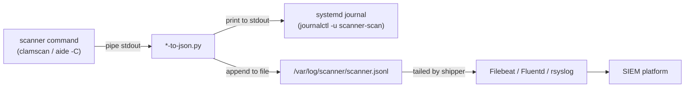

This page explains how the scanner-to-JSON pipeline produces **JSON Lines (JSONL)** output, how logrotate policies keep those files manageable, and how to configure a log shipper to forward records into your SIEM. Both ClamAV and AIDE share an identical write architecture — one JSON object per scan, appended to a single file — so the concepts below apply uniformly to both scanners.

Sources: [README.md](README.md#L110-L137), [CLAUDE.md](CLAUDE.md#L64-L80)

## Why JSONL?

**JSON Lines** (one valid JSON object per line, delimited by `\n`) is the lingua franca of log shippers. Every major agent — Filebeat, Fluentd, rsyslog, Vector, Splunk Forwarder — can tail a JSONL file with zero custom parsing. The format is both human-readable (`jq` works line-by-line) and machine-parseable (each line is a self-contained `json.loads()` call). Unlike multi-record JSON arrays, JSONL is **append-safe**: a writer opens the file, writes one line, closes. No array brackets to balance, no risk of corrupting the entire file if the process is interrupted mid-write. This atomic-per-line property is critical for security scanners that may be killed by OOM or timeout policies.

Sources: [aide/shared/aide-to-json.py](aide/shared/aide-to-json.py#L1-L10), [clamav/shared/clamscan-to-json.py](clamav/shared/clamscan-to-json.py#L1-L11)

## The Dual-Write Architecture

Both Python parsers implement the same two-output strategy. Understanding this flow is essential for configuring log collection correctly:



**Path 1 — stdout → journal**: The parser calls `print(json_line)` which writes to stdout. When run under a systemd service, stdout is captured by the journal. This is the **reliable** path: even if the JSONL file is unwritable (permissions, missing directory, full disk), the record still appears in `journalctl`. Use this for ad-hoc debugging.

**Path 2 — file append → log shipper → SIEM**: The parser opens `/var/log/<scanner>/<scanner>.jsonl` in append mode, writes the JSON line plus a trailing newline, then closes. This is the **structured** path that log shippers tail. The file write is best-effort — an `OSError` (on the AIDE parser) or `PermissionError` (on the ClamAV parser) is silently caught and the process continues. The stdout output is always primary.

Sources: [aide/shared/aide-to-json.py](aide/shared/aide-to-json.py#L203-L227), [clamav/shared/clamscan-to-json.py](clamav/shared/clamscan-to-json.py#L54-L77)

### JSONL Write Mechanics

The parsers use `json.dumps()` with compact separators to minimize line length. Each record includes a UTC ISO 8601 timestamp and the hostname, injected by the parser before serialization:

```python
# AIDE parser (aide-to-json.py, lines 210-214)
parsed["hostname"] = socket.gethostname()
parsed["timestamp"] = datetime.now(timezone.utc).strftime("%Y-%m-%dT%H:%M:%SZ")
parsed["scanner"] = "aide"
json_line = json.dumps(parsed, separators=(",", ":"))
```

The ClamAV parser follows the identical pattern but omits the `scanner` field (it relies on the log file path for identification). The `separators=(",", ":")` argument removes all unnecessary whitespace, producing the most compact single-line representation possible — important when log shippers have per-line size limits.

Sources: [aide/shared/aide-to-json.py](aide/shared/aide-to-json.py#L209-L216), [clamav/shared/clamscan-to-json.py](clamav/shared/clamscan-to-json.py#L61-L67)

## Log File Paths and Ownership

Each scanner writes to a dedicated subdirectory under `/var/log/`:

| Scanner | JSONL Path | Owner:Group | Mode |
|---------|-----------|-------------|------|
| AIDE | `/var/log/aide/aide.jsonl` | `root:root` | `0640` |
| ClamAV | `/var/log/clamav/clamscan.jsonl` | `root:clamupdate` | `0640` |

The ownership difference reflects the underlying package conventions. ClamAV's Cisco Talos RPM creates a `clamupdate` group, and the logrotate config uses that group so that the `freshclam` daemon (which updates virus definitions) can also write to the ClamAV log directory. AIDE runs entirely as root and uses `root:root` ownership. The restrictive `0640` mode means only root and the group can read the files — log shippers must run as root or be added to the appropriate group.

Sources: [aide/shared/aide-jsonl.conf](aide/shared/aide-jsonl.conf#L1-L9), [clamav/shared/clamav-jsonl.conf](clamav/shared/clamav-jsonl.conf#L1-L13)

## Logrotate Configuration

Both scanners ship logrotate configuration files that manage the JSONL files on a 30-day retention cycle. These configs should be installed to `/etc/logrotate.d/` on production hosts.

### AIDE Logrotate

```
/var/log/aide/aide.jsonl {
    daily
    rotate 30
    compress
    delaycompress
    missingok
    notifempty
    create 0640 root root
}
```

### ClamAV Logrotate

```
/var/log/clamav/clamscan.jsonl {
    daily
    rotate 30
    compress
    delaycompress
    missingok
    notifempty
    create 0640 root clamupdate
    sharedscripts
    postrotate
        # Signal filebeat/fluentd to reopen the file if needed
    endscript
}
```

Sources: [aide/shared/aide-jsonl.conf](aide/shared/aide-jsonl.conf#L1-L9), [clamav/shared/clamav-jsonl.conf](clamav/shared/clamav-jsonl.conf#L1-L13)

### Directive Comparison

The two configs share a common core but differ in one important detail:

| Directive | AIDE | ClamAV | Purpose |
|-----------|------|--------|---------|
| `daily` | ✅ | ✅ | Rotate once per day |
| `rotate 30` | ✅ | ✅ | Keep 30 days of history |
| `compress` | ✅ | ✅ | gzip older rotated files |
| `delaycompress` | ✅ | ✅ | Keep the most recent rotated file uncompressed (log shippers may still be reading it) |
| `missingok` | ✅ | ✅ | Don't error if the file doesn't exist yet |
| `notifempty` | ✅ | ✅ | Don't rotate a zero-byte file |
| `create 0640 ...` | `root root` | `root clamupdate` | Set ownership/mode on the newly created empty file after rotation |
| `sharedscripts` / `postrotate` | ❌ | ✅ | Placeholder for signaling the log shipper to reopen the file handle |

The ClamAV config includes a `postrotate` stanza with a comment signaling where to add a shipper-reopen command. This is important because logrotate replaces the file by creating a new inode — a tailing process still holding the old file descriptor will continue reading from the rotated (now compressed) file, silently missing new entries. The AIDE config omits this because the parser's append-only write pattern (open → write → close per scan) naturally re-resolves the file path on each invocation.

Sources: [aide/shared/aide-jsonl.conf](aide/shared/aide-jsonl.conf#L1-L9), [clamav/shared/clamav-jsonl.conf](clamav/shared/clamav-jsonl.conf#L1-L13)

### Rotation Timeline

After 30 days of operation with daily scans, the log directory looks like this:

```
/var/log/aide/
├── aide.jsonl                  ← active file (today's writes)
├── aide.jsonl.1                ← yesterday (uncompressed, still being tailed)
├── aide.jsonl.2.gz             ← 2 days ago
├── aide.jsonl.3.gz             ← 3 days ago
├── ...
└── aide.jsonl.30.gz            ← 30 days ago (oldest, deleted on next rotation)
```

With daily scans producing one JSON line each, a 30-file rotation is extremely conservative — each line is typically 200 bytes to 2 KB depending on the number of changes detected. Even the most chatty AIDE runs (hundreds of changed entries) rarely exceed 10 KB per line.

Sources: [aide/shared/aide-jsonl.conf](aide/shared/aide-jsonl.conf#L1-L9)

## Log Shipper Integration

The JSONL files are designed for **tail-based** log shipping. The log shipper watches the file, reads new lines as they appear, and forwards them to the SIEM. Below are reference configurations for the three most common shippers.

### Filebeat

```yaml
# /etc/filebeat/filebeat.yml
filebeat.inputs:
  - type: log
    enabled: true
    paths:
      - /var/log/aide/aide.jsonl
      - /var/log/clamav/clamscan.jsonl
    json.keys_under_root: true
    json.add_error_key: true
    fields:
      log_type: security_scanner

processors:
  - decode_json_fields:
      fields: ["message"]
      target: ""
      overwrite_keys: true

output.elasticsearch:
  hosts: ["elasticsearch:9200"]
  index: "security-scanners-%{+yyyy.MM.dd}"
```

Key considerations: Filebeat handles file rotation natively — it tracks the inode and automatically follows the new file after rotation. The `close_inactive: 5m` default is appropriate since scans run at most daily. If your scans take longer than 5 minutes between writes, increase `close_inactive` to prevent Filebeat from closing the harvester prematurely.

### Fluentd (td-agent)

```xml
# /etc/td-agent/conf.d/security-scanners.conf
<source>
  @type tail
  path /var/log/aide/aide.jsonl,/var/log/clamav/clamscan.jsonl
  pos_file /var/log/td-agent/security-scanners.pos
  tag security.scanner
  <parse>
    @type json
    time_key timestamp
    time_format %Y-%m-%dT%H:%M:%SZ
    keep_time_key true
  </parse>
</source>

<match security.scanner>
  @type elasticsearch
  host elasticsearch
  port 9200
  logstash_format true
  logstash_prefix security-scanners
  include_tag_key true
</match>
```

Fluentd's `tail` input uses a position file (`*.pos`) to track read offsets across restarts. After logrotate, Fluentd detects the new inode and begins tailing the fresh file. The `postrotate` hook in the ClamAV logrotate config can send a signal to Fluentd (`kill -USR1 $(cat /var/run/td-agent/td-agent.pid)`) if automatic detection is unreliable.

### rsyslog

```
# /etc/rsyslog.d/30-security-scanners.conf
module(load="imfile" PollingInterval="10")

input(type="imfile"
      File="/var/log/aide/aide.jsonl"
      Tag="aide"
      Severity="info"
      Facility="local6")

input(type="imfile"
      File="/var/log/clamav/clamscan.jsonl"
      Tag="clamav"
      Severity="info"
      Facility="local6")

template(name="SecurityJson" type="list") {
  property(name="msg")
}

if $syslogfacility == 24 then {
  action(type="omfwd"
         Target="logstash.example.com"
         Port="5144"
         Protocol="tcp"
         Template="SecurityJson")
}
```

rsyslog's `imfile` module polls the file at the configured interval and reads new lines. After logrotate, `imfile` detects the truncation or inode change and reopens the file. The `Facility="local6"` (facility code 22) tag keeps scanner logs separate from system messages.

Sources: [clamav/shared/clamav-jsonl.conf](clamav/shared/clamav-jsonl.conf#L10-L12), [README.md](README.md#L114-L125)

## Shipper-Ingestion Contract

Every JSONL line emitted by either parser conforms to an implicit contract that log shippers rely on:

| Guarantee | Detail |
|-----------|--------|
| **One object per line** | Each `json.dumps()` call produces exactly one line terminated by `\n` — no embedded newlines |
| **Self-describing** | Each line is a complete, parseable JSON object (no streaming/array context needed) |
| **Deterministic fields** | `hostname`, `timestamp` are always present — shippers can index immediately |
| **Append-only** | The parser opens in `"a"` mode, writes, closes — no in-place mutation of existing content |
| **Compact encoding** | `separators=(",", ":")` eliminates whitespace — no risk of line-wrapping artifacts |
| **UTF-8 safe** | `json.dumps()` produces ASCII-safe output (non-ASCII characters are `\uXXXX`-escaped) |

The validation scripts used in CI (`validate-aide-jsonl.py` and `validate-clamav-jsonl.py`) verify this contract by reading the JSONL file, asserting the expected line count, and confirming that each line parses as valid JSON with the required envelope fields present.

Sources: [scripts/validate-aide-jsonl.py](scripts/validate-aide-jsonl.py#L1-L29), [scripts/validate-clamav-jsonl.py](scripts/validate-clamav-jsonl.py#L1-L27), [aide/shared/aide-to-json.py](aide/shared/aide-to-json.py#L214-L226)

## Production Deployment Checklist

When deploying these scanners to production hosts, ensure the following log-related pieces are in place:

1. **Create log directories** — The parsers create the JSONL file but not its parent directory. Ensure `/var/log/aide/` and `/var/log/clamav/` exist with correct ownership before the first scan runs.

2. **Install logrotate configs** — Copy `*-jsonl.conf` files to `/etc/logrotate.d/` and verify logrotate picks them up: `logrotate --debug /etc/logrotate.d/aide-jsonl.conf`.

3. **Configure the log shipper** — Install and configure your shipper (Filebeat, Fluentd, or rsyslog) to tail both JSONL files. Verify connectivity to your SIEM before enabling scheduled scans.

4. **Test the full pipeline end-to-end** — Run a manual scan via the systemd service, then confirm the JSON line appears in both the journal (`journalctl -u aide-check.service --since "5 minutes ago"`) and the SIEM index.

5. **Set up rotation monitoring** — After 48 hours, verify that `.jsonl.1` and `.jsonl.1.gz` files appear and that the log shipper continues ingesting from the active `.jsonl` file without gaps.

Sources: [aide/shared/aide-to-json.py](aide/shared/aide-to-json.py#L218-L226), [clamav/shared/clamscan-to-json.py](clamav/shared/clamscan-to-json.py#L69-L76), [aide/shared/aide-jsonl.conf](aide/shared/aide-jsonl.conf#L1-L9), [clamav/shared/clamav-jsonl.conf](clamav/shared/clamav-jsonl.conf#L1-L13)

## Related Pages

- [Systemd Service and Timer Units for Scheduled Scans](13-systemd-service-and-timer-units-for-scheduled-scans) — How the systemd units invoke the parsers and schedule scans
- [Querying Scanner Output with jq](14-querying-scanner-output-with-jq) — Practical `jq` commands for filtering and analyzing JSONL files
- [ClamAV JSON Schema and Output Formats](7-clamav-json-schema-and-output-formats) — Field-level reference for ClamAV JSONL records
- [AIDE JSON Schema and Output Fields Reference](11-aide-json-schema-and-output-fields-reference) — Field-level reference for AIDE JSONL records
- [JSONL Validation Scripts for ClamAV and AIDE](18-jsonl-validation-scripts-for-clamav-and-aide) — CI validation scripts that verify the JSONL contract