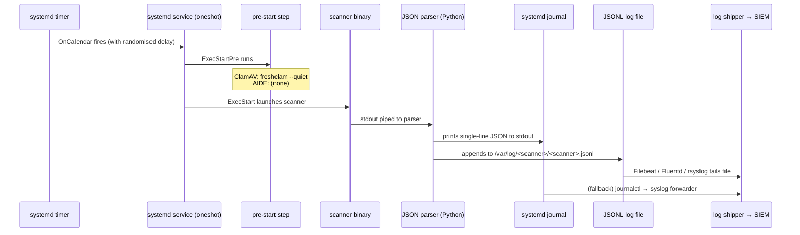
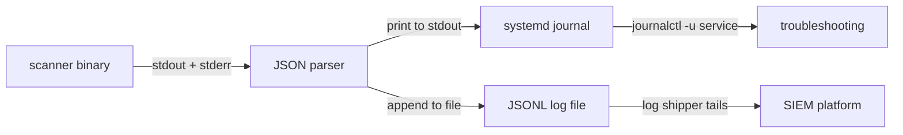

This page explains how the project uses **systemd timer units** to schedule recurring security scans, and **service units** to execute the scanner-to-JSON pipeline. Both ClamAV and AIDE ship with a `.timer` / `.service` pair under their respective `shared/` directories. These units are designed for production host deployment — they handle definition updates, resource throttling, randomised start jitter to avoid thundering-herd load on SIEM infrastructure, and persistent catch-up when machines are offline. Understanding their structure and tuning their parameters is the critical step between "the scanner works in Docker" and "I have reliable, daily JSONL output feeding my SIEM."

Sources: [aide-check.service](aide/shared/aide-check.service#L1-L23), [aide-check.timer](aide/shared/aide-check.timer#L1-L12), [clamav-scan.service](clamav/shared/clamav-scan.service#L1-L30), [clamav-scan.timer](clamav/shared/clamav-scan.timer#L1-L19)

## Architectural Overview: How Timers Drive the Pipeline

Before examining the individual directives, it helps to see the full lifecycle from timer fire to SIEM ingestion. Both scanners follow an identical structural pattern — the only differences are the scanner binary, the JSON parser script, and the scheduling cadence.



The key design principle is **dual-output redundancy**: every scan writes one JSON line to stdout (captured by the systemd journal) *and* appends the same line to a JSONL file. If the log shipper misses the file write, the journal has it. If the journal rotates, the JSONL file retains 30 days of history via logrotate. This ensures no scan result is silently lost.

Sources: [aide-to-json.py](aide/shared/aide-to-json.py#L203-L230), [clamscan-to-json.py](clamav/shared/clamscan-to-json.py#L54-L80)

## Service Unit Anatomy

Both services use `Type=oneshot` — they run to completion and exit. This is the correct type for batch scan jobs that are not long-running daemons. Each service runs as `root` to ensure the scanner can read all files on the host and write to the JSONL log directory.

### ClamAV: `clamav-scan.service`

The ClamAV service has a **two-phase execution**. `ExecStartPre` runs `freshclam --quiet` to update virus definitions before every scan, ensuring the scanner always has the latest signatures. `ExecStart` then launches `clamscan` with recursive mode (`-r`) against the target path (`/` by default), piping the text output directly into `clamscan-to-json.py`.

| Directive | Value | Rationale |
|-----------|-------|-----------|
| `Type` | `oneshot` | Batch job — runs once, exits |
| `User` | `root` | Must read all files; write to `/var/log/clamav/` |
| `ExecStartPre` | `/usr/local/bin/freshclam --quiet` | Update definitions before every scan |
| `ExecStart` | `/bin/bash -c 'clamscan -r / \| clamscan-to-json.py'` | Scan + pipe to JSON parser |
| `TimeoutStartSec` | `86400` (24 hours) | Full-disk scans on large hosts may run for hours |
| `IOSchedulingClass` | `idle` | Defer I/O to avoid starving interactive workloads |
| `CPUSchedulingPolicy` | `idle` | Defer CPU to avoid starving interactive workloads |
| `After` / `Wants` | `network-online.target` | Freshclam needs network to download definitions |

The 24-hour timeout reflects a deliberate trade-off: a full recursive scan of a production host with millions of files can legitimately take many hours. Setting a shorter timeout would cause the service to be killed mid-scan, producing no output at all — which is worse than a slow scan.

Sources: [clamav-scan.service](clamav/shared/clamav-scan.service#L1-L30)

### AIDE: `aide-check.service`

The AIDE service is simpler — it has no `ExecStartPre` because AIDE's stateful database does not require network-based updates (the database is refreshed via a separate `aide --update` workflow). The service pipes both stdout and stderr (`2>&1`) into the JSON parser because AIDE reports certain metadata (e.g., database hash information) to stderr.

| Directive | Value | Rationale |
|-----------|-------|-----------|
| `Type` | `oneshot` | Batch job — runs once, exits |
| `User` | `root` | Must read all files; access AIDE database |
| `ExecStart` | `/bin/bash -c 'aide -C 2>&1 \| aide-to-json.py'` | Check against baseline, pipe to JSON parser |
| `TimeoutStartSec` | `7200` (2 hours) | File integrity checks are faster than AV scans |
| `IOSchedulingClass` | `idle` | Defer I/O to avoid starving interactive workloads |
| `CPUSchedulingPolicy` | `idle` | Defer CPU to avoid starving interactive workloads |

The `2>&1` redirection is specific to AIDE. Unlike ClamAV, AIDE writes some output to stderr (particularly the database integrity hash section), so merging streams before piping ensures the parser receives a complete report.

Sources: [aide-check.service](aide/shared/aide-check.service#L1-L23)

### Service Comparison

| Aspect | ClamAV | AIDE |
|--------|--------|------|
| **Pre-scan step** | `freshclam --quiet` (update definitions) | None (stateful database) |
| **Scanner command** | `clamscan -r /` | `aide -C` |
| **Stderr handling** | Not needed | `2>&1` merged into pipe |
| **Timeout** | 24 hours | 2 hours |
| **Scan target** | Configurable (`/` default) | Defined in `/etc/aide.conf` |
| **Typical duration** | Minutes to hours (file-count dependent) | Seconds to minutes |

Sources: [clamav-scan.service](clamav/shared/clamav-scan.service#L1-L30), [aide-check.service](aide/shared/aide-check.service#L1-L23)

## Timer Unit Anatomy

The timer units control *when* the services activate. They implement a **randomised, persistent, catch-up** scheduling strategy that is critical for fleet deployments.

### Core Timer Directives Explained

All four timer directives work together to create a reliable scheduling pattern:

- **`OnCalendar`** defines the *earliest* possible activation time using systemd calendar expressions. This is the anchor point — the timer will never fire before this time.
- **`RandomizedDelaySec`** adds a random offset between 0 and the specified value. Each host in a fleet gets a different delay, distributing load across the SIEM ingestion pipeline and scanner I/O.
- **`Persistent=true`** ensures that if the machine was powered off at the scheduled time, the timer fires on the next boot. Without this, a machine that was off at midnight simply skips that day's scan.
- **`AccuracySec`** defines the coalescing window. systemd groups timer expirations within this window to reduce wakeups, which matters for power management. For catch-up runs it also acts as a guard — ClamAV's `1h` accuracy combined with `Persistent` prevents a redundant second scan if the system boots within an hour of the last successful run.

### ClamAV: `clamav-scan.timer` — Daily with 24-Hour Spread

```ini
[Timer]
OnCalendar=*-*-* 00:00:00
RandomizedDelaySec=86400
Persistent=true
AccuracySec=1h
```

| Directive | Value | Purpose |
|-----------|-------|---------|
| `OnCalendar` | `*-*-* 00:00:00` | Earliest start: midnight every day |
| `RandomizedDelaySec` | `86400` | Random delay up to 24 hours — each host runs at a different time of day |
| `Persistent` | `true` | Catch-up on next boot if the machine was off |
| `AccuracySec` | `1h` | Prevents duplicate runs on boot if already ran within 1 hour |

The 24-hour randomised delay is the key anti-thundering-herd mechanism. In a fleet of 100 hosts, instead of all 100 hitting the SIEM at midnight, they spread evenly across the entire day. Combined with `Persistent=true`, this means even hosts that are powered on infrequently (e.g., developer workstations) will still run exactly one daily scan.

Sources: [clamav-scan.timer](clamav/shared/clamav-scan.timer#L1-L19)

### AIDE: `aide-check.timer` — Every 4 Hours with 30-Minute Jitter

```ini
[Timer]
OnCalendar=*-*-* 00/4:00:00
RandomizedDelaySec=1800
Persistent=true
AccuracySec=5m
```

| Directive | Value | Purpose |
|-----------|-------|---------|
| `OnCalendar` | `*-*-* 00/4:00:00` | Every 4 hours: 00:00, 04:00, 08:00, 12:00, 16:00, 20:00 |
| `RandomizedDelaySec` | `1800` | Random delay up to 30 minutes per activation |
| `Persistent` | `true` | Catch-up on next boot if missed |
| `AccuracySec` | `5m` | Tight 5-minute coalescing window |

AIDE runs more frequently (every 4 hours vs. daily) because file integrity monitoring benefits from higher temporal resolution — the sooner you detect an unauthorised change, the faster you can respond. The shorter 30-minute jitter is proportional to the 4-hour interval and keeps results within a predictable window while still distributing load across a fleet.

Sources: [aide-check.timer](aide/shared/aide-check.timer#L1-L12)

### Timer Comparison

| Aspect | ClamAV | AIDE |
|--------|--------|------|
| **Cadence** | Daily (1×/day) | Every 4 hours (6×/day) |
| **`OnCalendar`** | `*-*-* 00:00:00` | `*-*-* 00/4:00:00` |
| **Randomised delay** | 86400s (24h) | 1800s (30min) |
| **`AccuracySec`** | 1h | 5m |
| **Rationale for cadence** | Full AV scans are expensive; daily is standard | File integrity needs higher frequency for early detection |
| **Rationale for jitter** | 24h spread avoids SIEM stampede across fleet | 30min jitter proportional to 4h interval |

Sources: [clamav-scan.timer](clamav/shared/clamav-scan.timer#L1-L19), [aide-check.timer](aide/shared/aide-check.timer#L1-L12)

## Resource Scheduling: Why `idle` Matters

Both services set `IOSchedulingClass=idle` and `CPUSchedulingPolicy=idle`. These are not cosmetic — they are **critical for production host deployment** where the scanner runs alongside real workloads.

**`IOSchedulingClass=idle`** tells the Linux I/O scheduler to only service the scanner's I/O requests when no other process needs disk access. On a busy database server, this means the AIDE check or ClamAV scan will not compete with database reads for disk bandwidth.

**`CPUSchedulingPolicy=idle`** gives the scanner the lowest CPU scheduling priority. The kernel will only run the scanner when no other runnable process needs CPU time. This prevents the scanner from causing latency spikes on production services.

Together, these settings embody the principle that **security scanning should never degrade application performance**. The trade-off is that scans take longer — but a slower scan that completes is always preferable to a fast scan that impacts the host's primary workload.

Sources: [clamav-scan.service](clamav/shared/clamav-scan.service#L24-L26), [aide-check.service](aide/shared/aide-check.service#L17-L19)

## The Dual-Output Pattern in Practice

The service units' `ExecStart` lines pipe scanner output into the Python parser, which implements the dual-output pattern. Understanding this is essential for troubleshooting and SIEM configuration.



The Python parser scripts both follow this pattern:

1. **Read** all stdin from the scanner
2. **Parse** the text into a structured dict
3. **Enrich** with `hostname`, `timestamp` (and `scanner` for AIDE)
4. **Serialise** to a single compact JSON line (`separators=(",",":")`)
5. **Print** to stdout — systemd captures this in the journal
6. **Append** to the JSONL log file — the log shipper picks it up

The JSONL file write is **best-effort**. Both parsers catch `OSError` / `PermissionError` when the log directory doesn't exist or permissions are wrong. The primary output channel is always stdout (the journal), and the file is a convenience layer for log shippers. This design ensures that even in a degraded state (missing log directory, wrong permissions), the scan result still reaches the journal and can be forwarded from there.

Sources: [aide-to-json.py](aide/shared/aide-to-json.py#L216-L226), [clamscan-to-json.py](clamav/shared/clamscan-to-json.py#L66-L76)

## Deployment: Installing Units on a Production Host

The following steps deploy the scanner, service, timer, and logrotate configuration onto a bare-metal or VM host running AlmaLinux 9, Amazon Linux 2, or Amazon Linux 2023.

### ClamAV Installation

```bash
# 1. Copy the JSON parser to a system path
sudo cp clamav/shared/clamscan-to-json.py /usr/local/bin/
sudo chmod +x /usr/local/bin/clamscan-to-json.py

# 2. Install systemd units
sudo cp clamav/shared/clamav-scan.service /etc/systemd/system/
sudo cp clamav/shared/clamav-scan.timer /etc/systemd/system/

# 3. Create the JSONL log directory
sudo mkdir -p /var/log/clamav
sudo touch /var/log/clamav/clamscan.jsonl
sudo chmod 640 /var/log/clamav/clamscan.jsonl

# 4. Install logrotate config (30-day retention)
sudo cp clamav/shared/clamav-jsonl.conf /etc/logrotate.d/clamav-jsonl

# 5. Reload systemd, enable and start the timer
sudo systemctl daemon-reload
sudo systemctl enable clamav-scan.timer
sudo systemctl start clamav-scan.timer

# 6. Verify the timer is scheduled
sudo systemctl list-timers clamav-scan.timer

# 7. Run a manual test scan
sudo systemctl start clamav-scan.service

# 8. Inspect results
cat /var/log/clamav/clamscan.jsonl | python3 -m json.tool
journalctl -u clamav-scan.service --since today
```

Sources: [clamav/README.md](clamav/README.md#L335-L365)

### AIDE Installation

```bash
# 1. Install AIDE and initialise the baseline database
sudo dnf install -y aide jq
sudo aide --init
sudo cp /var/lib/aide/aide.db.new.gz /var/lib/aide/aide.db.gz

# 2. Copy the JSON parser to a system path
sudo cp aide/shared/aide-to-json.py /usr/local/bin/
sudo chmod +x /usr/local/bin/aide-to-json.py

# 3. Install systemd units and logrotate config
sudo cp aide/shared/aide-check.service /etc/systemd/system/
sudo cp aide/shared/aide-check.timer /etc/systemd/system/
sudo cp aide/shared/aide-jsonl.conf /etc/logrotate.d/aide-jsonl

# 4. Create the JSONL log directory
sudo mkdir -p /var/log/aide
sudo touch /var/log/aide/aide.jsonl
sudo chmod 640 /var/log/aide/aide.jsonl

# 5. Reload systemd, enable and start the timer
sudo systemctl daemon-reload
sudo systemctl enable --now aide-check.timer

# 6. Verify the timer is scheduled
sudo systemctl list-timers aide-check.timer

# 7. Run a manual test check
sudo systemctl start aide-check.service

# 8. Inspect results
tail -1 /var/log/aide/aide.jsonl | jq .
```

Sources: [aide/README.md](aide/README.md#L373-L399)

### Post-Installation Verification Checklist

| Check | Command | Expected Result |
|-------|---------|-----------------|
| Timer is active | `systemctl list-timers` | Timer shows next elapse time |
| Manual scan completes | `systemctl start <service>` | Service exits without error |
| JSONL file has content | `wc -l /var/log/<scanner>/<scanner>.jsonl` | ≥ 1 line |
| JSON is valid | `tail -1 /var/log/<scanner>/<scanner>.jsonl \| jq .` | Pretty-printed JSON object |
| Journal captured output | `journalctl -u <service> --since today` | JSON line visible |
| Logrotate is configured | `logrotate --debug /etc/logrotate.d/<scanner>-jsonl` | No errors |

## Cross-OS Compatibility: Binary Path Normalisation

The service units reference binaries at `/usr/local/bin/` paths (e.g., `/usr/local/bin/freshclam`, `/usr/local/bin/clamscan`). This is intentional — the Cisco Talos RPM used for AlmaLinux 9 and Amazon Linux 2023 installs to `/usr/local/bin/`, while Amazon Linux 2's EPEL package installs to `/usr/bin/`. The Amazon Linux 2 Dockerfile creates symlinks to normalise the paths:

```bash
# From the Amazon Linux 2 Dockerfile
ln -s /usr/bin/freshclam /usr/local/bin/freshclam
ln -s /usr/bin/clamscan /usr/local/bin/clamscan
```

This ensures a single shared `clamav-scan.service` file works identically across all three operating systems without modification. When deploying to Amazon Linux 2 hosts, ensure these symlinks exist.

Sources: [clamav/README.md](clamav/README.md#L97-L102), [clamav-scan.service](clamav/shared/clamav-scan.service#L12-L16)

## Tuning the Schedules for Your Environment

The default schedules are conservative starting points. Here are the key knobs and their trade-offs:

| Parameter | Default (ClamAV) | Default (AIDE) | When to Increase | When to Decrease |
|-----------|-------------------|----------------|-------------------|-------------------|
| **`OnCalendar` frequency** | Daily | Every 4h | High-security environments (ClamAV: 2×/day) | Low-value hosts (ClamAV: weekly) |
| **`RandomizedDelaySec`** | 86400 (24h) | 1800 (30min) | Large fleets (>500 hosts) to spread further | Small fleets (<10 hosts) for tighter windows |
| **`TimeoutStartSec`** | 86400 (24h) | 7200 (2h) | Very large filesystems (ClamAV) | Fast-storage hosts where scans finish quickly |
| **Scan path** | `/` (full filesystem) | Defined in `aide.conf` | Targeted paths for faster scans | Full filesystem for comprehensive coverage |

To change the ClamAV scan target, edit the `ExecStart` line in the service unit. For example, to scan only `/home` and `/var/www`:

```ini
ExecStart=/bin/bash -c '/usr/local/bin/clamscan -r /home /var/www | /usr/local/bin/clamscan-to-json.py'
```

After any modification, reload systemd and restart the timer:

```bash
sudo systemctl daemon-reload
sudo systemctl restart <timer-name>
```

Sources: [clamav-scan.service](clamav/shared/clamav-scan.service#L14-L16), [aide-check.service](aide/shared/aide-check.service#L11-L12)

## Relationship to Other Project Components

The systemd units sit at the centre of a three-layer integration chain. Upstream, the [Dockerfile Patterns](15-dockerfile-patterns-multi-architecture-builds-and-shared-assets) page explains how the Docker images bake in the scanner binaries and Python parsers that the service units invoke. Downstream, the [JSONL Log Format, Logrotate, and Log Shipper Configuration](12-jsonl-log-format-logrotate-and-log-shipper-configuration) page covers the logrotate configs and SIEM integration that consume the output these units produce. For ad-hoc analysis of the JSONL output after deployment, see [Querying Scanner Output with jq](14-querying-scanner-output-with-jq).