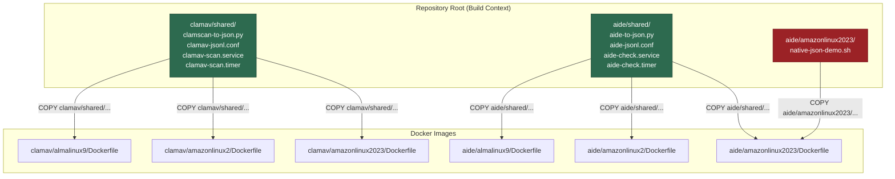

This page dissects the Dockerfile architecture that powers all six scanner images in this repository (2 scanners × 3 operating systems). The design revolves around three converging ideas: a **repository-root build context** that lets every Dockerfile reach shared assets, a **single-layer build philosophy** that keeps images lean, and a **multi-architecture download pattern** in the ClamAV images that selects the correct Cisco Talos RPM at build time using Docker's built-in `TARGETARCH` variable. Understanding these patterns is essential before modifying existing images or adding a new scanner/OS combination.

Sources: [CLAUDE.md](CLAUDE.md#L56-L63), [ci.yml](.github/workflows/ci.yml#L38-L39)

## The Repository-Root Build Context

Every Dockerfile in this project is built from the **repository root** as the Docker build context, not from its own directory. Both the CI pipeline and the local test runner invoke builds identically:

```
docker build -t almalinux9-clamav:latest -f clamav/almalinux9/Dockerfile .
#                                                          Dockerfile path ↑  ↑ build context = repo root
```

This is a deliberate architectural choice. Because the build context is `.` (the project root), every `COPY` instruction inside a Dockerfile can reference any file in the repository using its full relative path from root — including the cross-platform assets living in `<scanner>/shared/`. If each Dockerfile used its own directory as context, those shared files would be invisible during the build.

Sources: [ci.yml](.github/workflows/ci.yml#L39), [run-tests.sh](scripts/run-tests.sh#L54)

The following diagram shows how the build context flows into each image:



Notice the asymmetry: the AIDE Amazon Linux 2023 image receives **both** the shared Python parser and an OS-specific script (`native-json-demo.sh`) that demonstrates the order-sensitivity bug in AIDE 0.18.6's `report_format=json` config directive. Every other image copies exactly one shared asset — the JSON parser.

Sources: [clamav/almalinux9/Dockerfile](clamav/almalinux9/Dockerfile#L10), [aide/amazonlinux2023/Dockerfile](aide/amazonlinux2023/Dockerfile#L3-L4)

## Shared Assets: What Goes In vs. What Stays Out

Each scanner's `shared/` directory contains four to five files, but only a subset are copied into the Docker image. The distinction is critical: **build-time assets** (things needed inside the container at runtime) are `COPY`'d into the image, while **deployment-time assets** (things installed on the production host) remain in the repository for operators to deploy manually.

| Asset | Purpose | Copied into Image? | Used At |
|---|---|---|---|
| `aide-to-json.py` | Parses AIDE text output → JSON | ✅ Yes | Build time (`COPY`) |
| `clamscan-to-json.py` | Parses ClamAV text output → JSON | ✅ Yes | Build time (`COPY`) |
| `aide-check.service` / `aide-check.timer` | Systemd units for scheduled AIDE checks | ❌ No | Deployment time |
| `clamav-scan.service` / `clamav-scan.timer` | Systemd units for scheduled ClamAV scans | ❌ No | Deployment time |
| `aide-jsonl.conf` / `clamav-jsonl.conf` | Logrotate configuration for JSONL files | ❌ No | Deployment time |
| `native-json-demo.sh` | AIDE 0.18.6 native JSON reproducer | ✅ Yes (AL2023 only) | Build time (`COPY`) |

The JSON parsers are the only files that must exist inside the container because the container's job is to run a scanner, pipe its output through the parser, and produce structured JSON. The systemd units and logrotate configs are host-side concerns — they schedule scans and rotate log files on the machine where the scanner runs in production, not inside the Docker build environment.

Sources: [aide/almalinux9/Dockerfile](aide/almalinux9/Dockerfile#L3), [clamav/almalinux9/Dockerfile](clamav/almalinux9/Dockerfile#L10), [aide/shared/](aide/shared/), [clamav/shared/](clamav/shared/)

## Multi-Architecture Builds: The TARGETARCH Pattern

The ClamAV Dockerfiles for AlmaLinux 9 and Amazon Linux 2023 implement a multi-architecture build pattern that produces correct images for both `amd64` and `arm64` without any external tooling beyond `docker buildx`. The mechanism relies on Docker's automatic `TARGETARCH` build argument, which `buildx` populates based on the target platform.

Here is the full pattern as implemented in both files:

```dockerfile
# TARGETARCH is set by Docker buildx automatically (amd64 or arm64).
# Pick the matching Cisco Talos RPM. Only x86_64 and aarch64 are published.
ARG TARGETARCH
ARG CLAMAV_VERSION=1.5.2
ARG CLAMAV_SHA256_AMD64=9c7e0532e718b3aec294ec08be7fdbd39969d922bb7bb93cc06d1da890c39848
ARG CLAMAV_SHA256_ARM64=4e308f5df693b32c5ed5642e574efe18f8f61dcac2a3bfff8f33b4fafd3cf230
```

The key design decisions are:

1. **`ARG TARGETARCH`** is declared but never explicitly set — Docker buildx injects `amd64` or `arm64` automatically when building with `--platform linux/amd64` or `--platform linux/arm64`.

2. **Two separate SHA256 checksums** are declared as build args. This is necessary because Cisco Talos publishes distinct RPMs per architecture, each with a different hash.

3. **A `case` statement** in the `RUN` layer maps Docker's architecture naming (`amd64`/`arm64`) to the RPM filename conventions (`x86_64`/`aarch64`) and selects the matching checksum:

```dockerfile
RUN set -eux \
    && case "${TARGETARCH:-amd64}" in \
         amd64) RPM_ARCH=x86_64;  RPM_SHA=${CLAMAV_SHA256_AMD64} ;; \
         arm64) RPM_ARCH=aarch64; RPM_SHA=${CLAMAV_SHA256_ARM64} ;; \
         *) echo "Unsupported TARGETARCH: ${TARGETARCH}" >&2; exit 1 ;; \
       esac \
    && RPM_URL="https://github.com/Cisco-Talos/clamav/releases/download/clamav-${CLAMAV_VERSION}/clamav-${CLAMAV_VERSION}.linux.${RPM_ARCH}.rpm" \
    && wget -q "${RPM_URL}" -O /tmp/clamav.rpm \
    && echo "${RPM_SHA}  /tmp/clamav.rpm" | sha256sum -c - \
    ...
```

The `${TARGETARCH:-amd64}` default ensures the build still works with plain `docker build` (without `buildx`), defaulting to x86_64. The `sha256sum -c` verification ensures supply-chain integrity — if the downloaded RPM doesn't match the pinned hash, the build fails immediately.

Sources: [clamav/almalinux9/Dockerfile](clamav/almalinux9/Dockerfile#L3-L31), [clamav/amazonlinux2023/Dockerfile](clamav/amazonlinux2023/Dockerfile#L3-L31)

### Why Not All Images Use This Pattern

The multi-architecture pattern only appears in the two ClamAV Dockerfiles that install from Cisco Talos RPMs. The other four images don't need it for different reasons:

| Image | Package Source | Multi-Arch Needed? | Reason |
|---|---|---|---|
| ClamAV AlmaLinux 9 | Cisco Talos RPM (direct download) | ✅ Yes | RPM URL varies by architecture |
| ClamAV Amazon Linux 2023 | Cisco Talos RPM (direct download) | ✅ Yes | RPM URL varies by architecture |
| ClamAV Amazon Linux 2 | EPEL repository (`yum install`) | ❌ No | Package manager resolves arch automatically |
| AIDE AlmaLinux 9 | DNF repository (`dnf install`) | ❌ No | Package manager resolves arch automatically |
| AIDE Amazon Linux 2 | YUM repository (`yum install`) | ❌ No | Package manager resolves arch automatically |
| AIDE Amazon Linux 2023 | DNF repository (`dnf install`) | ❌ No | Package manager resolves arch automatically |

The pattern is only necessary when downloading architecture-specific artifacts directly. Native package managers (`dnf`, `yum`) already handle architecture resolution internally.

Sources: [clamav/amazonlinux2/Dockerfile](clamav/amazonlinux2/Dockerfile#L5-L6), [aide/almalinux9/Dockerfile](aide/almalinux9/Dockerfile#L5)

## Single-Layer Build Philosophy

Every Dockerfile in this repository chains all operations into a single `RUN` instruction using `&&`. This is not accidental — it serves two purposes:

1. **Layer minimization.** Each `RUN` instruction creates a new Docker layer. By consolidating package installation, file permissions, database initialization, and cleanup into one `RUN`, each image ends up with exactly two layers above the base: one `COPY` layer for the Python parser and one `RUN` layer for everything else.

2. **Cleanup effectiveness.** Because `dnf clean all` (or `yum clean all`) runs in the same layer that installs packages, the cleaned package cache never becomes part of the final image. If cleanup were in a separate `RUN`, the cached data would persist in an intermediate layer.

The AIDE images demonstrate this pattern at its most compact — the entire image build is three instructions:

```dockerfile
FROM almalinux:9

COPY aide/shared/aide-to-json.py /usr/local/bin/aide-to-json.py

RUN dnf install -y aide python3 \
    && chmod +x /usr/local/bin/aide-to-json.py \
    && aide --init -c /etc/aide.conf \
    && cp /var/lib/aide/aide.db.new.gz /var/lib/aide/aide.db.gz \
    && dnf clean all
```

The ClamAV images follow the same philosophy but are necessarily longer due to the architecture dispatch, RPM download, SHA256 verification, user creation, and virus definition update steps — all still within a single `RUN` layer.

Sources: [aide/almalinux9/Dockerfile](aide/almalinux9/Dockerfile#L1-L9), [clamav/almalinux9/Dockerfile](clamav/almalinux9/Dockerfile#L12-L31)

## AIDE Build-Time Database Initialization

All three AIDE Dockerfiles initialize the AIDE database during the image build itself. This is a significant design choice that affects how the containers behave at runtime:

```dockerfile
RUN ... \
    && aide --init -c /etc/aide.conf \
    && cp /var/lib/aide/aide.db.new.gz /var/lib/aide/aide.db.gz \
    ...
```

The `aide --init` command creates a baseline database of all file fingerprints at build time. The subsequent `cp` renames the "new" database to the active database name that `aide --check` expects. This means every container spawned from the image starts with a pre-built baseline — no initialization step is needed at first run.

There is a subtle trade-off: the baseline captures the container filesystem state at **build time**, not at **deployment time**. When the CI pipeline runs a smoke test and deliberately tampers with a file (e.g., `echo "tampered" > /tmp/ci-test-hack`), AIDE detects the change because it compares the current state against the build-time baseline. In production, this means the first check after deploying to a new host will likely report changes caused by container runtime differences (hostname files, `/etc/resolv.conf`, etc.) — this is documented as expected behavior in the test runner.

The Amazon Linux 2 variant omits the `-c /etc/aide.conf` flag from `aide --init` because its default AIDE package uses a different configuration path convention, while AlmaLinux 9 and Amazon Linux 2023 both require the explicit `-c /etc/aide.conf`.

Sources: [aide/almalinux9/Dockerfile](aide/almalinux9/Dockerfile#L7-L8), [aide/amazonlinux2/Dockerfile](aide/amazonlinux2/Dockerfile#L7-L8), [aide/amazonlinux2023/Dockerfile](aide/amazonlinux2023/Dockerfile#L8-L9)

## OS-Specific Package Installation Variations

Each of the three target operating systems has distinct package management characteristics that ripple through the Dockerfiles. The table below captures the key differences:

| Aspect | AlmaLinux 9 | Amazon Linux 2 | Amazon Linux 2023 |
|---|---|---|---|
| **Base image** | `almalinux:9` | `amazonlinux:2` | `amazonlinux:2023` |
| **Package manager** | `dnf` | `yum` | `dnf` |
| **ClamAV source** | Cisco Talos RPM (direct) | EPEL via `amazon-linux-extras` | Cisco Talos RPM (direct) |
| **ClamAV install** | `wget` + `dnf install /tmp/clamav.rpm` | `yum install clamav clamav-update` | `wget` + `dnf install /tmp/clamav.rpm` |
| **AIDE source** | DNF repo (AIDE 0.16) | YUM repo (AIDE 0.16.2) | DNF repo (AIDE 0.18.6) |
| **Extra packages needed** | `python3` (for parser) | `python3` (for parser) | `python3` (for parser) |
| **Clean command** | `dnf clean all` | `yum clean all` | `dnf clean all` |
| **ClamAV binary paths** | `/usr/local/bin/clamscan` | `/usr/bin/clamscan` (symlinked) | `/usr/local/bin/clamscan` |

The Amazon Linux 2 ClamAV Dockerfile has two unique quirks. First, it enables the EPEL repository via `amazon-linux-extras install -y epel` before installing ClamAV — this is the only image that requires a third-party repository. Second, it creates explicit symlinks (`ln -s /usr/bin/freshclam /usr/local/bin/freshclam`) because the EPEL package installs binaries to `/usr/bin/` while the Cisco Talos RPM installs to `/usr/local/bin/`. The symlink ensures that the shared systemd unit file's `ExecStartPre=/usr/local/bin/freshclam` path works across all three OS images without modification.

Sources: [clamav/amazonlinux2/Dockerfile](clamav/amazonlinux2/Dockerfile#L5-L11), [clamav/almalinux9/Dockerfile](clamav/almalinux9/Dockerfile#L19-L22), [aide/almalinux9/Dockerfile](aide/almalinux9/Dockerfile#L5)

## ClamAV Supply-Chain Integrity

The ClamAV images that download the Cisco Talos RPM implement a full download-verify-install pipeline within the single `RUN` layer:

```
wget → sha256sum verify → dnf install --allowerasing → rm RPM
```

The `--allowerasing` flag on `dnf install` is necessary because the Cisco Talos RPM may conflict with packages already present in the base image (typically `libxml2` or `openssl` library version mismatches). The flag tells DNF to resolve conflicts by removing conflicting packages if needed, rather than failing the build.

After installation succeeds, the RPM file is explicitly removed (`rm -f /tmp/clamav.rpm`) before the layer is committed, so the downloaded binary never bloats the final image. The virus definition database is then updated via `freshclam` using a minimal inline configuration:

```dockerfile
    && echo "DatabaseMirror database.clamav.net" > /usr/local/etc/freshclam.conf \
    && echo "DatabaseDirectory /var/lib/clamav" >> /usr/local/etc/freshclam.conf \
    && freshclam \
```

A dedicated `clamav` system user is created (`useradd -r -s /sbin/nologin clamav`) and given ownership of `/var/lib/clamav` so that `freshclam` can write definition updates when running under reduced privileges in production.

Sources: [clamav/almalinux9/Dockerfile](clamav/almalinux9/Dockerfile#L18-L31), [clamav/amazonlinux2023/Dockerfile](clamav/amazonlinux2023/Dockerfile#L18-L31)

## Adding a New Scanner or OS: Checklist

When extending this repository with a new scanner or operating system, follow the established conventions to maintain consistency:

**Adding a new OS for an existing scanner** (e.g., Ubuntu 24.04 for ClamAV):

1. Create `<scanner>/ubuntu2404/Dockerfile` using `FROM ubuntu:24.04`
2. `COPY` the shared Python parser from `<scanner>/shared/`
3. Use a single `RUN` layer with `&&` chaining
4. Install the scanner and `python3` via the OS package manager
5. Run `chmod +x` on the copied parser
6. If downloading architecture-specific binaries, implement the `TARGETARCH` pattern with pinned SHA256 checksums
7. Clean the package manager cache in the same `RUN` layer
8. Add the new OS to the matrix in [ci.yml](.github/workflows/ci.yml) and the arrays in [run-tests.sh](scripts/run-tests.sh)

**Adding a new scanner** (e.g., Lynis):

1. Create `lynis/shared/` with the JSON parser, systemd units, and logrotate config
2. Create `lynis/<os>/Dockerfile` for each supported OS
3. Each Dockerfile should `COPY` only the parser into the image
4. Systemd units and logrotate configs remain outside the image for host-side deployment
5. Add build and test jobs to the CI matrix

Sources: [run-tests.sh](scripts/run-tests.sh#L10-L11), [ci.yml](.github/workflows/ci.yml#L24-L34)

## Pattern Comparison Summary

The following table provides a side-by-side comparison of all six Dockerfiles, highlighting where patterns converge and where they diverge:

| Pattern | AIDE AL9 | AIDE AL2 | AIDE AL2023 | ClamAV AL9 | ClamAV AL2 | ClamAV AL2023 |
|---|---|---|---|---|---|---|
| Base image | `almalinux:9` | `amazonlinux:2` | `amazonlinux:2023` | `almalinux:9` | `amazonlinux:2` | `amazonlinux:2023` |
| Lines in Dockerfile | 9 | 9 | 10 | 31 | 11 | 31 |
| Uses `TARGETARCH` | — | — | — | ✅ | — | ✅ |
| Shared parser `COPY` | 1 | 1 | 1 | 1 | 1 | 1 |
| OS-specific `COPY` | — | — | 1 | — | — | — |
| Package manager | `dnf` | `yum` | `dnf` | `dnf` | `yum` | `dnf` |
| Direct RPM download | — | — | — | ✅ | — | ✅ |
| SHA256 verification | — | — | — | ✅ | — | ✅ |
| DB init at build | ✅ | ✅ | ✅ | — | — | — |
| Binary path symlinks | — | — | — | — | ✅ | — |
| Freshclam at build | — | — | — | ✅ | ✅ | ✅ |

Sources: [aide/almalinux9/Dockerfile](aide/almalinux9/Dockerfile), [aide/amazonlinux2/Dockerfile](aide/amazonlinux2/Dockerfile), [aide/amazonlinux2023/Dockerfile](aide/amazonlinux2023/Dockerfile), [clamav/almalinux9/Dockerfile](clamav/almalinux9/Dockerfile), [clamav/amazonlinux2/Dockerfile](clamav/amazonlinux2/Dockerfile), [clamav/amazonlinux2023/Dockerfile](clamav/amazonlinux2023/Dockerfile)

## Next Steps

- **Understand the exact binary paths and version differences** across all three operating systems → [Cross-OS Comparison: Binary Paths, Package Sources, and Version Matrix](16-cross-os-comparison-binary-paths-package-sources-and-version-matrix)
- **See how these images are built and tested in CI** → [GitHub Actions CI Pipeline: Parallel Builds, Smoke Tests, and Artifact Upload](17-github-actions-ci-pipeline-parallel-builds-smoke-tests-and-artifact-upload)
- **Understand the JSON parsers that run inside these images** → [ClamAV JSON Parser: Text-to-Structured Output (clamscan-to-json.py)](6-clamav-json-parser-text-to-structured-output-clamscan-to-json-py) and [AIDE JSON Parser: Parsing Multi-Section Integrity Reports (aide-to-json.py)](9-aide-json-parser-parsing-multi-section-integrity-reports-aide-to-json-py)