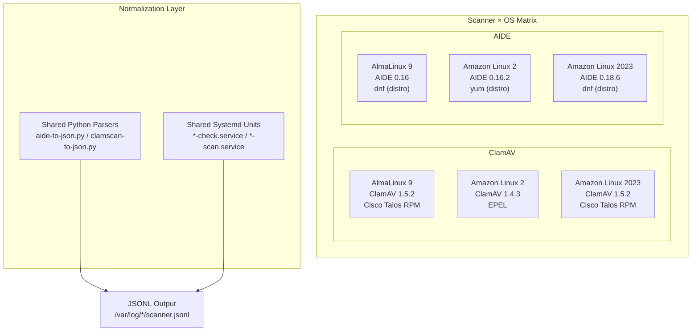
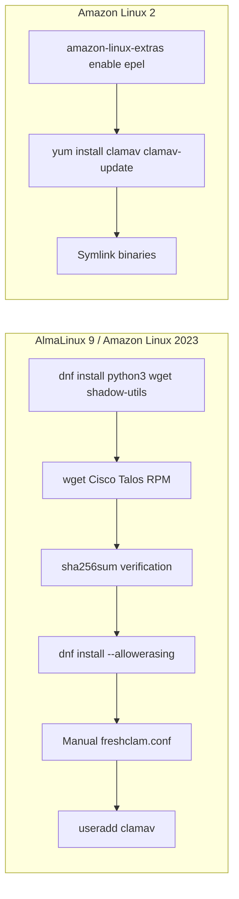

This page provides a consolidated reference for how the two scanners — **AIDE** and **ClamAV** — differ across the three supported operating systems. It covers binary installation paths, package sources, version pinning strategies, configuration file locations, and the architectural decisions that normalize these differences into a single, SIEM-ready JSON output pipeline. Understanding this matrix is essential for anyone extending the project to a new OS or debugging path-related failures in the shared systemd service units.

Sources: [CLAUDE.md](CLAUDE.md#L1-L156), [README.md](README.md#L1-L200)

## The Three-Dimension Matrix

The project tests every scanner against three Linux distributions, producing six Docker images in total. Each dimension introduces variation in package manager, glibc version, repository availability, and default filesystem layout.



The **normalization layer** — the shared Python parsers and systemd unit files — is what makes the matrix manageable. Despite binary paths and versions diverging across OSes, every image produces identically structured JSON output.

Sources: [CLAUDE.md](CLAUDE.md#L54-L76), [TEST-RESULTS-BREAKDOWN.md](TEST-RESULTS-BREAKDOWN.md#L43-L50)

## Version Matrix

### AIDE Versions

| Property | AlmaLinux 9 | Amazon Linux 2 | Amazon Linux 2023 |
|----------|:-----------:|:--------------:|:-----------------:|
| **AIDE Version** | 0.16 | 0.16.2 | 0.18.6 |
| **Install Method** | `dnf install aide` | `yum install aide` | `dnf install aide` |
| **Package Source** | Distro repos (AppStream) | Distro repos (amzn2-core) | Distro repos (amazonlinux) |
| **Init Command** | `aide --init -c /etc/aide.conf` | `aide --init` | `aide --init -c /etc/aide.conf` |
| **Native JSON** | No | No | Yes (`report_format=json`) |
| **Multi-threaded** | No | No | Yes (`--workers=N`) |
| **Default Hash** | SHA512 | SHA256 | SHA256/SHA512 |

The version jump from 0.16.x to 0.18.6 on Amazon Linux 2023 is significant. AIDE 0.18 added the `report_format` config directive, multi-threaded scanning, and several additional hash algorithms (GOST, Whirlpool, Stribog). The 0.16.x versions on AlmaLinux 9 and Amazon Linux 2 lack all of these features.

Sources: [aide/README.md](aide/README.md#L26-L55), [aide/almalinux9/Dockerfile](aide/almalinux9/Dockerfile#L1-L10), [aide/amazonlinux2/Dockerfile](aide/amazonlinux2/Dockerfile#L1-L10), [aide/amazonlinux2023/Dockerfile](aide/amazonlinux2023/Dockerfile#L1-L11)

### ClamAV Versions

| Property | AlmaLinux 9 | Amazon Linux 2 | Amazon Linux 2023 |
|----------|:-----------:|:--------------:|:-----------------:|
| **ClamAV Version** | 1.5.2 | 1.4.3 | 1.5.2 |
| **Install Method** | Cisco Talos RPM (wget + dnf) | EPEL via `amazon-linux-extras` | Cisco Talos RPM (wget + dnf) |
| **Version Pinning** | `ARG CLAMAV_VERSION=1.5.2` | Latest EPEL | `ARG CLAMAV_VERSION=1.5.2` |
| **`--json` Support** | No | No | No |
| **Scan Time (4 files)** | ~8.8 sec | ~14.6 sec | ~8.2 sec |
| **Data Format** | KiB | MB | KiB |

The ClamAV version split is driven by a **glibc constraint**: the Cisco Talos RPM requires glibc ≥ 2.28, but Amazon Linux 2 ships glibc 2.26. AL2 is therefore locked to the EPEL package at version 1.4.3. AlmaLinux 9 and Amazon Linux 2023 both use the Cisco Talos RPM, pinned to version 1.5.2 via a build argument with SHA-256 verification.

Sources: [clamav/README.md](clamav/README.md#L80-L110), [clamav/almalinux9/Dockerfile](clamav/almalinux9/Dockerfile#L1-L32), [clamav/amazonlinux2/Dockerfile](clamav/amazonlinux2/Dockerfile#L1-L12), [clamav/amazonlinux2023/Dockerfile](clamav/amazonlinux2023/Dockerfile#L1-L32), [TEST-RESULTS-BREAKDOWN.md](TEST-RESULTS-BREAKDOWN.md#L153-L164)

## Binary Paths and the Symlink Strategy

### ClamAV Binary Divergence

The Cisco Talos RPM installs binaries to `/usr/local/bin/`, while the EPEL package installs to `/usr/bin/`. The shared systemd service unit hardcodes `/usr/local/bin/clamscan` and `/usr/local/bin/freshclam`:

```
ExecStartPre=/usr/local/bin/freshclam --quiet
ExecStart=/bin/bash -c '/usr/local/bin/clamscan -r / | /usr/local/bin/clamscan-to-json.py'
```

On Amazon Linux 2, the EPEL package places binaries at `/usr/bin/clamscan` and `/usr/bin/freshclam`. The Dockerfile resolves this with explicit symlinks:

```dockerfile
RUN ln -s /usr/bin/freshclam /usr/local/bin/freshclam \
    && ln -s /usr/bin/clamscan /usr/local/bin/clamscan
```

| OS | `clamscan` Path | `freshclam` Path | Symlink Needed? |
|----|-----------------|-------------------|:---------------:|
| AlmaLinux 9 | `/usr/local/bin/clamscan` | `/usr/local/bin/freshclam` | No |
| Amazon Linux 2 | `/usr/bin/clamscan` → `/usr/local/bin/clamscan` | `/usr/bin/freshclam` → `/usr/local/bin/freshclam` | **Yes** |
| Amazon Linux 2023 | `/usr/local/bin/clamscan` | `/usr/local/bin/freshclam` | No |

### ClamAV Configuration Paths

The Cisco Talos RPM and EPEL package also differ in where they expect `freshclam.conf`. The AL9 and AL2023 Dockerfiles manually create this file at `/usr/local/etc/freshclam.conf`, while AL2's EPEL package uses `/etc/freshclam.conf` out of the box.

| OS | `freshclam.conf` Path | Created in Dockerfile? |
|----|----------------------|:---------------------:|
| AlmaLinux 9 | `/usr/local/etc/freshclam.conf` | Yes (echo + redirect) |
| Amazon Linux 2 | `/etc/freshclam.conf` | No (EPEL provides it) |
| Amazon Linux 2023 | `/usr/local/etc/freshclam.conf` | Yes (echo + redirect) |

### AIDE Binary Paths

AIDE is more consistent across OSes. All three distros install the binary to `/usr/sbin/aide`, configuration to `/etc/aide.conf`, and the database to `/var/lib/aide/aide.db.gz`. The shared systemd service unit uses the full path `/usr/sbin/aide`:

```
ExecStart=/bin/bash -c '/usr/sbin/aide -C 2>&1 | /usr/local/bin/aide-to-json.py'
```

| OS | `aide` Binary | Config | Database |
|----|---------------|--------|----------|
| AlmaLinux 9 | `/usr/sbin/aide` | `/etc/aide.conf` | `/var/lib/aide/aide.db.gz` |
| Amazon Linux 2 | `/usr/sbin/aide` | `/etc/aide.conf` | `/var/lib/aide/aide.db.gz` |
| Amazon Linux 2023 | `/usr/sbin/aide` | `/etc/aide.conf` | `/var/lib/aide/aide.db.gz` |

One subtle difference is the `--init` command. AlmaLinux 9 and Amazon Linux 2023 explicitly pass `-c /etc/aide.conf`, while Amazon Linux 2 omits it and relies on the compiled-in default. This is captured in each Dockerfile's `RUN` instruction.

Sources: [clamav/almalinux9/Dockerfile](clamav/almalinux9/Dockerfile#L19-L31), [clamav/amazonlinux2/Dockerfile](clamav/amazonlinux2/Dockerfile#L5-L11), [clamav/amazonlinux2023/Dockerfile](clamav/amazonlinux2023/Dockerfile#L19-L31), [clamav/shared/clamav-scan.service](clamav/shared/clamav-scan.service#L12-L16), [aide/shared/aide-check.service](aide/shared/aide-check.service#L12), [aide/almalinux9/Dockerfile](aide/almalinux9/Dockerfile#L5-L9), [aide/amazonlinux2/Dockerfile](aide/amazonlinux2/Dockerfile#L5-L9), [aide/amazonlinux2023/Dockerfile](aide/amazonlinux2023/Dockerfile#L6-L10)

## Package Source Breakdown

### AIDE — Distro Repositories Only

All three OSes install AIDE from their native package repositories. There is no third-party RPM or manual download. The package manager difference reflects each OS generation:

| OS | Package Manager | Command |
|----|----------------|---------|
| AlmaLinux 9 | `dnf` | `dnf install -y aide python3` |
| Amazon Linux 2 | `yum` | `yum install -y aide python3` |
| Amazon Linux 2023 | `dnf` | `dnf install -y aide python3` |

Amazon Linux 2 is the only distribution that still uses `yum`. The Dockerfile for AL2 uses `yum clean all` instead of `dnf clean all` for cache cleanup, reflecting the older package management stack.

### ClamAV — Two Distinct Sources

ClamAV introduces a **bifurcated install strategy** that accounts for most of the cross-OS complexity:



The **Cisco Talos RPM path** (AL9, AL2023) is significantly more involved: it requires `shadow-utils` for the `useradd` command, `--allowerasing` to resolve a `libcurl`/`libcurl-minimal` conflict, manual creation of `freshclam.conf`, and manual creation of the `clamav` system user. The payoff is version 1.5.2 with the latest CVE fixes and multi-architecture support via the `TARGETARCH` build argument.

The **EPEL path** (AL2) is simpler — a two-line install — but delivers the older 1.4.3 version and lacks `TARGETARCH` multi-architecture support. The version is also unpinned; it installs whatever is current in the EPEL repository at build time.

Sources: [clamav/almalinux9/Dockerfile](clamav/almalinux9/Dockerfile#L5-L31), [clamav/amazonlinux2/Dockerfile](clamav/amazonlinux2/Dockerfile#L5-L11), [clamav/amazonlinux2023/Dockerfile](clamav/amazonlinux2023/Dockerfile#L5-L31), [clamav/README.md](clamav/README.md#L92-L109)

## Version Pinning and Verification

### ClamAV — Explicit Pinning with SHA-256 Verification

The AL9 and AL2023 Dockerfiles pin ClamAV using three `ARG` directives and a runtime SHA-256 check:

```dockerfile
ARG CLAMAV_VERSION=1.5.2
ARG CLAMAV_SHA256_AMD64=9c7e0532e718b3aec294ec08be7fdbd39969d922bb7bb93cc06d1da890c39848
ARG CLAMAV_SHA256_ARM64=4e308f5df693b32c5ed5642e574efe18f8f61dcac2a3bfff8f33b4fafd3cf230
```

The build selects the correct hash based on Docker's built-in `TARGETARCH` variable, downloads the matching RPM, and verifies integrity before installation. This ensures reproducible builds and protects against supply-chain tampering.

### AIDE — Implicit Versioning

AIDE versions are determined entirely by what each distro's repository ships. There is no version pinning — `dnf install aide` installs the current repository version. The resulting versions (0.16, 0.16.2, 0.18.6) are a natural consequence of each distribution's package lifecycle, not an explicit project choice.

### Summary Table

| Component | Pinning Strategy | Verification | Reproducibility |
|-----------|-----------------|-------------|:---------------:|
| ClamAV (AL9, AL2023) | `ARG CLAMAV_VERSION` | SHA-256 checksum | High |
| ClamAV (AL2) | None (EPEL latest) | None | Low |
| AIDE (all OSes) | None (distro latest) | None | Low |
| Python parser | stdlib only | No dependencies needed | High |

Sources: [clamav/almalinux9/Dockerfile](clamav/almalinux9/Dockerfile#L5-L22), [clamav/amazonlinux2023/Dockerfile](clamav/amazonlinux2023/Dockerfile#L5-L22)

## Feature Differences by Version

### AIDE Feature Matrix (0.16 vs 0.16.2 vs 0.18.6)

The AIDE version spread — 0.16 to 0.18.6 — spans a major feature release boundary. The following table catalogs the capabilities available (or absent) on each OS:

| Feature | AL9 (0.16) | AL2 (0.16.2) | AL2023 (0.18.6) |
|---------|:----------:|:------------:|:---------------:|
| `report_format=json` config | ❌ Unknown expression | ❌ Unknown expression | ✅ (order-sensitive) |
| Multi-threaded scan | ❌ | ❌ | ✅ `--workers=N` |
| Hash: MD5, SHA1, SHA256, SHA512 | ✅ | ✅ | ✅ |
| Hash: CRC32, Whirlpool, GOST | ❌ | ❌ | ✅ |
| Hash: Stribog256, Stribog512 | ❌ | ❌ | ✅ |
| Inode tracking by default | No | No | Yes |
| `-c` config flag required | Yes | No (compiled default) | Yes |
| Default hash algorithm | SHA512 | SHA256 | SHA256/SHA512 |

The expanded hash algorithm set on AL2023 means that AIDE database integrity checks produce richer fingerprints. The tradeoff is that Docker baseline comparisons show more changed entries on AL2023 (59 changes vs. 3–12 on other OSes) because inode/ctime tracking detects Docker's layer-copy filesystem modifications.

### ClamAV Feature Matrix (1.4.3 vs 1.5.2)

| Feature | AL2 (1.4.3) | AL9/AL2023 (1.5.2) |
|---------|:-----------:|:-------------------:|
| `--json` CLI flag | ❌ | ❌ |
| `--no-summary` flag | ✅ | ✅ |
| Data size format | `0.00 MB` | `2.26 KiB` |
| Scan performance (4 files) | ~14.6 sec | ~8.2–8.8 sec |
| Multi-arch RPM | ❌ (x86_64 only EPEL) | ✅ `TARGETARCH` |

None of the tested builds compile in `--json` support, which is why the Python parser exists as the universal normalization layer. The performance difference — nearly 2× slower on AL2 — is attributable to the older glibc and ClamAV engine version rather than OS overhead.

Sources: [aide/README.md](aide/README.md#L26-L55), [TEST-RESULTS-BREAKDOWN.md](TEST-RESULTS-BREAKDOWN.md#L260-L287), [clamav/README.md](clamav/README.md#L78-L91)

## Normalization: How the Project Bridges the Gaps

The key architectural insight is that **binary path divergence is an OS-layer concern, but JSON schema uniformity is a project-layer guarantee**. Three mechanisms enforce this:

**1. Symlinks for Path Normalization.** The Amazon Linux 2 Dockerfile creates symlinks so that the shared systemd service unit's hardcoded `/usr/local/bin/clamscan` path resolves correctly on an OS where the binary actually lives at `/usr/bin/clamscan`. This keeps the service unit OS-agnostic.

**2. Shared Python Parsers.** Both `clamscan-to-json.py` and `aide-to-json.py` read from stdin and emit identically structured JSON regardless of which OS produced the scanner output. The parsers handle version-specific output variations (like AIDE 0.18.6's additional hash algorithms) transparently. Each parser enriches the output with `hostname`, `timestamp`, and `scanner` fields that the native scanner output does not include.

**3. Shared Systemd Units.** The service and timer files in each `shared/` directory are written once and deployed across all three OSes. The `aide-check.service` uses `/usr/sbin/aide` (consistent across OSes), and the `clamav-scan.service` uses `/usr/local/bin/clamscan` (made consistent via symlinks on AL2).

| Normalization Target | Mechanism | Files Affected |
|---------------------|-----------|---------------|
| ClamAV binary path | Symlinks on AL2 | [clamav/amazonlinux2/Dockerfile](clamav/amazonlinux2/Dockerfile#L8-L9) |
| JSON output schema | Shared Python parsers | [clamav/shared/clamscan-to-json.py](clamav/shared/clamscan-to-json.py#L1-L81), [aide/shared/aide-to-json.py](aide/shared/aide-to-json.py#L1-L231) |
| Systemd ExecStart paths | Symlinks + shared units | [clamav/shared/clamav-scan.service](clamav/shared/clamav-scan.service#L12-L16), [aide/shared/aide-check.service](aide/shared/aide-check.service#L12) |
| Log file paths | Consistent across OSes | `/var/log/clamav/clamscan.jsonl`, `/var/log/aide/aide.jsonl` |

Sources: [clamav/amazonlinux2/Dockerfile](clamav/amazonlinux2/Dockerfile#L8-L9), [clamav/shared/clamscan-to-json.py](clamav/shared/clamscan-to-json.py#L53-L80), [aide/shared/aide-to-json.py](aide/shared/aide-to-json.py#L200-L231), [CLAUDE.md](CLAUDE.md#L54-L76)

## CI Matrix: Building All Six Images

The GitHub Actions pipeline at `.github/workflows/ci.yml` exercises the full 2×3 matrix in parallel. Two matrix jobs — `build-clamav` and `build-aide` — each iterate over the three OS directories. A separate `verify-aide-native-json-al2023` job tests the AL2023-only native JSON feature:

| CI Job | Matrix Combinations | Key Verification |
|--------|:-------------------:|-----------------|
| `build-clamav` | 3 (AL9, AL2, AL2023) | `clamscan --version`, scan + JSON output, JSONL validation |
| `build-aide` | 3 (AL9, AL2, AL2023) | `aide --version`, check + JSON output, JSONL validation |
| `verify-aide-native-json-al2023` | 1 (AL2023 only) | `report_format=json` produces valid JSON, demo script |

The `fail-fast: false` strategy ensures that a failure on one OS does not cancel the remaining builds, giving full visibility into which OS-scanner combinations pass or fail.

Sources: [.github/workflows/ci.yml](.github/workflows/ci.yml#L19-L196)

## Adding a New OS: Checklist

When extending this project to a new Linux distribution, the following points from the cross-OS matrix must be addressed:

1. **Binary paths** — Determine where the package installs `clamscan`, `freshclam`, and `aide`. If they differ from `/usr/local/bin/` or `/usr/sbin/`, add symlinks or modify the shared service units.
2. **Package source** — Decide between distro repos, EPEL, or a third-party RPM. Verify glibc compatibility for the Cisco Talos RPM if targeting ClamAV 1.5.2+.
3. **Version pinning** — If using a downloaded RPM, add `ARG` directives with SHA-256 checksums. If using distro repos, document the expected version.
4. **Init command** — AIDE may or may not require an explicit `-c /etc/aide.conf` flag. Test both forms.
5. **Service compatibility** — Confirm that the shared systemd service unit's `ExecStart` paths resolve correctly. Add symlinks if needed.
6. **Hash algorithms** — AIDE's default `aide.conf` may configure different hash algorithms, affecting baseline database size and comparison output.
7. **CI integration** — Add the new OS to both matrix jobs in `.github/workflows/ci.yml`.

Sources: [CLAUDE.md](CLAUDE.md#L115-L155), [scripts/run-tests.sh](scripts/run-tests.sh#L10-L11)

## Related Pages

- [Dockerfile Patterns: Multi-Architecture Builds and Shared Assets](15-dockerfile-patterns-multi-architecture-builds-and-shared-assets) — How the Dockerfiles are structured to support the cross-OS matrix
- [Understanding ClamAV OS-Specific Install Methods and Gotchas](5-understanding-clamav-os-specific-install-methods-and-gotchas) — Deep dive into the EPEL vs. Cisco Talos RPM decision
- [Understanding AIDE Versions, Stateful Workflow, and OS Differences](8-understanding-aide-versions-stateful-workflow-and-os-differences) — How AIDE 0.16.x and 0.18.6 differ in behavior
- [GitHub Actions CI Pipeline: Parallel Builds, Smoke Tests, and Artifact Upload](17-github-actions-ci-pipeline-parallel-builds-smoke-tests-and-artifact-upload) — How the CI exercises the full matrix
- [Project Structure and File Organization](22-project-structure-and-file-organization) — Where each file lives in the repository hierarchy