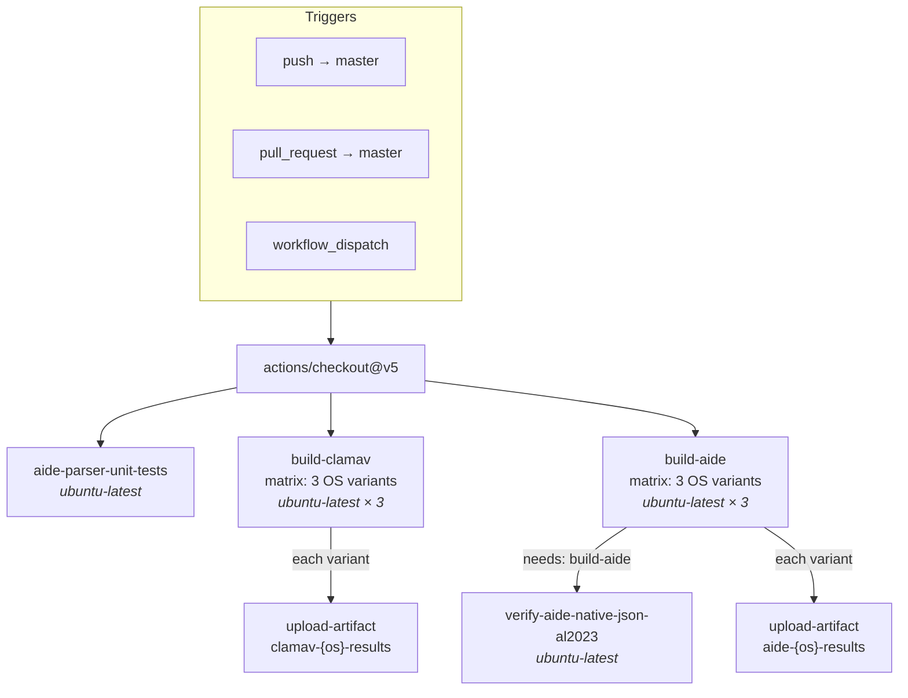
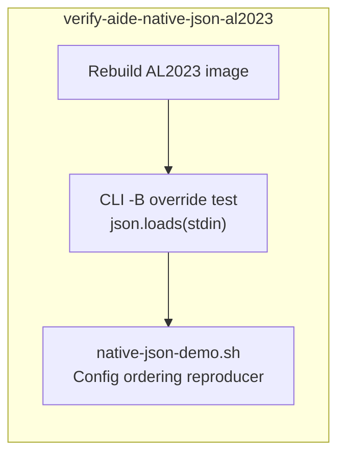
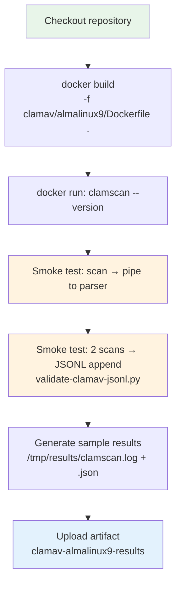

The repository's CI pipeline, defined in a single workflow file, validates every push and pull request against the `master` branch by building **six Docker images** (two scanners × three operating systems), running targeted smoke tests inside each container, and uploading sample results as downloadable artifacts. The pipeline operates on a straightforward contract: if any scanner parser produces malformed JSON, any Docker build fails, or any OS-specific binary behaves unexpectedly, the entire run fails fast and visibly. This page dissects that pipeline — its job topology, its testing strategy, and the validation scripts that make smoke tests trustworthy.

Sources: [ci.yml](.github/workflows/ci.yml#L1-L196)

## Pipeline Architecture: Four Independent Jobs

The workflow is triggered by three events: pushes to `master`, pull requests targeting `master`, and manual `workflow_dispatch` invocations. It fans out into **four top-level jobs** that run in parallel (with one deliberate exception). Three of the four jobs have zero dependencies — they begin simultaneously the moment the checkout completes. The fourth job, `verify-aide-native-json-al2023`, depends on `build-aide` succeeding, because it re-uses the same Docker image for an additional AIDE-specific verification.

Sources: [ci.yml](.github/workflows/ci.yml#L1-L9)

### Job Summary Table

| Job Name | Runner | Matrix Size | Depends On | Purpose |
|---|---|---|---|---|
| `aide-parser-unit-tests` | `ubuntu-latest` | 1 (no matrix) | — | Pure-Python parser regression tests |
| `build-clamav` | `ubuntu-latest` | 3 OS variants | — | Build, smoke test, generate ClamAV results |
| `build-aide` | `ubuntu-latest` | 3 OS variants | — | Build, smoke test, generate AIDE results |
| `verify-aide-native-json-al2023` | `ubuntu-latest` | 1 | `build-aide` | Verify AIDE 0.18.6 native JSON output on AL2023 |

The **matrix strategy** for both `build-clamav` and `build-aide` uses `fail-fast: false`, meaning all six matrix variants run to completion regardless of whether sibling variants fail. This is critical for a multi-OS project: a failure on AlmaLinux 9 should not prevent observing whether Amazon Linux 2023 also fails, since the root causes are almost always OS-specific packaging or path differences.

Sources: [ci.yml](.github/workflows/ci.yml#L10-L24), [ci.yml](.github/workflows/ci.yml#L97-L112)

## Job 1: AIDE Parser Unit Tests

This is the lightest job in the pipeline — it requires no Docker, no network access, and no container builds. It runs the pure-Python test script `scripts/test-aide-parser.py`, which feeds a carefully crafted multi-line AIDE text fixture into the parser and validates that the output JSON matches expectations. The fixture covers edge cases that are difficult to trigger reliably inside Docker containers: multi-line ACL continuation values, SHA256/SHA512 hash values that span multiple lines, and the regression from issue #8 where ACL continuation lines were mistakenly parsed as standalone "attribute: A" entries.

Sources: [ci.yml](.github/workflows/ci.yml#L11-L17), [test-aide-parser.py](scripts/test-aide-parser.py#L1-L141)

Because this job runs on `ubuntu-latest` with only `actions/checkout@v5` as a prerequisite, it completes in seconds. Its fast feedback makes it the first signal of parser regressions — long before the heavier Docker-based jobs finish building images.

Sources: [ci.yml](.github/workflows/ci.yml#L11-L17)

## Job 2: ClamAV Build, Smoke Test, and Results

The `build-clamav` job uses a matrix with three OS variants. Each variant builds its own Docker image, then executes a four-stage validation sequence: version verification, JSON output smoke test, JSONL append validation, and sample results generation.

Sources: [ci.yml](.github/workflows/ci.yml#L19-L95)

### Matrix Configuration

| Matrix Variable | AlmaLinux 9 | Amazon Linux 2 | Amazon Linux 2023 |
|---|---|---|---|
| `os-dir` | `almalinux9` | `amazonlinux2` | `amazonlinux2023` |
| `os-label` | AlmaLinux 9 | Amazon Linux 2 | Amazon Linux 2023 |
| `image-tag` | `almalinux9-clamav` | `amazonlinux2-clamav` | `amazonlinux2023-clamav` |

Each variant follows an identical step sequence. The **Build image** step constructs the Docker image using the OS-specific Dockerfile (e.g., `clamav/almalinux9/Dockerfile`). The **Verify ClamAV version** step runs `clamscan --version` inside the container to confirm the binary is functional and report its version — this catches the common failure mode where a package repository returns a different or broken ClamAV version.

Sources: [ci.yml](.github/workflows/ci.yml#L36-L42)

### Smoke Test: JSON Output

The first smoke test runs `clamscan` against four innocuous system files (`/etc/hostname`, `/etc/hosts`, `/etc/passwd`, `/etc/resolv.conf`) and pipes the raw text output through `clamscan-to-json.py`. If the parser fails or produces invalid JSON, the step exits with a non-zero code, failing the job. This test exercises the **core scanner-to-JSON pipeline** end-to-end inside the container.

Sources: [ci.yml](.github/workflows/ci.yml#L44-L50)

### Smoke Test: JSONL Append and Validation

The second smoke test is more nuanced. It runs two consecutive scans (scanning different file sets each time), each piped through the parser, which appends one JSON line per scan to `/var/log/clamav/clamscan.jsonl`. It then invokes `validate-clamav-jsonl.py` with an expected line count of `2`. The validation script confirms that exactly two lines exist, that each line is valid JSON, and that each contains a `hostname` field and a `file_results` array. This catches a class of bugs where the parser might corrupt subsequent lines during append, or where the JSONL file accumulates stale data from previous runs.

Sources: [ci.yml](.github/workflows/ci.yml#L52-L59), [validate-clamav-jsonl.py](scripts/validate-clamav-jsonl.py#L1-L27)

### Sample Results and Artifact Upload

After smoke tests pass, the job generates human-readable sample output — both raw `clamscan` text (with and without `--no-summary`) and parsed JSON — and writes them to `/tmp/results/` on the host via a bind mount. These results are uploaded as GitHub Actions artifacts with a 30-day retention period. The artifact names follow the pattern `clamav-{os-dir}-results` (e.g., `clamav-almalinux9-results`).

Sources: [ci.yml](.github/workflows/ci.yml#L61-L95)

## Job 3: AIDE Build, Smoke Test, and Results

The `build-aide` job mirrors the ClamAV structure but with AIDE-specific adaptations. The key difference is AIDE's **stateful database model**: AIDE compares the current filesystem against a previously initialized database, so smoke tests must account for baseline changes that Docker containers naturally produce (hostname changes, `resolv.conf` modifications, package installation artifacts).

Sources: [ci.yml](.github/workflows/ci.yml#L97-L175)

### Smoke Test: JSONL Append and Change Detection

The AIDE JSONL smoke test performs two `aide -C` checks. The first captures the "clean" check output (which may still show changes from container initialization). The second deliberately introduces a tampered file (`echo "tampered" > /tmp/ci-test-hack`) to force detectable change output. After both checks, `validate-aide-jsonl.py` verifies exactly two JSONL lines, each containing `scanner`, `result`, `hostname`, and `timestamp` fields.

Sources: [ci.yml](.github/workflows/ci.yml#L129-L137), [validate-aide-jsonl.py](scripts/validate-aide-jsonl.py#L1-L29)

### Tamper Simulation Strategy

The sample results generation step uses a two-phase approach: a **clean check** followed by a **tampered check** that both creates a new file and modifies permissions on `/etc/resolv.conf` (`chmod 777`). This dual-action tampering ensures that AIDE detects both file additions and permission changes, producing richer output for the sample results. The raw log and parsed JSON are written to `/tmp/results/` and uploaded as artifacts with names like `aide-almalinux9-results`.

Sources: [ci.yml](.github/workflows/ci.yml#L139-L175)

## Job 4: Native JSON Verification for AIDE on Amazon Linux 2023

This job is architecturally distinct from the other three. It depends on `build-aide` (via the `needs:` directive) and performs **AIDE 0.18.6-specific validation** that only applies to Amazon Linux 2023, where AIDE supports native JSON output via `report_format=json`. The job has two steps.

Sources: [ci.yml](.github/workflows/ci.yml#L177-L196)

**Step 1 — Native JSON via CLI `-B` override**: It tampers with `/etc/passwd`, then runs `aide --check -B "report_format=json"` and pipes the output through Python's `json.loads()` to confirm the native JSON is syntactically valid. This verifies that the `-B` command-line override mechanism works correctly.

**Step 2 — Config ordering reproducer**: It runs the `native-json-demo.sh` script, which demonstrates the subtle **config directive ordering bug** in AIDE 0.18.6: appending `report_format=json` to the end of `aide.conf` has no effect because AIDE binds the report format to each `report_url=` at declaration time. The script tests multiple configuration approaches and confirms which ones produce JSON output versus plain text.

Sources: [ci.yml](.github/workflows/ci.yml#L187-L196), [native-json-demo.sh](aide/amazonlinux2023/native-json-demo.sh#L1-L68)

## CI vs Local Testing: Parallel Toolchains

The CI pipeline and the local test runner (`scripts/run-tests.sh`) cover overlapping but intentionally different territory. Understanding their relationship clarifies when to rely on each.

Sources: [ci.yml](.github/workflows/ci.yml#L1-L196), [run-tests.sh](scripts/run-tests.sh#L1-L183)

| Aspect | GitHub Actions CI | Local `run-tests.sh` |
|---|---|---|
| **Scope** | Build, smoke test, validate, upload artifacts | Build, scan, generate report |
| **Validation** | Inline JSONL validation per container | No inline validation (relies on visual inspection) |
| **Output location** | GitHub Actions artifacts (30-day retention) | Local `*/results/` directories |
| **Report generation** | Not performed | Calls `generate-report.sh` to produce `TEST-RESULTS-BREAKDOWN.md` |
| **Native JSON test** | Dedicated job for AL2023 | Not included |
| **Selective runs** | All jobs always run (no filtering) | Supports `--scanner`, `--os`, `--build-only` flags |
| **Runner** | Clean `ubuntu-latest` VM | Whatever host runs the script |

The CI pipeline intentionally does **not** call `generate-report.sh` because the report is designed for local consumption with detailed per-OS breakdowns. CI focuses on binary pass/fail validation: either the parser produces valid JSON or it does not.

Sources: [run-tests.sh](scripts/run-tests.sh#L174-L182)

## JSONL Validation Scripts: The Gatekeepers

Both validation scripts (`validate-clamav-jsonl.py` and `validate-aide-jsonl.py`) follow an identical structural pattern. They accept a file path and an expected line count, assert the line count matches, then validate each line independently. The scripts exit with code `1` on any failure, which causes the enclosing `docker run` command to fail, which in turn fails the GitHub Actions step.

Sources: [validate-clamav-jsonl.py](scripts/validate-clamav-jsonl.py#L1-L27), [validate-aide-jsonl.py](scripts/validate-aide-jsonl.py#L1-L29)

### Validation Contract Comparison

| Check | `validate-clamav-jsonl.py` | `validate-aide-jsonl.py` |
|---|---|---|
| Line count assertion | ✅ `len(lines) != expected` | ✅ `len(lines) != expected` |
| Valid JSON per line | ✅ `json.loads(line)` | ✅ `json.loads(line)` |
| Required field: `scanner` | ❌ Not checked | ✅ Must equal `"aide"` |
| Required field: `result` | ❌ Not checked | ✅ Must exist |
| Required field: `hostname` | ✅ Checked (with fallback) | ✅ Must exist |
| Required field: `timestamp` | ❌ Not checked | ✅ Must exist |
| Diagnostic output | `hostname` + `file_results` count | `result` + `hostname` |

The AIDE validator is stricter — it checks four required fields and asserts `scanner == "aide"`. The ClamAV validator is more lenient, checking only that JSON parses and reporting the `hostname` and `file_results` count. This asymmetry reflects the scanners' different output complexity: AIDE produces a richer JSON structure where field presence is a stronger signal of correct parsing.

Sources: [validate-clamav-jsonl.py](scripts/validate-clamav-jsonl.py#L16-L26), [validate-aide-jsonl.py](scripts/validate-aide-jsonl.py#L16-L28)

## Artifact Structure and Retention

Each matrix variant uploads its results as a separate artifact, producing a total of **six artifacts** per CI run (three ClamAV + three AIDE). Each artifact contains two files: a raw scanner log and a parsed JSON file.

Sources: [ci.yml](.github/workflows/ci.yml#L90-L95), [ci.yml](.github/workflows/ci.yml#L170-L175)

| Artifact Name | Contents | Retention |
|---|---|---|
| `clamav-almalinux9-results` | `clamscan.log`, `clamscan.json` | 30 days |
| `clamav-amazonlinux2-results` | `clamscan.log`, `clamscan.json` | 30 days |
| `clamav-amazonlinux2023-results` | `clamscan.log`, `clamscan.json` | 30 days |
| `aide-almalinux9-results` | `aide.log`, `aide.json` | 30 days |
| `aide-amazonlinux2-results` | `aide.log`, `aide.json` | 30 days |
| `aide-amazonlinux2023-results` | `aide.log`, `aide.json` | 30 days |

The 30-day retention window balances storage efficiency against the need to inspect historical results. For longer-term archival, the local `run-tests.sh` script writes results into the repository's `*/results/` directories, which are version-controlled and persist indefinitely.

Sources: [ci.yml](.github/workflows/ci.yml#L90-L95), [ci.yml](.github/workflows/ci.yml#L170-L175)

## Execution Flow Summary

The following diagram shows the complete step sequence for a single matrix variant, using ClamAV on AlmaLinux 9 as the example. All three ClamAV variants and all three AIDE variants follow this same pattern.

Each smoke test step (`D` and `E` in the diagram) runs inside a fresh, ephemeral Docker container with `--rm`, ensuring no state leaks between steps. The JSONL validation step binds the host's `scripts/` directory into the container so the validation script can run against the JSONL file that the parser appended during the test.

Sources: [ci.yml](.github/workflows/ci.yml#L36-L95)

## Next Steps

- **[JSONL Validation Scripts for ClamAV and AIDE](18-jsonl-validation-scripts-for-clamav-and-aide)** — Deep dive into the validation scripts' field-level assertions and how to extend them for custom schema checks.
- **[AIDE Parser Unit Tests: Multi-Line ACLs, Hash Continuations, and Edge Cases](19-aide-parser-unit-tests-multi-line-acls-hash-continuations-and-edge-cases)** — Detailed walkthrough of the parser unit test fixture and each assertion it validates.
- **[Using the Test Runner to Build, Scan, and Generate Reports](3-using-the-test-runner-to-build-scan-and-generate-reports)** — The local testing counterpart to CI, including the `--scanner` and `--os` filtering flags.
- **[Native JSON vs Python Wrapper on Amazon Linux 2023](10-native-json-vs-python-wrapper-on-amazon-linux-2023-report_format-json)** — Background on why the `verify-aide-native-json-al2023` CI job exists and the config ordering bug it verifies.