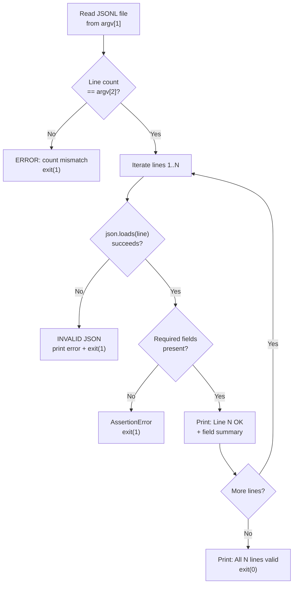

The CI pipeline's trust in scanner output rests on two compact Python scripts — `validate-clamav-jsonl.py` and `validate-aide-jsonl.py` — that serve as the final gate in every smoke test. These scripts answer a deceptively simple question: *after running a real scanner inside a real container, did the parser produce a well-formed JSONL file with the expected number of entries and the required structural fields?* Their design is deliberately minimal — no dependencies, no frameworks, no tolerance for ambiguity. Each script reads a JSONL file, asserts the line count, parses every line as JSON, checks for mandatory fields, and exits with code `1` on the first violation. That non-zero exit code cascades through Docker's exit status to GitHub Actions, turning any structural defect into an immediate CI failure. This page examines the shared pattern, the scanner-specific validation contracts, and the CI integration that makes these scripts the project's last line of defense against silent parser regressions.

Sources: [validate-clamav-jsonl.py](scripts/validate-clamav-jsonl.py#L1-L27), [validate-aide-jsonl.py](scripts/validate-aide-jsonl.py#L1-L29)

## The Shared Validation Pattern

Both scripts follow an identical three-phase execution model. Understanding this pattern once means understanding both validators forever.

**Phase 1 — Line count assertion.** The script reads the JSONL file and compares the number of lines against an expected count passed as the second command-line argument. If the counts differ, it prints an error message showing both values and exits with code `1`. This catches scenarios where the parser was invoked the wrong number of times, where a crash prevented writing, or where a file permissions error silently dropped output.

**Phase 2 — Per-line JSON parsing and field validation.** Each line is individually passed through `json.loads()`. If parsing fails, the exception message is printed alongside the 1-based line number and the script exits. On successful parse, the script checks for required top-level fields. This is where the two validators diverge in *what* they assert, but not in *how* they assert it.

**Phase 3 — Success confirmation.** If every line passes both checks, the script prints a summary line confirming the count and exits with code `0`.

The following flowchart captures this shared execution model:



Sources: [validate-clamav-jsonl.py](scripts/validate-clamav-jsonl.py#L1-L27), [validate-aide-jsonl.py](scripts/validate-aide-jsonl.py#L1-L29)

## ClamAV Validation Contract

The ClamAV validator enforces a lightweight contract. After confirming the expected line count, it checks each parsed JSON line for two fields:

| Field | Type | Purpose | Validation Method |
|-------|------|---------|-------------------|
| `hostname` | string | Identifies the scanning host for SIEM correlation | `obj.get("hostname", "MISSING")` — missing key becomes literal `"MISSING"` |
| `file_results` | array | Contains per-file scan results (status: OK or FOUND) | `len(obj.get("file_results", []))` — array length is reported |

The validator does **not** assert that `hostname` is non-empty, that `file_results` contains entries, or that specific sub-fields like `scan_summary` or `timestamp` are present. This is intentional: the CI smoke test scans a small set of files (`/etc/hostname`, `/etc/hosts`, `/etc/passwd`) that are guaranteed clean, so the contract only verifies structural integrity, not semantic correctness of scan results. The output line reports the hostname value and the file count, giving the CI log a quick human-readable fingerprint:

```
Line 1: OK (hostname=abc123, files=1)
Line 2: OK (hostname=abc123, files=2)
All 2 lines valid.
```

Sources: [validate-clamav-jsonl.py](scripts/validate-clamav-jsonl.py#L16-L26)

## AIDE Validation Contract

The AIDE validator enforces a stricter contract using four `assert` statements rather than the ClamAV validator's softer `.get()` approach:

| Field | Type | Assertion | Failure Mode |
|-------|------|-----------|-------------|
| `scanner` | string | `obj["scanner"] == "aide"` | `AssertionError` if missing or wrong value |
| `result` | string | `"result" in obj` | `AssertionError` if key absent |
| `hostname` | string | `"hostname" in obj` | `AssertionError` if key absent |
| `timestamp` | string | `"timestamp" in obj` | `AssertionError` if key absent |

The key difference from the ClamAV validator is that the AIDE `scanner` field is checked for an **exact value** (`"aide"`), not just presence. This catches a subtle failure mode: if the parser accidentally emits a JSON object from the wrong scanner (or a partial/malformed object), the string comparison fails immediately. Additionally, using `assert` rather than `.get()` means a missing key raises `AssertionError` directly, producing a cleaner error signal than a KeyError traceback. The output line reports the scan result and hostname:

```
Line 1: OK (result=clean, hostname=abc123)
Line 2: OK (result=changes_detected, hostname=abc123)
All 2 lines valid.
```

Sources: [validate-aide-jsonl.py](scripts/validate-aide-jsonl.py#L16-L28)

## Comparative Design Analysis

The following table highlights the structural and semantic differences between the two validators:

| Aspect | `validate-clamav-jsonl.py` | `validate-aide-jsonl.py` |
|--------|---------------------------|--------------------------|
| **Lines of code** | 27 | 29 |
| **Default file path** | `/var/log/clamav/clamscan.jsonl` | `/var/log/aide/aide.jsonl` |
| **Default expected count** | `2` | `2` |
| **Field access style** | `.get()` with defaults | `assert` + direct key access |
| **Fields validated** | `hostname`, `file_results` (count reported) | `scanner` (value match), `result`, `hostname`, `timestamp` |
| **Value enforcement** | No (presence-only, via `.get()`) | Yes (`scanner` must equal `"aide"`) |
| **Diagnostic output per line** | hostname + file count | result + hostname |

The `.get()` vs `assert` distinction is a deliberate calibration, not an inconsistency. The ClamAV validator reports the `hostname` value even when missing (showing `"MISSING"`), which provides diagnostic context in CI logs without failing the build on a non-critical field. The AIDE validator uses `assert` because all four fields are guaranteed to exist in every well-formed AIDE parser output — they are unconditionally injected by the parser's `main()` function, making their absence a definitive bug rather than an environmental variance.

Sources: [validate-clamav-jsonl.py](scripts/validate-clamav-jsonl.py#L1-L27), [validate-aide-jsonl.py](scripts/validate-aide-jsonl.py#L1-L29)

## CI Integration: Volume Mounting and Invocation

Both validators are invoked inside Docker containers during GitHub Actions smoke tests. The CI workflow mounts the host's `scripts/` directory into the container and calls the validator against the JSONL file that the parser wrote during the test. This pattern — running the validator inside the same container that ran the scanner — ensures that the validation sees exactly the same filesystem state as the parser.

The ClamAV smoke test runs two sequential scans with different file sets to exercise the append mechanism, then validates:

```yaml
# .github/workflows/ci.yml (ClamAV JSONL validation step)
docker run --rm -v $PWD/scripts:/scripts ${{ matrix.image-tag }}:latest bash -c '
  mkdir -p /var/log/clamav
  clamscan /etc/hostname | python3 /usr/local/bin/clamscan-to-json.py
  clamscan /etc/hosts /etc/passwd | python3 /usr/local/bin/clamscan-to-json.py
  python3 /scripts/validate-clamav-jsonl.py /var/log/clamav/clamscan.jsonl 2
'
```

The AIDE smoke test follows the same structure, but introduces a deliberate file tampering step between the two checks to force a `changes_detected` result:

```yaml
# .github/workflows/ci.yml (AIDE JSONL validation step)
docker run --rm -v $PWD/scripts:/scripts ${{ matrix.image-tag }}:latest bash -c '
  mkdir -p /var/log/aide
  aide -C 2>&1 | python3 /usr/local/bin/aide-to-json.py
  echo "tampered" > /tmp/ci-test-hack
  aide -C 2>&1 | python3 /usr/local/bin/aide-to-json.py
  python3 /scripts/validate-aide-jsonl.py /var/log/aide/aide.jsonl 2
'
```

The volume mount (`-v $PWD/scripts:/scripts`) is the only mechanism that makes the validator available inside the container. The scripts are **not** copied into the Docker image during the build phase — they exist solely as CI-side verification tools. This separation ensures that production images contain only the scanner and its parser, not test infrastructure.

Sources: [ci.yml](.github/workflows/ci.yml#L52-L59), [ci.yml](.github/workflows/ci.yml#L129-L137)

## Command-Line Interface Reference

Both scripts accept identical positional arguments:

| Argument | Position | Required | Default | Description |
|----------|----------|----------|---------|-------------|
| `path` | 1 | No | `/var/log/<scanner>/<scanner>.jsonl` | Path to the JSONL file to validate |
| `expected` | 2 | No | `2` | Expected number of lines in the file |

The defaults match the production log paths and the standard CI test pattern (two sequential scans/checks). Running either script with no arguments validates the production path with an expected count of 2 — exactly the configuration used in CI. The following table shows the per-script defaults:

| Script | Default `path` | Default `expected` |
|--------|---------------|-------------------|
| `validate-clamav-jsonl.py` | `/var/log/clamav/clamscan.jsonl` | `2` |
| `validate-aide-jsonl.py` | `/var/log/aide/aide.jsonl` | `2` |

Sources: [validate-clamav-jsonl.py](scripts/validate-clamav-jsonl.py#L5-L10), [validate-aide-jsonl.py](scripts/validate-aide-jsonl.py#L5-L10)

## What the Validators Do Not Check

Understanding the boundaries of validation is as important as understanding what's checked. The validators are **smoke tests**, not schema validators. They deliberately omit several checks that a full schema validator would enforce:

- **No timestamp format validation.** The `timestamp` field's presence is confirmed, but its ISO 8601 format (`%Y-%m-%dT%H:%M:%SZ`) is not verified.
- **No value range checks.** The AIDE `result` field is checked for presence but not constrained to `{"clean", "changes_detected"}`.
- **No nested structure validation.** The ClamAV `file_results` array's length is reported but its element schema (`{"file": "...", "status": "..."}`) is not verified.
- **No duplicate line detection.** Two identical JSON lines would pass validation.
- **No file size or encoding checks.** UTF-8 validity and file size limits are not enforced.

These omissions are by design. The validator's job is to catch catastrophic failures (malformed JSON, missing envelope fields, wrong scan count), not to enforce the full output schema. That deeper validation is covered by the [AIDE Parser Unit Tests](19-aide-parser-unit-tests-multi-line-acls-hash-continuations-and-edge-cases), which exercise the parser against a comprehensive multi-section AIDE text fixture with detailed structural assertions.

Sources: [validate-clamav-jsonl.py](scripts/validate-clamav-jsonl.py#L16-L26), [validate-aide-jsonl.py](scripts/validate-aide-jsonl.py#L16-L28)

## Exit Code Semantics and Failure Cascading

The validators use a binary exit code model that integrates cleanly with both Docker and GitHub Actions:

| Exit Code | Meaning | CI Effect |
|-----------|---------|-----------|
| `0` | All lines valid, count matches | Step passes, pipeline continues |
| `1` | Any failure (count mismatch, JSON parse error, assertion failure) | `docker run` exits non-zero → GitHub Actions step fails → job fails |

Because the validators run inside a `bash -c '...'` command passed to `docker run`, the exit code propagates through two layers: first from Python to bash (which preserves the exit code for the last command), then from bash to Docker (which sets the container's exit code to the script's exit code), then from Docker to GitHub Actions (which treats any non-zero exit as a step failure). This three-layer propagation means a single `sys.exit(1)` in either validator is sufficient to halt the entire CI job.

Sources: [validate-clamav-jsonl.py](scripts/validate-clamav-jsonl.py#L13-L24), [validate-aide-jsonl.py](scripts/validate-aide-jsonl.py#L12-L26)

## Related Pages

- **[GitHub Actions CI Pipeline: Parallel Builds, Smoke Tests, and Artifact Upload](17-github-actions-ci-pipeline-parallel-builds-smoke-tests-and-artifact-upload)** — How the validation scripts fit into the broader CI job topology and matrix strategy.
- **[AIDE Parser Unit Tests: Multi-Line ACLs, Hash Continuations, and Edge Cases](19-aide-parser-unit-tests-multi-line-acls-hash-continuations-and-edge-cases)** — The deeper structural validation that complements these smoke tests.
- **[ClamAV JSON Schema and Output Formats](7-clamav-json-schema-and-output-formats)** — The full ClamAV output schema that the validator samples.
- **[AIDE JSON Schema and Output Fields Reference](11-aide-json-schema-and-output-fields-reference)** — The complete AIDE field reference including which fields the validator requires.
- **[JSONL Log Format, Logrotate, and Log Shipper Configuration](12-jsonl-log-format-logrotate-and-log-shipper-configuration)** — How the JSONL files validated here are consumed by SIEM infrastructure.