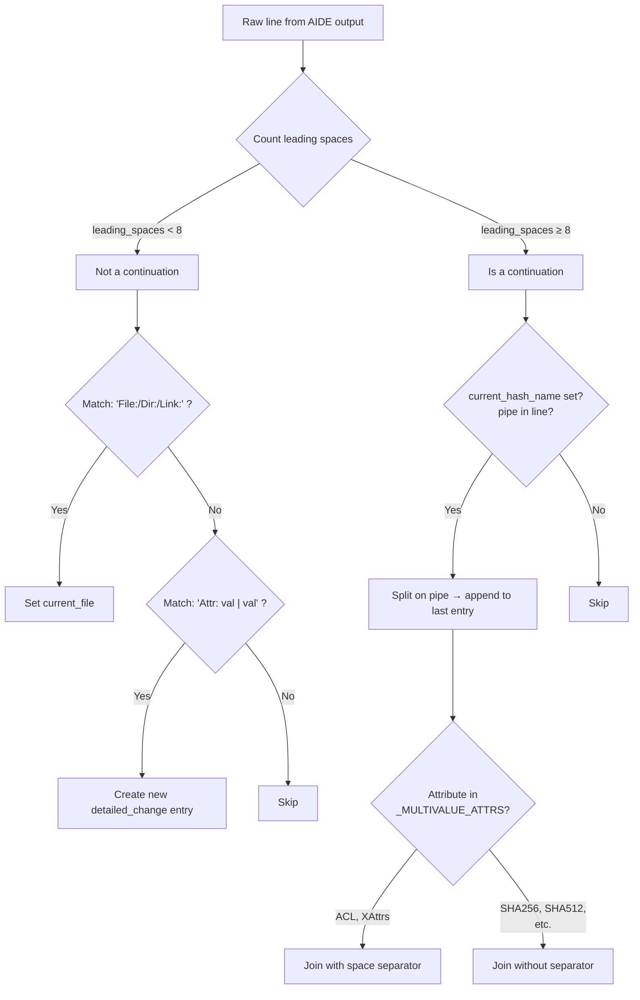
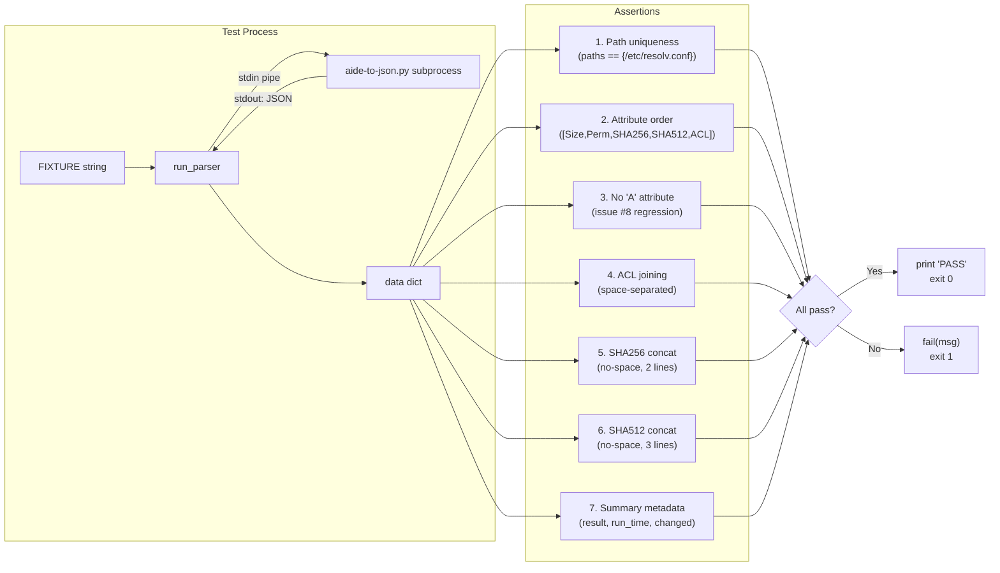

The unit test suite at `scripts/test-aide-parser.py` exists because some AIDE parser behaviors are **impossible to reliably exercise through Docker smoke tests**. AIDE's text output wraps long values across multiple lines — SHA512 hashes may span three lines, ACL entries stack several `A:` clauses vertically, and the indentation-based continuation grammar creates subtle edge cases that differ across AIDE versions and filesystem configurations. The test suite constructs a single, deterministic fixture input that forces every continuation-path code branch in `aide-to-json.py`, then asserts that the resulting JSON has exactly the right structure with no phantom entries.

Sources: [test-aide-parser.py](scripts/test-aide-parser.py#L1-L13), [aide-to-json.py](aide/shared/aide-to-json.py#L114-L162)

## Why Subprocess Isolation Over Import-Based Tests

The test harness does **not** import `parse_aide()` directly — it invokes the parser as a full `subprocess.run()` pipeline, feeding the fixture text via stdin and reading JSON from stdout. This design choice is intentional and serves two purposes. First, it tests the entire executable path including `main()`, the JSONL file-append side effect (which silently fails with `PermissionError` when `/var/log/aide/` doesn't exist on the host), and the stdout JSON emission. Second, it avoids `sys.path` manipulation or import coupling between the `scripts/` and `aide/shared/` directories, keeping the test runnable with a single `python3 scripts/test-aide-parser.py` invocation and zero configuration.

The helper function `run_parser()` captures both stdout and stderr, runs with `check=True` (so any non-zero exit from the parser surfaces immediately as a `CalledProcessError`), and parses stdout as JSON. The caller receives a fully deserialized Python dict — every assertion then operates on the parsed structure, not on raw text.

Sources: [test-aide-parser.py](scripts/test-aide-parser.py#L59-L67), [aide-to-json.py](aide/shared/aide-to-json.py#L203-L230)

## The FIXTURE: A Crafted AIDE Report

The test fixture is a hand-authored AIDE `--check` report embedded as a multiline string constant. It is designed to exercise four specific parser challenges simultaneously within a single parser invocation:

| Challenge | How It Manifests in the Fixture | Lines in AIDE Output |
|---|---|---|
| **Multi-line ACL values** | Three `A:` lines per side (old/new), each continuation indented by 12+ spaces | Lines 51–53 |
| **Multi-line SHA512 hash** | Three-line value (header + 2 continuations) per side | Lines 48–50 |
| **Two-line SHA256 hash** | Header + 1 continuation per side | Lines 46–47 |
| **Mixed attribute types** | Size, Perm, SHA256, SHA512, and ACL on the same file | Lines 44–53 |

The fixture declares exactly one changed file (`/etc/resolv.conf`) with five attributes, giving the test a deterministic assertion surface — no ambiguity about which entries should appear or how many.

Sources: [test-aide-parser.py](scripts/test-aide-parser.py#L23-L56)

## The Continuation-Detection Mechanism

Understanding the tests requires understanding what they're testing. The parser's continuation-detection algorithm is the critical code path under scrutiny. It operates on a simple but effective heuristic: **count leading spaces in the raw (unstripped) line**.



The threshold of 8 leading spaces distinguishes a **new attribute line** (which has only 1–2 leading spaces, like `  SHA256    :`) from a **continuation line** (which has 12+ leading spaces, like `              A: group::r--`). This matters because ACL continuation lines begin with text like `A: group::r--` which would match the attribute-introducing regex `^(\w+)\s*:\s+(.+)$` if the parser didn't check indentation first — that exact scenario was **issue #8**.

The `_MULTIVALUE_ATTRS` set (`{"ACL", "XAttrs"}`) controls the join strategy. Attributes in this set get a **space** separator between fragments (because ACL entries like `A: user::rw- A: group::r--` are semantically a list). All other multi-line attributes — hashes — get **no separator**, because base64-encoded hash fragments must be concatenated directly.

Sources: [aide-to-json.py](aide/shared/aide-to-json.py#L16-L18), [aide-to-json.py](aide/shared/aide-to-json.py#L114-L162)

## Assertion-by-Assertion Breakdown

The test function `main()` runs the fixture through the parser and then performs seven distinct assertion groups. Each targets a specific parser behavior:

### 1. Path Uniqueness — No Phantom Entries

```python
paths = {c["path"] for c in data.get("detailed_changes", [])}
if paths != {"/etc/resolv.conf"}:
    fail(...)
```

The parser must produce **exactly one** path in `detailed_changes`. This catches the regression where ACL continuation lines (like `              A: group::r-- | A: group::rwx`) were being parsed as new `File:` entries or as standalone attribute entries. The set comparison ensures neither duplicates nor spurious paths appear.

Sources: [test-aide-parser.py](scripts/test-aide-parser.py#L83-L85)

### 2. Attribute Ordering — Five Entries, No More

```python
attrs = [c["attribute"] for c in data["detailed_changes"]]
expected = ["Size", "Perm", "SHA256", "SHA512", "ACL"]
if attrs != expected:
    fail(...)
```

This is an **order-preserving** list comparison. The fixture contains attributes in the order Size → Perm → SHA256 → SHA512 → ACL, and the parser must emit them in that exact sequence. A list comparison (not a set) catches both missing attributes and out-of-order emission.

Sources: [test-aide-parser.py](scripts/test-aide-parser.py#L87-L90)

### 3. Issue #8 Regression — No Bogus "A" Attribute

```python
if "A" in attrs:
    fail("ACL continuation leaked as attribute 'A' (issue #8 regression)")
```

This is the most historically significant assertion. When AIDE emits multi-line ACL values, each continuation line starts with `A:` (the ACL type prefix). Without the `leading_spaces >= 8` guard, the parser's attribute regex `^(\w+)\s*:\s+(.+)$` would match `A` as the attribute name and create a bogus `{"attribute": "A", "old": "group::r--", "new": "group::rwx"}` entry. The test locks this fix in place permanently.

Sources: [test-aide-parser.py](scripts/test-aide-parser.py#L92-L94)

### 4. ACL Value Joining — Space-Separated Fragments

```python
acl = next(c for c in data["detailed_changes"] if c["attribute"] == "ACL")
expected_old = "A: user::rw- A: group::r-- A: other::r--"
expected_new = "A: user::rwx A: group::rwx A: other::rwx"
```

The three per-side ACL lines (`user::`, `group::`, `other::`) must be joined with **spaces** into a single string. The test verifies both the `old` and `new` sides independently, ensuring the `_MULTIVALUE_ATTRS` space-separator logic works for multi-line ACL continuations.

Sources: [test-aide-parser.py](scripts/test-aide-parser.py#L97-L103)

### 5. SHA256 Hash — Two-Line Concatenation Without Spaces

```python
sha256 = next(c for c in data["detailed_changes"] if c["attribute"] == "SHA256")
if sha256["old"] != "BdNg+yp9IvgPU88Z3Zsm6eymhdJ03z7mi7Ok9u6WtTM=":
    fail(...)
```

SHA256 in the fixture spans two lines per side (a relatively short base64 value that AIDE wraps). The test verifies the fragments are concatenated directly with no space — `BdNg+yp9IvgPU88Z3Zsm6eymhdJ03z7m` + `i7Ok9u6WtTM=` = `BdNg+yp9IvgPU88Z3Zsm6eymhdJ03z7mi7Ok9u6WtTM=`. A space injection here would corrupt the hash value.

Sources: [test-aide-parser.py](scripts/test-aide-parser.py#L105-L110)

### 6. SHA512 Hash — Three-Line Concatenation Without Spaces

```python
expected_old_sha512 = (
    "z4/WlF+yww5Lrxg5hpIMyn/2X7G727yY"
    "iIZ0hee1cC4CPKRuTTwqOqR+a4PrwaQ+"
    "dELMHdsn+4/f8UNrnXzvzg=="
)
if sha512["old"] != expected_old_sha512:
    fail(...)
if " " in sha512["old"]:
    fail("SHA512 old should not contain spaces: {!r}".format(sha512["old"]))
```

SHA512 is the longest hash format and exercises the **maximum continuation depth** (header + 2 continuation lines). The assertion verifies exact concatenation of three fragments and includes an explicit `" " in sha512["old"]` guard — a belt-and-suspenders check that no space leaked in even if the string comparison happened to pass. This double-check pattern reflects real-world debugging: an earlier bug joined hash fragments with spaces (because ACL joining was applied globally before `_MULTIVALUE_ATTRS` was introduced).

Sources: [test-aide-parser.py](scripts/test-aide-parser.py#L112-L123)

### 7. Summary and Metadata Fields

```python
if data["result"] != "changes_detected": fail(...)
if data.get("run_time_seconds") != 3: fail(...)
if data["summary"]["changed"] != 1: fail(...)
```

Beyond detailed changes, the test validates the report-level metadata: the `result` enum must be `"changes_detected"` (not `"clean"`), the parsed `run_time_seconds` must be 3 (from the fixture's `(run time: 0m 3s)`), and the summary `changed` count must be 1. These catch regressions in the summary parser and timestamp extractor.

Sources: [test-aide-parser.py](scripts/test-aide-parser.py#L125-L131)

## Joining Strategy: Space vs. No-Space Decision Table

The parser's continuation handling branches on a single predicate: whether the current attribute belongs to `_MULTIVALUE_ATTRS`. The following table maps every AIDE attribute that can span multiple lines to its joining behavior:

| Attribute | In `_MULTIVALUE_ATTRS`? | Join Separator | Rationale |
|---|---|---|---|
| **ACL** | ✅ Yes | `" "` (space) | ACL entries are semantically a list; spaces preserve readability |
| **XAttrs** | ✅ Yes | `" "` (space) | Extended attributes follow the same list pattern as ACLs |
| **SHA256** | ❌ No | `""` (none) | Base64 hash fragments must be concatenated directly |
| **SHA512** | ❌ No | `""` (none) | Same as SHA256 — longer, more continuation lines |
| **SHA1** | ❌ No | `""` (none) | Legacy hash, same concatenation rule |
| **MD5** | ❌ No | `""` (none) | Legacy hash, same concatenation rule |

The test fixture covers the two most common multi-line attributes (ACL and SHA512) plus the boundary case of a two-line SHA256, providing confident coverage of both join strategies.

Sources: [aide-to-json.py](aide/shared/aide-to-json.py#L16-L18), [aide-to-json.py](aide/shared/aide-to-json.py#L149-L161)

## Test Execution and CI Integration

The test runs as a **dedicated CI job** — `aide-parser-unit-tests` — that executes **before any Docker builds**. This ordering is strategic: if the parser has a regression, the failure surfaces in under 30 seconds on a GitHub Actions runner without waiting for six Docker image builds to complete.

```yaml
aide-parser-unit-tests:
    name: AIDE parser unit tests
    runs-on: ubuntu-latest
    steps:
      - uses: actions/checkout@v5
      - name: Run parser tests
        run: python3 scripts/test-aide-parser.py
```

The job requires nothing beyond a Python 3 interpreter and the repository source — no Docker, no pip dependencies, no network access. This makes it the fastest feedback loop in the entire CI pipeline. Locally, it runs identically with `python3 scripts/test-aide-parser.py` from the project root.

On success, the test prints a concise summary:

```
PASS: all parser assertions hold
  detailed_changes attrs: ['Size', 'Perm', 'SHA256', 'SHA512', 'ACL']
  ACL.old = A: user::rw- A: group::r-- A: other::r--
  ACL.new = A: user::rwx A: group::rwx A: other::rwx
```

On failure, `sys.exit(1)` provides a non-zero exit code that CI interprets as a job failure, with the `fail()` message printed to stderr identifying exactly which assertion broke.

Sources: [ci.yml](.github/workflows/ci.yml#L11-L17), [test-aide-parser.py](scripts/test-aide-parser.py#L133-L140)

## Test Architecture Diagram

The following diagram shows the complete test execution flow, from fixture input through subprocess invocation to the seven assertion groups:



Sources: [test-aide-parser.py](scripts/test-aide-parser.py#L75-L140)

## Relationship to Other Testing Layers

The unit test is one layer in a three-tier testing strategy for the AIDE parser:

| Layer | What It Tests | Speed | Dependencies |
|---|---|---|---|
| **Unit tests** (`test-aide-parser.py`) | Continuation logic, join strategy, issue #8 regression | ~1 second | Python stdlib only |
| **Docker smoke tests** (CI `build-aide` job) | End-to-end: real AIDE binary → real output → parser → JSONL | ~2–5 min per OS | Docker, AIDE binary |
| **JSONL validation** (`validate-aide-jsonl.py`) | Schema conformance of accumulated JSONL files | ~1 second | Python stdlib + scan output |

The unit test covers **parsing logic** that the Docker smoke tests can only trigger if the container's filesystem happens to produce multi-line hash or ACL output (which depends on AIDE version, file sizes, and filesystem ACL configuration). By constructing the fixture directly, the unit test guarantees coverage regardless of runtime conditions.

For deeper understanding of the parser under test, see [AIDE JSON Parser: Parsing Multi-Section Integrity Reports (aide-to-json.py)](9-aide-json-parser-parsing-multi-section-integrity-reports-aide-to-json-py). For the validation scripts that run inside Docker containers, see [JSONL Validation Scripts for ClamAV and AIDE](18-jsonl-validation-scripts-for-clamav-and-aide). For the CI pipeline that orchestrates all testing layers, see [GitHub Actions CI Pipeline: Parallel Builds, Smoke Tests, and Artifact Upload](17-github-actions-ci-pipeline-parallel-builds-smoke-tests-and-artifact-upload).