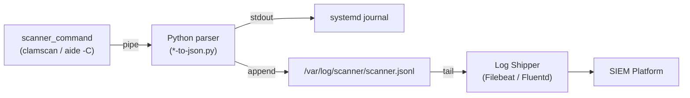
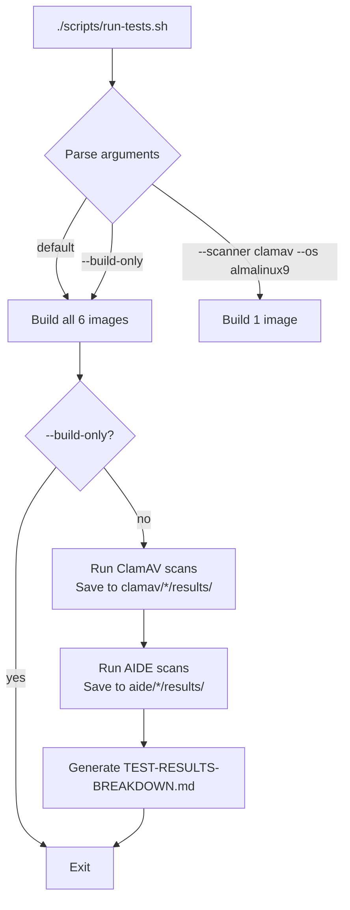

This guide walks you through cloning the repository, building all six Docker images (two scanners × three Linux distributions), running your first ClamAV antivirus scan and AIDE file-integrity check, and inspecting the structured JSON output that feeds into SIEM pipelines. By the end of this page you will have verified that every scanner produces valid, single-line JSON suitable for log shippers like Filebeat or Fluentd.

**What you need before starting:** a machine with Docker installed (Docker Desktop, Docker Engine, or Podman with Docker CLI compatibility) and roughly 3 GB of free disk space for base images and virus definitions. No Python packages are required — every parser uses only the standard library, and the `clamscan-to-json.py` and `aide-to-json.py` scripts are baked into each Docker image at build time.

Sources: [CLAUDE.md](CLAUDE.md#L56-L77), [clamav/almalinux9/Dockerfile](clamav/almalinux9/Dockerfile#L1-L32), [aide/almalinux9/Dockerfile](aide/almalinux9/Dockerfile#L1-L10)

---

## Project Layout at a Glance

The repository is organized around a **scanner → OS → artifact** hierarchy. Each scanner directory (`clamav/`, `aide/`) contains a per-OS subdirectory with a Dockerfile, a `results/` folder for sample outputs, and a `shared/` directory that holds the Python JSON parsers, systemd units, and logrotate configs that are copied into every image.

```
linux-security-scanners/
├── clamav/
│   ├── shared/                    # Python parser, systemd units, logrotate
│   │   ├── clamscan-to-json.py
│   │   ├── clamav-scan.service
│   │   ├── clamav-scan.timer
│   │   └── clamav-jsonl.conf
│   ├── almalinux9/Dockerfile
│   ├── amazonlinux2/Dockerfile
│   └── amazonlinux2023/Dockerfile
├── aide/
│   ├── shared/                    # Python parser, systemd units, logrotate
│   │   ├── aide-to-json.py
│   │   ├── aide-check.service
│   │   ├── aide-check.timer
│   │   └── aide-jsonl.conf
│   ├── almalinux9/Dockerfile
│   ├── amazonlinux2/Dockerfile
│   └── amazonlinux2023/Dockerfile
└── scripts/
    └── run-tests.sh               # Build + scan + results automation
```

**Key convention:** all `docker build` commands run from the **project root** (not from inside the scanner subdirectory). This is because each Dockerfile references `COPY clamav/shared/…` or `COPY aide/shared/…` using paths relative to the build context root.

Sources: [README.md](README.md#L19-L48), [CLAUDE.md](CLAUDE.md#L146-L151)

---

## Understanding the Scanner-to-JSON Pipeline

Every image in this project follows the same architectural pattern — a scanner emits plain-text output, a Python parser consumes it via stdin, and the result is a single-line JSON object written to both stdout and a JSONL append-only log file. This diagram shows the data flow you will trigger in the sections below:



Each parser enriches the JSON with three metadata fields — `hostname`, `timestamp` (ISO 8601 UTC), and `scanner` name — so downstream consumers can correlate records across hosts without additional enrichment. The JSONL log file is designed for continuous tailing by log shippers; a logrotate configuration in each `shared/` directory handles 30-day rotation.

Sources: [README.md](README.md#L110-L125), [clamav/shared/clamscan-to-json.py](clamav/shared/clamscan-to-json.py#L54-L76), [aide/shared/aide-to-json.py](aide/shared/aide-to-json.py#L203-L226)

---

## Step 1 — Clone and Verify Prerequisites

```bash
git clone https://github.com/tupacalypse187/linux-security-scanners.git
cd linux-security-scanners
```

Confirm Docker is running:

```bash
docker info --format '{{.ServerVersion}}'
# Expected: a version string (e.g. 27.x.x)
```

That is the only external dependency. Python 3 is installed inside each image by the Dockerfile; no local Python installation is required.

Sources: [CLAUDE.md](CLAUDE.md#L115-L143)

---

## Step 2 — Build the Docker Images

The project ships six images — one for each combination of scanner and operating system. The table below shows the naming convention and what goes into each image:

| Image Tag | Base Image | Scanner | Scanner Version | Install Source |
|---|---|---|---|---|
| `almalinux9-clamav:latest` | `almalinux:9` | ClamAV | 1.5.2 | Cisco Talos RPM |
| `amazonlinux2-clamav:latest` | `amazonlinux:2` | ClamAV | 1.4.3 | EPEL (via `amazon-linux-extras`) |
| `amazonlinux2023-clamav:latest` | `amazonlinux:2023` | ClamAV | 1.5.2 | Cisco Talos RPM |
| `almalinux9-aide:latest` | `almalinux:9` | AIDE | 0.16 | `dnf` (AppStream) |
| `amazonlinux2-aide:latest` | `amazonlinux:2` | AIDE | 0.16.2 | `yum` (Amazon repos) |
| `amazonlinux2023-aide:latest` | `amazonlinux:2023` | AIDE | 0.18.6 | `dnf` (Amazon repos) |

### Build All Six Images

Run these commands from the project root:

```bash
# ClamAV images
docker build -t almalinux9-clamav:latest -f clamav/almalinux9/Dockerfile .
docker build -t amazonlinux2-clamav:latest -f clamav/amazonlinux2/Dockerfile .
docker build -t amazonlinux2023-clamav:latest -f clamav/amazonlinux2023/Dockerfile .

# AIDE images
docker build -t almalinux9-aide:latest -f aide/almalinux9/Dockerfile .
docker build -t amazonlinux2-aide:latest -f aide/amazonlinux2/Dockerfile .
docker build -t amazonlinux2023-aide:latest -f aide/amazonlinux2023/Dockerfile .
```

**What happens during build:** Each Dockerfile installs the scanner binary and Python 3, copies the shared parser into `/usr/local/bin/`, and performs scanner-specific initialization. ClamAV images download virus definitions via `freshclam` (this is the slowest step — allow 30–90 seconds depending on your connection). AIDE images initialize the baseline integrity database with `aide --init` and copy it into place so the container can immediately run checks.

**Build time note:** ClamAV images for AlmaLinux 9 and Amazon Linux 2023 download a verified Cisco Talos RPM with SHA-256 checksum validation and multi-architecture support (`amd64` / `arm64`). Amazon Linux 2 uses the lighter EPEL package. AIDE images are faster to build because they install from standard distribution repos.

Sources: [clamav/almalinux9/Dockerfile](clamav/almalinux9/Dockerfile#L1-L32), [clamav/amazonlinux2/Dockerfile](clamav/amazonlinux2/Dockerfile#L1-L12), [aide/almalinux9/Dockerfile](aide/almalinux9/Dockerfile#L1-L10), [README.md](README.md#L62-L77)

---

## Step 3 — Run Your First ClamAV Scan

After building `almalinux9-clamav:latest`, run a scan against a few system files and pipe the output through the JSON parser:

```bash
docker run --rm almalinux9-clamav:latest bash -c '
  mkdir -p /var/log/clamav
  clamscan /etc/hostname /etc/hosts /etc/passwd /etc/resolv.conf \
    | python3 /usr/local/bin/clamscan-to-json.py
'
```

**Expected output** — a single JSON line printed to stdout:

```json
{"file_results":[{"file":"/etc/hostname","status":"OK"},{"file":"/etc/hosts","status":"OK"},{"file":"/etc/passwd","status":"OK"},{"file":"/etc/resolv.conf","status":"OK"}],"scan_summary":{"known_viruses":3627837,"engine_version":"1.5.2","scanned_directories":0,"scanned_files":4,"infected_files":0,"data_scanned":"68.12 KB","time":"0.026 sec"},"hostname":"a1b2c3d4e5f6","timestamp":"2026-04-23T13:56:57Z"}
```

Breaking down the structure:

| Field | Type | Description |
|---|---|---|
| `file_results` | array | One object per scanned file with `file` path and `status` (`"OK"` or `"FOUND ..."`) |
| `scan_summary` | object | Aggregate statistics — virus count, files scanned, infected files, data scanned, time |
| `hostname` | string | Container hostname, added by the parser for host-level correlation |
| `timestamp` | string | ISO 8601 UTC timestamp of when the parser ran |

If you have `jq` installed on your host, pipe the output for a readable view:

```bash
docker run --rm almalinux9-clamav:latest bash -c '
  mkdir -p /var/log/clamav
  clamscan /etc/hostname /etc/hosts \
    | python3 /usr/local/bin/clamscan-to-json.py
' | jq .
```

Sources: [clamav/shared/clamscan-to-json.py](clamav/shared/clamscan-to-json.py#L17-L80), [clamav/almalinux9/results/clamscan.json](clamav/almalinux9/results/clamscan.json#L1-L5)

---

## Step 4 — Run Your First AIDE Integrity Check

AIDE requires an initialized database to check against. The Dockerfile handles this at build time — it runs `aide --init` and copies the resulting database into the location AIDE expects for checks (`/var/lib/aide/aide.db.gz`). Run a check with:

```bash
docker run --rm almalinux9-aide:latest bash -c '
  mkdir -p /var/log/aide
  aide -C 2>&1 | python3 /usr/local/bin/aide-to-json.py
'
```

**Expected output** — a single JSON line:

```json
{"result":"changes_detected","outline":"AIDE found differences between database and filesystem!!","summary":{"total_entries":9312,"added":0,"removed":0,"changed":4},"changed_entries":[{"path":"/etc/hostname","flags":"f   ...    .C.."},...],"hostname":"ae1e553cdb71","timestamp":"2026-04-23T13:57:01Z","scanner":"aide"}
```

**Why does a fresh container report changes?** The AIDE database is initialized during `docker build`, but the container gets a different hostname, modified `/etc/resolv.conf`, and other runtime artifacts. This is expected behavior — in production, the database reflects the known-good state of a specific host.

The key fields in AIDE output:

| Field | Value | Meaning |
|---|---|---|
| `result` | `"clean"` or `"changes_detected"` | Top-level verdict |
| `outline` | string | AIDE's status message line |
| `summary` | object | Entry counts: `total_entries`, `added`, `removed`, `changed` |
| `changed_entries` | array | Each entry has `path` and change `flags` |
| `detailed_changes` | array | Per-attribute diffs with `old` and `new` values (when changes exist) |
| `scanner` | `"aide"` | Parser-injected identifier |

Sources: [aide/shared/aide-to-json.py](aide/shared/aide-to-json.py#L21-L200), [aide/almalinux9/results/aide.json](aide/almalinux9/results/aide.json#L1-L5), [aide/almalinux9/Dockerfile](aide/almalinux9/Dockerfile#L5-L9)

---

## Step 5 — Use the Test Runner for Batch Operations

The `run-tests.sh` script automates building, scanning, and saving results across all scanner/OS combinations. It is the fastest way to validate that everything works end-to-end.



### Common invocations

| Command | What it does |
|---|---|
| `./scripts/run-tests.sh` | Build all 6 images, run all scans, save results, generate report |
| `./scripts/run-tests.sh --build-only` | Build images only — skip scan tests |
| `./scripts/run-tests.sh --scanner clamav --os almalinux9` | Build and test a single combination |
| `./scripts/run-tests.sh --scanner aide` | Build and test all 3 AIDE images |
| `./scripts/run-tests.sh --os amazonlinux2023` | Build and test both scanners on AL2023 |

After a full run, each `*/results/` directory contains sample `.log` (raw scanner output) and `.json` (parser output) files that are also checked into the repository as reference artifacts.

Sources: [scripts/run-tests.sh](scripts/run-tests.sh#L1-L182), [README.md](README.md#L79-L91)

---

## Troubleshooting Common Issues

| Symptom | Cause | Fix |
|---|---|---|
| `COPY failed: file not found` | Running `docker build` from inside a scanner subdirectory instead of project root | `cd` to the project root before building |
| ClamAV build hangs at `freshclam` | DNS or firewall blocking `database.clamav.net` | Check outbound connectivity on port 443 |
| `dnf install --allowerasing` conflict on AL9/AL2023 | `libcurl-minimal` shipped by base image conflicts with ClamAV's `libcurl` | Already handled in the Dockerfile; if it fails, ensure you are using the latest Dockerfile |
| AIDE reports `changes_detected` on a fresh container | AIDE database was built at image creation; container runtime modifies hostname, resolv.conf, etc. | Expected behavior — see [Understanding AIDE Versions, Stateful Workflow, and OS Differences](8-understanding-aide-versions-stateful-workflow-and-os-differences) |
| `permission denied` writing to `/var/log/clamav/clamscan.jsonl` | Running parser outside a container without the log directory | The parser silently falls back to stdout-only — no action needed for testing |
| Build fails with `Unsupported TARGETARCH` | Building for an architecture other than `amd64` or `arm64` | Only x86_64 and aarch64 ClamAV RPMs are published by Cisco Talos |

Sources: [clamav/almalinux9/Dockerfile](clamav/almalinux9/Dockerfile#L13-L16), [clamav/shared/clamscan-to-json.py](clamav/shared/clamscan-to-json.py#L69-L76), [aide/shared/aide-to-json.py](aide/shared/aide-to-json.py#L222-L226)

---

## Cleaning Up

When you are finished experimenting, remove the images to reclaim disk space:

```bash
docker rmi \
  almalinux9-clamav:latest amazonlinux2-clamav:latest amazonlinux2023-clamav:latest \
  almalinux9-aide:latest amazonlinux2-aide:latest amazonlinux2023-aide:latest
docker image prune -f
```

Sources: [README.md](README.md#L194-L201)

---

## Where to Go Next

You have built the images, run scans, and verified that JSON output flows through the pipeline. Here are the logical next steps based on what you want to do:

- **Automate builds and scans** — [Using the Test Runner to Build, Scan, and Generate Reports](3-using-the-test-runner-to-build-scan-and-generate-reports) covers the full `run-tests.sh` workflow, including CI integration and report generation.
- **Understand the architecture** — [Architecture: The Scanner-to-JSON Pipeline Pattern](4-architecture-the-scanner-to-json-pipeline-pattern) explains the shared pipeline design and how the Python parsers fit into the SIEM ingestion chain.
- **Dive into ClamAV specifics** — Start with [Understanding ClamAV OS-Specific Install Methods and Gotchas](5-understanding-clamav-os-specific-install-methods-and-gotchas) to learn why each OS uses a different install method.
- **Dive into AIDE specifics** — Start with [Understanding AIDE Versions, Stateful Workflow, and OS Differences](8-understanding-aide-versions-stateful-workflow-and-os-differences) to understand AIDE's stateful database model and version differences.
- **Deploy to production** — [Systemd Service and Timer Units for Scheduled Scans](13-systemd-service-and-timer-units-for-scheduled-scans) shows how to schedule daily scans with randomized delays, and [JSONL Log Format, Logrotate, and Log Shipper Configuration](12-jsonl-log-format-logrotate-and-log-shipper-configuration) covers the SIEM tailing setup.