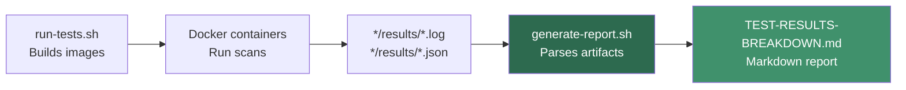
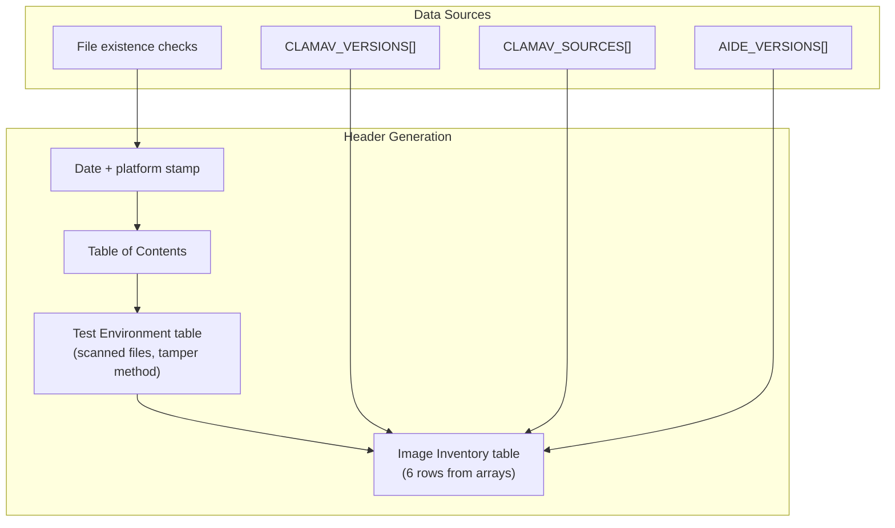

**`generate-report.sh`** is a self-contained Bash report generator that transforms raw scanner output files — `clamscan.log`, `aide.log`, and their JSON counterparts — into a structured Markdown document called [TEST-RESULTS-BREAKDOWN.md](TEST-RESULTS-BREAKDOWN.md). It runs automatically at the end of `run-tests.sh` but can also be invoked standalone whenever result files exist under the `*/results/` directories. The script requires zero external dependencies beyond standard POSIX utilities (`sed`, `grep`, `wc`, `date`) and produces repeatable, deterministic output from a given set of scan artifacts.

Sources: [generate-report.sh](scripts/generate-report.sh#L1-L9), [run-tests.sh](scripts/run-tests.sh#L178-L181)

## How It Fits in the Pipeline

The report generator sits at the **terminal end** of the local test workflow. The `run-tests.sh` script first builds Docker images, then runs scans that populate per-OS `results/` directories with `.log` and `.json` files, and finally delegates to `generate-report.sh` to aggregate those artifacts into a single human-readable report. Crucially, the report generator has no knowledge of Docker — it operates entirely on pre-existing files, which means you can re-run it at any time to refresh the report without re-scanning.

Sources: [run-tests.sh](scripts/run-tests.sh#L64-L181), [generate-report.sh](scripts/generate-report.sh#L11-L18)

## Invocation and Options

The script accepts a single optional flag to override the default output path. When called without arguments, it writes to `TEST-RESULTS-BREAKDOWN.md` at the project root.

| Invocation | Behavior |
|------------|----------|
| `./scripts/generate-report.sh` | Writes to `./TEST-RESULTS-BREAKDOWN.md` |
| `./scripts/generate-report.sh --output path/to/report.md` | Writes to the specified path |
| *(implicit via run-tests.sh)* | Called automatically at line 181 of `run-tests.sh` |

The script uses `set -euo pipefail` for strict error handling — it will abort immediately if any command fails or an unset variable is referenced. This means the report generation is an all-or-nothing operation: either you get a complete report or an explicit error.

Sources: [generate-report.sh](scripts/generate-report.sh#L1-L18)

## Configuration Constants

The script defines four arrays that configure which scanners and operating systems to report on, plus hardcoded version metadata. These constants mirror the image inventory built by `run-tests.sh` and ensure the report's image inventory table is populated even when individual result files are missing.

| Constant | Value | Purpose |
|----------|-------|---------|
| `SCANNERS` | `clamav aide` | Scanner directories to iterate |
| `OSES` | `almalinux9 amazonlinux2 amazonlinux2023` | OS variants to iterate |
| `CLAMAV_VERSIONS` | `1.5.2 1.4.3 1.5.2` | Static version labels for image inventory |
| `CLAMAV_SOURCES` | `Cisco Talos RPM EPEL Cisco Talos RPM` | Install source labels for image inventory |
| `AIDE_VERSIONS` | `0.16 0.16.2 0.18.6` | Static version labels for image inventory |

Note that ClamAV and AIDE versions in the image inventory table come from these **hardcoded arrays**, not from parsing the log files. The log-parsed versions appear separately in each per-OS results section. This dual-source approach means the inventory table always renders complete rows even when results are absent.

Sources: [generate-report.sh](scripts/generate-report.sh#L20-L27)

## Parsing Helper Functions

The script defines **eleven** helper functions that extract structured data from the unstructured text logs. These functions form the script's core intelligence — each one targets a specific field or section within a log file using `sed` address ranges and regex capture groups.

### ClamAV Parsing Helpers

| Function | Input | Output | Extraction Pattern |
|----------|-------|--------|--------------------|
| `get_clamav_version` | `.log` file path | Version string (e.g. `1.5.2`) | `sed -n 's/Engine version: \([0-9.]*\)/\1/p'` |
| `get_clamav_field` | `.log` file path + field name | Field value | `sed -n "s/^${field}: \(.*\)/\1/p"` |
| `get_clamav_scanned_files` | `.log` file path | File paths (up to 10) | Range `--- WITH summary ---` to `--- WITHOUT summary ---` |

The `get_clamav_field` helper is the workhorse for ClamAV — it extracts any line that matches `^<FieldName>: <value>` from the `SCAN SUMMARY` block. This single function handles `Known viruses`, `Scanned files`, `Infected files`, `Data scanned`, and `Time` fields by parameterizing the field name.

Sources: [generate-report.sh](scripts/generate-report.sh#L40-L49), [generate-report.sh](scripts/generate-report.sh#L129-L132)

### AIDE Parsing Helpers

| Function | Input | Output | Extraction Pattern |
|----------|-------|--------|--------------------|
| `get_aide_version` | `.log` file path | Version string (e.g. `0.18.6`) | `s/.*AIDE \([0-9.]*\).*/\1/p` |
| `get_aide_summary` | `.log` file path + field | Numeric count | `s/^<field>[[:space:]]*:[[:space:]]*\([0-9]*\)/\1/p` |
| `get_aide_summary_stdin` | stdin pipe + field | Numeric count | Same pattern, reads from pipe |
| `get_aide_runtime` | `.log` file path | Time string (e.g. `0m 3s`) | `s/.*run time: \([0-9]*m [0-9]*s\).*/\1/p` |
| `get_aide_runtime_stdin` | stdin pipe | Time string | Same pattern, reads from pipe |
| `get_aide_changed_count` | `.log` file path | Count of changed entries | Range `CLEAN CHECK` to `TAMPERED`, grep `^[fdl]` |
| `get_aide_added_count` | `.log` file path | Count of added entries | Range `CLEAN CHECK` to `TAMPERED`, grep `^++++++++++++++++` |
| `get_aide_hash_algos` | `.log` file path | Comma-separated algo list | Extracts uppercase tokens from database section |
| `get_aide_changed_files` | `.log` file path | Up to 20 file paths | Extracts paths from changed-entry detail lines |
| `has_perm_change` | `.log` file path | `Yes` / `No` | Greps for `rw-r--r--.*rwxrwxrwx` permission diff |

A critical design detail: AIDE parsing uses **dual variants** of several helpers — one that reads from a file argument and one that reads from stdin. The stdin variants (`get_aide_summary_stdin`, `get_aide_runtime_stdin`) exist because the per-OS sections first pipe a `sed` address range (extracting a log section) into the helper, avoiding temporary files. The file-argument variants are used when the entire log is passed directly.

Sources: [generate-report.sh](scripts/generate-report.sh#L51-L138)

### Utility Helper

The `hr_size` function converts byte counts into human-readable form (`B`, `KB`, `MB`) for the file inventory section. It uses integer arithmetic only — no `bc` or external tools — making it portable across all Unix systems.

Sources: [generate-report.sh](scripts/generate-report.sh#L104-L119)

## Report Structure: Four Sections in Depth

The generated report is built inside a single Bash subshell `{ ... } > "$OUTPUT"`, which redirects all `echo` and `printf` output to the destination file. This pattern avoids per-write open/close overhead and ensures atomicity — if any section fails, no partial file is written.

Sources: [generate-report.sh](scripts/generate-report.sh#L143-L632)

### Section 0 — Header, Environment, and Image Inventory

The report opens with a metadata header (generation date, platform, image count), a table of contents, a test environment table describing what was scanned and how tampering was performed, and a six-row image inventory table mapping each Docker image tag to its scanner version, base OS, and install source. The image count is computed dynamically by iterating all scanner/OS combinations and checking for the existence of `.log` result files.

Sources: [generate-report.sh](scripts/generate-report.sh#L143-L200)

### Section 1 — ClamAV Results

This section begins with a static `heredoc` explaining how ClamAV tests work (the with-summary vs. without-summary scan modes), then iterates each OS to produce a per-OS results table. For each OS, the script extracts six fields from `clamscan.log` using the parsing helpers and renders them in a markdown table. If the corresponding `.json` file exists, it counts valid JSON lines (`grep -c '^{.*}$'`) and produces a secondary table describing what each JSON section contains.

The section concludes with a **cross-OS comparison table** that places all three operating systems side-by-side on five metrics: version, signature count, scan time, infected count, and install source. The `--json` support row is hardcoded as `No` for all three, reflecting the reality that none of the available RPM packages compile in ClamAV's native JSON output.

Sources: [generate-report.sh](scripts/generate-report.sh#L202-L328)

### Section 2 — AIDE Results

The AIDE section follows the same pattern but with considerably more parsing complexity. A static `heredoc` explains AIDE's stateful three-phase workflow (`--init` → `--check` → `--update`) and the important caveat about Docker-induced baseline drift. Then, for each OS, the script extracts summary fields from **two distinct log sections**: the clean check (between `=== CLEAN CHECK` and `=== CHECK WITH TAMPERED`) and the tampered check (from `=== CHECK WITH TAMPERED` onward).

The per-OS rendering includes a comparison table with columns for both check types, a changed-files table that classifies each changed path by its likely cause (Docker hostname injection, Python cache creation, inode shift, etc.), OS-specific notes about version behavior, and a hash-algorithm listing extracted from the database section of the log.

The cross-OS comparison table is built using associative arrays (`declare -A`) — a Bash 4+ feature — that map OS names to extracted values. This allows the final `printf` to reference values by key rather than by positional index.

Sources: [generate-report.sh](scripts/generate-report.sh#L330-L526)

### Section 3 — JSONL Append Validation

A static `heredoc` section that documents the expected JSONL structure for both ClamAV and AIDE, with example line formats and SIEM query examples using `jq`. This section contains no dynamic content — it serves as documentation within the generated report, explaining *why* two JSON lines per file matters for the SIEM ingestion pipeline.

Sources: [generate-report.sh](scripts/generate-report.sh#L528-L567)

### Section 4 — File Inventory

The final section dynamically builds a directory tree and file-size table from the actual result files on disk. The `hr_size` helper converts each file's byte count into human-readable units. This inventory serves as a checksum: if a file appears in the tree but not in the earlier sections, something went wrong during parsing.

Sources: [generate-report.sh](scripts/generate-report.sh#L569-L632)

## Resilience and Edge Cases

The script is designed to handle missing data gracefully. When a result file doesn't exist for a given scanner/OS combination, the script emits a **"No results found"** message with the exact `run-tests.sh` command needed to generate the missing data. Default values are applied via Bash's `${var:-default}` parameter expansion and the `${:=}` assignment syntax, ensuring table cells never contain empty strings.

The `set -euo pipefail` strict mode means the script will fail loudly if a `sed` or `grep` command encounters an unexpected error, but the `|| echo "0"` and `|| echo "N/A"` fallbacks on extraction commands prevent non-matching patterns from triggering the exit-on-error behavior.

Sources: [generate-report.sh](scripts/generate-report.sh#L230-L239), [generate-report.sh](scripts/generate-report.sh#L391-L402)

## Relationship to CI Artifacts

In the GitHub Actions CI pipeline (`.github/workflows/ci.yml`), each matrix job uploads its result files as workflow artifacts. The CI does **not** run `generate-report.sh` — it uploads the raw `.log` and `.json` files individually. The report generator is intended for **local development use**, where a developer has run `run-tests.sh` (or the full matrix) on their machine and wants a consolidated view. If you download CI artifacts into the correct `*/results/` directory structure, `generate-report.sh` will generate a report from them as well.

Sources: [ci.yml](.github/workflows/ci.yml#L61-L95)

## Next Steps

- **Understand the test runner that feeds this script**: [Using the Test Runner to Build, Scan, and Generate Reports](3-using-the-test-runner-to-build-scan-and-generate-reports)
- **Explore the CI pipeline that produces the raw artifacts**: [GitHub Actions CI Pipeline: Parallel Builds, Smoke Tests, and Artifact Upload](17-github-actions-ci-pipeline-parallel-builds-smoke-tests-and-artifact-upload)
- **Validate the JSONL files that appear in the report's inventory**: [JSONL Validation Scripts for ClamAV and AIDE](18-jsonl-validation-scripts-for-clamav-and-aide)
- **Query the JSON output yourself with jq examples**: [Querying Scanner Output with jq](14-querying-scanner-output-with-jq)