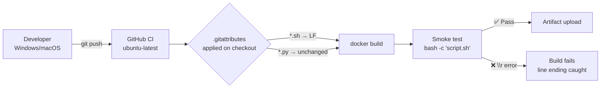

When a developer clones this repository on Windows, edits a shell script in Notepad, and pushes the change, every line they touch silently gains a `\r\n` (CRLF) ending instead of the `\n` (LF) that Linux expects. That invisible difference breaks `bash` inside Docker containers with cryptic errors like `'\r': command not found` — and it can also corrupt Python stdin parsing if the parser doesn't account for mixed line endings. This page explains the single line of `.gitattributes` that prevents this failure, how the Python parsers are designed to tolerate both formats, and why cross-host development (Windows, macOS, Linux) works without friction in this project.

Sources: [.gitattributes](.gitattributes#L1-L2), [CLAUDE.md](CLAUDE.md#L146-L152)

## The Problem: CRLF Kills Shell Scripts in Linux Containers

This project is developed across three host operating systems. The original author works on **Windows 11 Docker Desktop**, CI runs on **Ubuntu** (`ubuntu-latest`), and contributors also build natively on **macOS** (darwin/arm64). When Git checks out files on Windows, its default `core.autocrlf=true` setting converts every `\n` into `\r\n` on disk. That conversion is harmless for most text files — but it is fatal for shell scripts executed inside Linux containers.

The Docker build process uses `COPY` to transfer shared scripts from the host filesystem directly into the container image. For example, the AIDE Amazon Linux 2023 image copies two scripts:

```
COPY aide/shared/aide-to-json.py /usr/local/bin/aide-to-json.py
COPY aide/amazonlinux2023/native-json-demo.sh /usr/local/bin/native-json-demo.sh
```

If `native-json-demo.sh` arrives inside the container with `\r\n` endings, `bash` interprets the carriage return as a literal character. A line like `set -eu` becomes `set -eu\r`, which produces `'\r': command not found`. The script fails immediately, and the Docker build or runtime command breaks.

Sources: [aide/amazonlinux2023/Dockerfile](aide/amazonlinux2023/Dockerfile#L3-L4), [CLAUDE.md](CLAUDE.md#L146-L152)

## The Fix: One Rule in `.gitattributes`

The entire line-ending strategy is captured in a single `.gitattributes` rule:

```
# Shell scripts must use LF line endings — they run inside Linux containers
*.sh text eol=lf
```

This directive tells Git to **normalize** all `*.sh` files to LF (`\n`) in the repository and on checkout, regardless of the host operating system or the user's `core.autocrlf` setting. The `text` attribute marks the file as text (enabling line-ending conversion), and `eol=lf` pins the working-tree line ending to LF. This means:

- On **Windows**, even if `core.autocrlf=true` is set, `*.sh` files will always be checked out with LF endings — no CRLF conversion happens.
- On **macOS** and **Linux**, where LF is already the default, this rule has no visible effect but serves as an explicit declaration of intent.
- In **CI** (GitHub Actions on `ubuntu-latest`), the `actions/checkout` step respects `.gitattributes`, ensuring that scripts used in smoke tests always have correct endings.

This rule was added specifically to fix a real incident: the `native-json-demo.sh` script had been committed with CRLF line endings, which broke execution inside the Amazon Linux 2023 container. The fix commit added `.gitattributes` and normalized the file back to LF.

Sources: [.gitattributes](.gitattributes#L1-L2)

## What About Python Scripts and Config Files?

You might notice that `.gitattributes` only covers `*.sh` — not `*.py`, `*.conf`, `*.service`, or `*.timer`. This is an intentional, deliberate scope choice based on how each file type behaves inside containers.

### Python Scripts Are Line-Ending Agnostic

Both parsers — `clamscan-to-json.py` and `aide-to-json.py` — use `str.splitlines()` to break their input into lines. This Python stdlib method splits on **all** common line endings: `\n` (LF), `\r\n` (CRLF), and even `\r` (old Mac CR). So even if scanner output somehow arrived with Windows-style line endings, the parser would handle it correctly:

```python
for line in raw.splitlines():    # Handles \n, \r\n, \r
    line = line.strip()           # Removes any trailing \r
```

Additionally, the parsers write JSONL output using explicit `"\n"` characters via `f.write(json_line + "\n")`, ensuring that output is always LF-terminated regardless of the host platform. Python 3's `open()` in text mode also translates platform-native line endings on read, providing a second layer of safety.

Sources: [clamav/shared/clamscan-to-json.py](clamav/shared/clamscan-to-json.py#L21-L22), [aide/shared/aide-to-json.py](aide/shared/aide-to-json.py#L39-L41), [aide/shared/aide-to-json.py](aide/shared/aide-to-json.py#L220-L221)

### Config and Service Files Don't Execute

The `.conf` (logrotate), `.service`, and `.timer` (systemd) files in `shared/` directories are not executed by `bash` — they are parsed by their respective daemons. Systemd unit files and logrotate configs are tolerant of trailing whitespace and line-ending variations. Even if these files had CRLF endings, the services would function correctly because the parsers strip whitespace and don't interpret `\r` as a command boundary.

### The Full Scope Decision

| File Type | Covered by `.gitattributes`? | Needs Coverage? | Why |
|-----------|------------------------------|-----------------|-----|
| `*.sh` (shell scripts) | ✅ Yes | **Critical** | `bash` chokes on `\r` — scripts fail immediately |
| `*.py` (Python parsers) | ❌ No | Not needed | `splitlines()` handles all endings; shebang works on both |
| `*.service`, `*.timer` | ❌ No | Not needed | Systemd tolerates trailing `\r` in unit files |
| `*.conf` (logrotate) | ❌ No | Not needed | Logrotate parsers strip whitespace |
| `Dockerfile` | ❌ No | Not needed | Docker's own parser handles all line endings |

Sources: [.gitattributes](.gitattributes#L1-L2), [aide/shared/aide-jsonl.conf](aide/shared/aide-jsonl.conf#L1-L9), [aide/shared/aide-check.service](aide/shared/aide-check.service#L1-L23), [clamav/shared/clamav-scan.service](clamav/shared/clamav-scan.service#L1-L30)

## Cross-Host Portability Beyond Line Endings

Line endings are the most visible cross-platform concern, but this project addresses several other portability dimensions. Understanding these patterns helps you contribute code that works on any host OS.

### Shell Quoting: `docker run bash -c '...'`

Both the test runner and CI pipeline execute commands inside containers via `docker run --rm <image> bash -c '...'`. This pattern is deceptively tricky because the inner script runs under Linux `bash`, but the outer quoting is interpreted by the host shell (which could be `cmd.exe`, PowerShell, Git Bash, `zsh`, or `bash`). The project avoids nested quoting complexity by passing variables via Docker's `-e` flag:

```bash
docker run --rm -e TAG="$TAG" "$TAG" bash -c '
    echo "Image: $TAG"
'
```

This technique — passing the outer variable as an environment variable into the container — eliminates fragile quote-splicing that broke earlier versions of `run-tests.sh`. The fix was specifically made to support Windows Git Bash, macOS `zsh`, and Linux `bash` simultaneously.

Sources: [scripts/run-tests.sh](scripts/run-tests.sh#L83-L99), [scripts/run-tests.sh](scripts/run-tests.sh#L135-L154)

### Multi-Architecture Docker Builds

The ClamAV Dockerfiles for AlmaLinux 9 and Amazon Linux 2023 support both **x86_64** and **aarch64** (ARM64) architectures. The `TARGETARCH` build argument is set automatically by Docker Buildx and selects the correct Cisco Talos RPM:

```dockerfile
ARG TARGETARCH
RUN case "${TARGETARCH:-amd64}" in \
      amd64) RPM_ARCH=x86_64  ;; \
      arm64) RPM_ARCH=aarch64 ;; \
    esac
```

This means the same `docker build` command produces native images on Intel Macs, Apple Silicon Macs, and Linux ARM servers — no emulation needed.

Sources: [clamav/almalinux9/Dockerfile](clamav/almalinux9/Dockerfile#L5-L17), [clamav/amazonlinux2023/Dockerfile](clamav/amazonlinux2023/Dockerfile#L5-L17)

### CI as the Cross-Platform Safety Net

The [GitHub Actions CI Pipeline](17-github-actions-ci-pipeline-parallel-builds-smoke-tests-and-artifact-upload) runs on `ubuntu-latest`, which provides a clean Linux environment. If a contributor on Windows accidentally commits a file that only works on Windows (wrong paths, wrong quoting, wrong line endings), CI will catch it because:

1. `actions/checkout@v5` applies `.gitattributes` rules, ensuring `*.sh` files have LF endings.
2. Docker builds execute natively on Linux — no WSL or Git Bash translation layer.
3. Smoke tests actually run every script inside the container, confirming end-to-end functionality.



Sources: [.github/workflows/ci.yml](.github/workflows/ci.yml#L1-L10), [.github/workflows/ci.yml](.github/workflows/ci.yml#L36-L39)

## The Historical Incident: How `.gitattributes` Was Born

The `.gitattributes` file was not part of the original project — it was added in a later commit after a real CRLF incident. The `native-json-demo.sh` script (a demo for AIDE 0.18.6's native JSON support on Amazon Linux 2023) had been committed with CRLF line endings, which caused it to fail when executed inside the Docker container. The fix involved two changes:

1. Adding `.gitattributes` with the `*.sh text eol=lf` rule to prevent future occurrences.
2. Normalizing `native-json-demo.sh` back to LF endings (the commit shows `0` content changes — only the line endings were corrected).

This is a common pattern in cross-platform projects: the `.gitattributes` file is often added *after* the first line-ending incident, not before. The lesson is clear — if your project includes shell scripts that run inside Linux containers, add `.gitattributes` on day one.

Sources: [.gitattributes](.gitattributes#L1-L2)

## Troubleshooting Line Ending Issues

If you encounter `'\r': command not found` or similar errors when running scripts inside Docker containers, follow these steps:

| Symptom | Likely Cause | Fix |
|---------|-------------|-----|
| `'\r': command not found` in container | Shell script has CRLF endings | Run `git checkout -- <file>` to re-apply `.gitattributes` |
| Script works locally but fails in CI | Local `core.autocrlf` is masking the issue | Verify `.gitattributes` covers the file type |
| `git diff` shows `^M` characters | CRLF in working tree but LF in index | Run `git add --renormalize .` and commit |
| Python parser produces unexpected output | Mixed line endings in scanner output | Already handled by `splitlines()` — check for other issues |

To verify line endings in a specific file, run `file <path>` — it reports "ASCII text" for LF-only files and may show "ASCII text, with CRLF line terminators" for Windows files. You can also inspect with `cat -v <path> | head -5` — CRLF shows as `^M` at line ends.

## Extending `.gitattributes` for Your Fork

If you fork this project and add new file types that execute inside Linux containers (e.g., `.bash`, `.ksh`, or data files parsed by line-sensitive tools), extend `.gitattributes` with additional rules:

```gitattributes
# Existing rule
*.sh text eol=lf

# Add rules for new executable types
*.bash text eol=lf
*.ksh  text eol=lf
```

The `text eol=lf` pattern works for any file type where the content must have Unix line endings inside the container. Be conservative — only add rules for file types where incorrect endings would cause a real failure.

Sources: [.gitattributes](.gitattributes#L1-L2)

## Related Pages

- [Dockerfile Patterns: Multi-Architecture Builds and Shared Assets](15-dockerfile-patterns-multi-architecture-builds-and-shared-assets) — how `COPY` transfers shared assets into container images
- [GitHub Actions CI Pipeline: Parallel Builds, Smoke Tests, and Artifact Upload](17-github-actions-ci-pipeline-parallel-builds-smoke-tests-and-artifact-upload) — how CI validates builds across platforms
- [Project Structure and File Organization](22-project-structure-and-file-organization) — where shared scripts live and how they're referenced