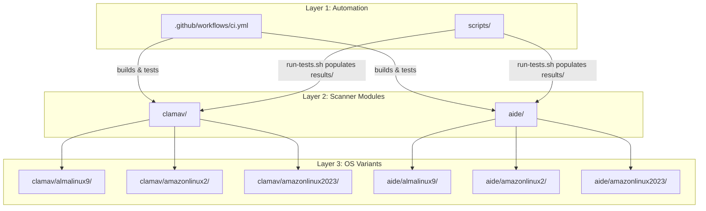
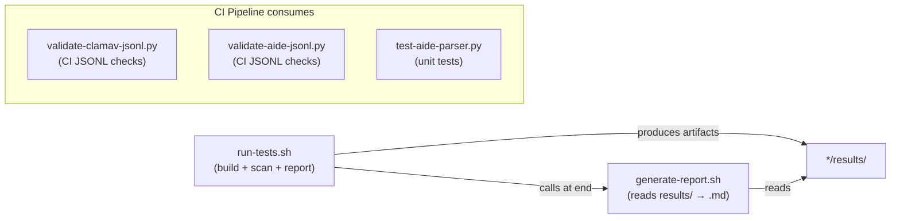

This page is your map to every file and directory in the **linux-security-scanners** repository. Rather than listing files alphabetically, we will walk through the organizational logic — why things live where they do, what naming conventions are at play, and how the directory layout directly reflects the project's **scanner-first, OS-variant** architecture. By the end, you should be able to predict where any new scanner or OS variant would be added, and understand which files are shared infrastructure versus OS-specific configuration.

Sources: [CLAUDE.md](CLAUDE.md#L16-L52), [README.md](README.md#L17-L48)

## The Big Picture: Three-Layer Architecture

The repository is organized around a clear three-layer hierarchy that mirrors how the system is built, tested, and deployed:



**Layer 1** (root-level automation) orchestrates builds and validation. **Layer 2** (scanner modules) groups everything related to a single scanner type. **Layer 3** (OS variants) holds the per-operating-system Dockerfiles and their test results. The key insight is that **cross-platform assets live in `shared/` subdirectories within each scanner**, while OS-specific concerns are isolated in named subdirectories.

Sources: [CLAUDE.md](CLAUDE.md#L54-L76), [README.md](README.md#L110-L137)

## Root-Level Files

The project root contains configuration, documentation, and automation entry points. These files serve as the "control plane" for the entire repository:

| File | Purpose | Audience |
|------|---------|----------|
| `README.md` | Public-facing project overview, quick start guide, scanner version matrix | All users |
| `CLAUDE.md` | AI-assisted development context — project structure summary, build commands, key findings | AI tools / developers |
| `HISTORY.md` | PR and issue timeline with full descriptions — preserved because GitHub metadata doesn't travel with git clones | Maintainers |
| `TEST-RESULTS-BREAKDOWN.md` | Auto-generated test report with cross-OS comparison tables, created by `scripts/generate-report.sh` | QA / developers |
| `.gitattributes` | Enforces LF line endings on `*.sh` files so shell scripts run correctly inside Linux containers from any host OS | Cross-platform hygiene |
| `.gitignore` | Excludes OS/editor artifacts, Python bytecode, and runtime outputs (`*.log`, `*.jsonl` in `results/` directories) | Version control |

The `.gitattributes` file is particularly important for cross-platform development: because Docker builds run on Linux but developers may work on macOS or Windows, enforcing LF line endings prevents subtle `"\r: command not found"` errors inside containers. The `.gitignore` file strategically tracks reference JSON outputs in `results/` while ignoring ephemeral `.log` and `.jsonl` files that are regenerated by each test run.

Sources: [.gitattributes](.gitattributes#L1-L2), [.gitignore](.gitignore#L1-L19), [HISTORY.md](HISTORY.md#L1-L6), [TEST-RESULTS-BREAKDOWN.md](TEST-RESULTS-BREAKDOWN.md#L1-L8)

## Scanner Module Layout

Each scanner (`clamav/` and `aide/`) follows an identical internal structure. This is a deliberate convention — if you understand one, you understand both. The pattern looks like this:

```
<scanner>/
├── README.md              # Full scanner-specific documentation
├── shared/                # Cross-platform assets (same on all OSes)
│   ├── *-to-json.py       # Text-to-JSON parser (core pipeline component)
│   ├── *-scan.service     # Systemd service unit
│   ├── *-scan.timer       # Systemd timer unit (scheduled execution)
│   └── *-jsonl.conf       # Logrotate config (30-day retention)
├── almalinux9/
│   ├── Dockerfile         # AlmaLinux 9 image definition
│   └── results/           # Test output artifacts
│       └── *.json         # Sample JSON parser output
├── amazonlinux2/
│   ├── Dockerfile         # Amazon Linux 2 image definition
│   └── results/           # Test output artifacts
└── amazonlinux2023/
    ├── Dockerfile         # Amazon Linux 2023 image definition
    └── results/           # Test output artifacts
```

The **`shared/` directory** is the heart of each scanner module. It contains the Python parser, systemd units, and logrotate configuration — assets that are identical regardless of which OS image they run on. Every Dockerfile in the module copies files from `shared/` into the container image at build time using `COPY <scanner>/shared/... /usr/local/bin/`.

The **OS-specific directories** contain only two things: a `Dockerfile` that defines the container image, and a `results/` subdirectory that captures test output. This minimal footprint per OS variant makes it straightforward to add new operating systems — you create a new directory, write a Dockerfile, and the shared infrastructure automatically applies.

Sources: [clamav/almalinux9/Dockerfile](clamav/almalinux9/Dockerfile#L10-L10), [aide/almalinux9/Dockerfile](aide/almalinux9/Dockerfile#L3-L3), [CLAUDE.md](CLAUDE.md#L27-L51)

### Shared Assets: What Lives Where and Why

The `shared/` subdirectory within each scanner module contains four to five files, each with a specific role in the scanner-to-SIEM pipeline:

| Shared File (ClamAV) | Shared File (AIDE) | Purpose | Copied to Container Path |
|---|---|---|---|
| `clamscan-to-json.py` | `aide-to-json.py` | Reads scanner text from stdin, emits one-line JSON to stdout, appends to JSONL file | `/usr/local/bin/<name>` |
| `clamav-scan.service` | `aide-check.service` | Systemd oneshot service that pipes scanner output into the JSON parser | `/etc/systemd/system/` (deployment) |
| `clamav-scan.timer` | `aide-check.timer` | Systemd timer — daily for ClamAV, every 4 hours for AIDE | `/etc/systemd/system/` (deployment) |
| `clamav-jsonl.conf` | `aide-jsonl.conf` | Logrotate config for `/var/log/<scanner>/<scanner>.jsonl` | `/etc/logrotate.d/` (deployment) |
| — | *(AL2023 only)* `native-json-demo.sh` | Demonstrates AIDE 0.18.6 native JSON behavior (order-sensitive config) | `/usr/local/bin/` |

Note that `clamav/shared/` also contains `parse_to_json.py` — an earlier version of the parser that reads from files at hardcoded paths (`/tmp/with_summary.txt`, `/tmp/no_summary.txt`). This is a **development artifact** that was superseded by `clamscan-to-json.py`, which reads from stdin and appends to JSONL. Both files are preserved in the repository.

Sources: [clamav/shared/clamscan-to-json.py](clamav/shared/clamscan-to-json.py#L1-L11), [aide/shared/aide-to-json.py](aide/shared/aide-to-json.py#L1-L10), [clamav/shared/clamav-scan.service](clamav/shared/clamav-scan.service#L1-L30), [aide/shared/aide-check.timer](aide/shared/aide-check.timer#L1-L12), [clamav/shared/parse_to_json.py](clamav/shared/parse_to_json.py#L1-L6)

### OS-Specific Directories: Dockerfiles and Results

Each OS variant directory (`almalinux9/`, `amazonlinux2/`, `amazonlinux2023/`) is intentionally lightweight. It contains exactly one `Dockerfile` and one `results/` subdirectory. The Dockerfile is the sole point of divergence between OS variants — it specifies the base image, the package installation method, and any OS-specific quirks.

Here is how the Dockerfiles differ across operating systems for the same scanner:

| Aspect | AlmaLinux 9 | Amazon Linux 2 | Amazon Linux 2023 |
|--------|-------------|----------------|-------------------|
| **Base image** | `almalinux:9` | `amazonlinux:2` | `amazonlinux:2023` |
| **Package manager** | `dnf` | `yum` + `amazon-linux-extras` | `dnf` |
| **ClamAV source** | Cisco Talos RPM (SHA-verified) | EPEL via `amazon-linux-extras` | Cisco Talos RPM (SHA-verified) |
| **ClamAV version** | 1.5.2 | 1.4.3 | 1.5.2 |
| **AIDE version** | 0.16 | 0.16.2 | 0.18.6 |
| **Multi-arch support** | Yes (`TARGETARCH` + arch-specific SHA) | No (EPEL package) | Yes (`TARGETARCH` + arch-specific SHA) |

The `results/` subdirectory in each OS variant captures test artifacts. The `.gitignore` file is configured to track `.json` files (reference parser output) while ignoring `.log` and `.jsonl` files (ephemeral runtime output). This means that reference JSON outputs are committed to the repository as documentation, while raw scanner logs and JSONL append files are regenerated locally by test runs.

Sources: [clamav/almalinux9/Dockerfile](clamav/almalinux9/Dockerfile#L1-L32), [clamav/amazonlinux2/Dockerfile](clamav/amazonlinux2/Dockerfile#L1-L12), [clamav/amazonlinux2023/Dockerfile](clamav/amazonlinux2023/Dockerfile#L1-L32), [aide/almalinux9/Dockerfile](aide/almalinux9/Dockerfile#L1-L10), [aide/amazonlinux2/Dockerfile](aide/amazonlinux2/Dockerfile#L1-L10), [aide/amazonlinux2023/Dockerfile](aide/amazonlinux2023/Dockerfile#L1-L11)

### The Amazon Linux 2023 AIDE Exception

The `aide/amazonlinux2023/` directory is the only OS variant that carries extra files beyond the standard `Dockerfile` + `results/` pattern. This is because AIDE 0.18.6 on Amazon Linux 2023 is the only combination where **native JSON output** (`report_format=json`) is available, but it has a critical gotcha: the config directive is order-sensitive and must appear *before* any `report_url=` lines. Two additional files document and demonstrate this behavior:

- **`native-json-demo.sh`** — A reproducible script that tests three methods of enabling native JSON output (CLI `-B` flag, appended config, inserted config) and shows which ones produce JSON vs. plain text. It is copied into the Docker image at build time and can be run inside the container.
- **`native-json-comparison.md`** — A detailed side-by-side comparison of native JSON output versus the Python wrapper, covering schema differences, SIEM compatibility, and config complexity.

This exception proves the organizational rule: when an OS variant needs unique documentation or tooling, it lives *inside* that variant's directory rather than in `shared/`. The Dockerfile for this variant has an extra `COPY` line to include `native-json-demo.sh` in the image.

Sources: [aide/amazonlinux2023/native-json-demo.sh](aide/amazonlinux2023/native-json-demo.sh#L1-L18), [aide/amazonlinux2023/native-json-comparison.md](aide/amazonlinux2023/native-json-comparison.md#L1-L27), [aide/amazonlinux2023/Dockerfile](aide/amazonlinux2023/Dockerfile#L4-L4)

## The `scripts/` Directory: Build, Test, Validate, Report

All automation and testing scripts live in a single `scripts/` directory at the project root. This centralization means that CI pipelines and local development workflows share the same entry points. The scripts form a dependency chain:



Here is what each script does and when you would use it:

| Script | Language | Purpose | When to Run |
|--------|----------|---------|-------------|
| `run-tests.sh` | Bash | Builds all Docker images, runs scans for every scanner/OS combo, saves results to `*/results/`, then calls `generate-report.sh` | Local development: `./scripts/run-tests.sh` |
| `generate-report.sh` | Bash | Reads `.log` and `.json` files from all `*/results/` directories and produces `TEST-RESULTS-BREAKDOWN.md` with cross-OS comparison tables | After tests: `./scripts/generate-report.sh` |
| `validate-clamav-jsonl.py` | Python | Validates that a JSONL file contains the expected number of lines, each with valid JSON containing `hostname` and `file_results` | CI smoke test (inside container) |
| `validate-aide-jsonl.py` | Python | Validates JSONL lines contain valid JSON with `scanner`, `result`, `hostname`, and `timestamp` fields | CI smoke test (inside container) |
| `test-aide-parser.py` | Python | Unit tests for the AIDE parser covering multi-line ACLs, hash continuations, and edge cases — runs without Docker | Locally or CI: `python3 scripts/test-aide-parser.py` |

The `run-tests.sh` script accepts several flags for targeted builds: `--build-only` skips scans, `--scanner <name>` runs only one scanner, and `--os <name>` targets a single OS variant. These flags compose, so `--scanner aide --os almalinux9` builds and tests only the AlmaLinux 9 AIDE image.

Sources: [scripts/run-tests.sh](scripts/run-tests.sh#L1-L35), [scripts/generate-report.sh](scripts/generate-report.sh#L1-L18), [scripts/validate-clamav-jsonl.py](scripts/validate-clamav-jsonl.py#L1-L27), [scripts/validate-aide-jsonl.py](scripts/validate-aide-jsonl.py#L1-L29), [scripts/test-aide-parser.py](scripts/test-aide-parser.py#L1-L21)

## CI Configuration

The `.github/workflows/ci.yml` file defines the GitHub Actions pipeline. It runs on every push or pull request to `master` and consists of four parallel job groups:

| Job | Purpose | Runs On |
|-----|---------|---------|
| `aide-parser-unit-tests` | Runs `test-aide-parser.py` without Docker — fast feedback on parser logic | Any OS (no container needed) |
| `build-clamav` (×3 matrix) | Builds, version-checks, smoke-tests, and validates JSONL for each ClamAV OS variant | `ubuntu-latest` (Docker required) |
| `build-aide` (×3 matrix) | Builds, version-checks, smoke-tests, and validates JSONL for each AIDE OS variant | `ubuntu-latest` (Docker required) |
| `verify-aide-native-json-al2023` | Verifies AIDE 0.18.6 native JSON output works and the demo script runs cleanly | `ubuntu-latest` (depends on `build-aide`) |

Each build job uploads sample scan results as downloadable artifacts with 30-day retention. The `fail-fast: false` setting ensures that a failure in one OS variant does not cancel the others — all six images are tested independently.

Sources: [.github/workflows/ci.yml](.github/workflows/ci.yml#L1-L196)

## Complete File Inventory

The following table provides a comprehensive inventory of every tracked file in the repository, organized by directory with cross-references to the documentation page that covers it in depth:

| Path | Type | Brief Description |
|------|------|-------------------|
| `README.md` | Documentation | Project overview and quick start |
| `CLAUDE.md` | Documentation | AI-assisted development context |
| `HISTORY.md` | Documentation | PR/issue timeline with full descriptions |
| `TEST-RESULTS-BREAKDOWN.md` | Generated | Cross-OS test report (auto-generated) |
| `.gitattributes` | Config | LF line ending enforcement for `*.sh` |
| `.gitignore` | Config | Excludes runtime outputs and editor artifacts |
| `.github/workflows/ci.yml` | CI | GitHub Actions pipeline definition |
| `clamav/README.md` | Documentation | Full ClamAV guide |
| `clamav/shared/clamscan-to-json.py` | Python | ClamAV text-to-JSON parser (stdin → stdout + JSONL) |
| `clamav/shared/parse_to_json.py` | Python | Earlier parser version (file-based, deprecated) |
| `clamav/shared/clamav-scan.service` | Systemd | ClamAV on-demand scan service unit |
| `clamav/shared/clamav-scan.timer` | Systemd | Daily ClamAV scan timer |
| `clamav/shared/clamav-jsonl.conf` | Logrotate | 30-day rotation for `clamscan.jsonl` |
| `clamav/almalinux9/Dockerfile` | Dockerfile | AlmaLinux 9 + ClamAV 1.5.2 (Cisco Talos RPM) |
| `clamav/almalinux9/results/clamscan.json` | Test artifact | Sample JSON parser output |
| `clamav/amazonlinux2/Dockerfile` | Dockerfile | Amazon Linux 2 + ClamAV 1.4.3 (EPEL) |
| `clamav/amazonlinux2/results/clamscan.json` | Test artifact | Sample JSON parser output |
| `clamav/amazonlinux2023/Dockerfile` | Dockerfile | Amazon Linux 2023 + ClamAV 1.5.2 (Cisco Talos RPM) |
| `clamav/amazonlinux2023/results/clamscan.json` | Test artifact | Sample JSON parser output |
| `aide/README.md` | Documentation | Full AIDE guide |
| `aide/shared/aide-to-json.py` | Python | AIDE text-to-JSON parser (stdin → stdout + JSONL) |
| `aide/shared/aide-check.service` | Systemd | AIDE integrity check service unit |
| `aide/shared/aide-check.timer` | Systemd | Every-4-hours AIDE check timer |
| `aide/shared/aide-jsonl.conf` | Logrotate | 30-day rotation for `aide.jsonl` |
| `aide/almalinux9/Dockerfile` | Dockerfile | AlmaLinux 9 + AIDE 0.16 |
| `aide/almalinux9/results/aide.json` | Test artifact | Sample JSON parser output |
| `aide/amazonlinux2/Dockerfile` | Dockerfile | Amazon Linux 2 + AIDE 0.16.2 |
| `aide/amazonlinux2/results/aide.json` | Test artifact | Sample JSON parser output |
| `aide/amazonlinux2023/Dockerfile` | Dockerfile | Amazon Linux 2023 + AIDE 0.18.6 |
| `aide/amazonlinux2023/results/aide.json` | Test artifact | Sample JSON parser output |
| `aide/amazonlinux2023/native-json-demo.sh` | Shell | Reproducer for native JSON config ordering |
| `aide/amazonlinux2023/native-json-comparison.md` | Documentation | Native JSON vs Python wrapper comparison |
| `scripts/run-tests.sh` | Shell | Build + scan + report runner |
| `scripts/generate-report.sh` | Shell | Test results report generator |
| `scripts/validate-clamav-jsonl.py` | Python | CI JSONL validation for ClamAV |
| `scripts/validate-aide-jsonl.py` | Python | CI JSONL validation for AIDE |
| `scripts/test-aide-parser.py` | Python | AIDE parser unit tests |

Sources: [CLAUDE.md](CLAUDE.md#L18-L52), [README.md](README.md#L19-L48)

## Naming Conventions and Patterns

Understanding the naming patterns makes it easy to navigate the codebase without memorizing every path:

**Scanner directories** use the lowercase scanner name (`clamav/`, `aide/`). This is intentional — it matches the package name on all supported distributions.

**OS variant directories** use the distribution name with major version appended, no separators: `almalinux9/`, `amazonlinux2/`, `amazonlinux2023/`. These names are used directly as Docker image tag prefixes (e.g., `almalinux9-clamav:latest`).

**Parser scripts** follow the pattern `<scanner_command>-to-json.py`: `clamscan-to-json.py` (not `clamav-to-json.py`) and `aide-to-json.py`. The name matches the CLI command that produces the text output, not the scanner package name.

**Systemd units** use the pattern `<scanner>-scan.service` and `<scanner>-scan.timer` for ClamAV, but `aide-check.service` and `aide-check.timer` for AIDE. This mirrors the naming convention of the upstream `aide` package on RHEL-based systems.

**Results files** are named after the scanner command that produced them: `clamscan.json` and `clamscan.log` (not `clamav.json`), `aide.json` and `aide.log`. This makes it immediately clear which tool generated the output.

Sources: [scripts/run-tests.sh](scripts/run-tests.sh#L65-L115), [clamav/shared/clamscan-to-json.py](clamav/shared/clamscan-to-json.py#L5-L7), [aide/shared/aide-check.service](aide/shared/aide-check.service#L1-L3)

## How to Add a New Scanner or OS Variant

The project structure is designed to be extensible. Here is the mental model for adding new components:

**To add a new OS variant** (e.g., Ubuntu 24.04):
1. Create `<scanner>/ubuntu2404/Dockerfile` — base it on an existing Dockerfile but change the `FROM` image and package installation commands.
2. Create `<scanner>/ubuntu2404/results/` directory — `run-tests.sh` will populate it automatically.
3. The `shared/` assets (parser, systemd units, logrotate config) apply without modification.
4. Update `scripts/run-tests.sh` to add `ubuntu2404` to the `OSES` array if you want it included in the test runner.

**To add a new scanner** (e.g., Rootkit Hunter):
1. Create `rkhunter/` at the project root.
2. Create `rkhunter/shared/` with `rkhunter-to-json.py`, `rkhunter-scan.service`, `rkhunter-scan.timer`, and `rkhunter-jsonl.conf`.
3. Create `rkhunter/almalinux9/Dockerfile`, `rkhunter/amazonlinux2/Dockerfile`, and `rkhunter/amazonlinux2023/Dockerfile`.
4. Create `rkhunter/README.md` with the scanner-specific guide.
5. Update `scripts/run-tests.sh` to add `rkhunter` to the `SCANNERS` array.
6. Update `.github/workflows/ci.yml` with a new `build-rkhunter` job matrix.

This predictable structure means that adding new components is a matter of following the established directory template rather than making architectural decisions.

Sources: [scripts/run-tests.sh](scripts/run-tests.sh#L10-L11), [CLAUDE.md](CLAUDE.md#L56-L76)

## Where to Go Next

Now that you understand the project's file organization, these pages will help you dive into specific areas:

- **[Dockerfile Patterns: Multi-Architecture Builds and Shared Assets](15-dockerfile-patterns-multi-architecture-builds-and-shared-assets)** — How each Dockerfile is structured, why `COPY` paths use the scanner-relative convention, and how multi-architecture builds work.
- **[GitHub Actions CI Pipeline: Parallel Builds, Smoke Tests, and Artifact Upload](17-github-actions-ci-pipeline-parallel-builds-smoke-tests-and-artifact-upload)** — How the CI configuration maps to the directory structure you just learned.
- **[Line Ending Enforcement and Cross-Host Compatibility](21-line-ending-enforcement-and-cross-host-compatibility)** — Why `.gitattributes` exists and how it prevents cross-platform breakage.
- **[Architecture: The Scanner-to-JSON Pipeline Pattern](4-architecture-the-scanner-to-json-pipeline-pattern)** — How the `shared/*-to-json.py` parsers fit into the end-to-end data flow.