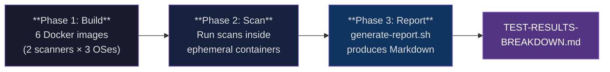
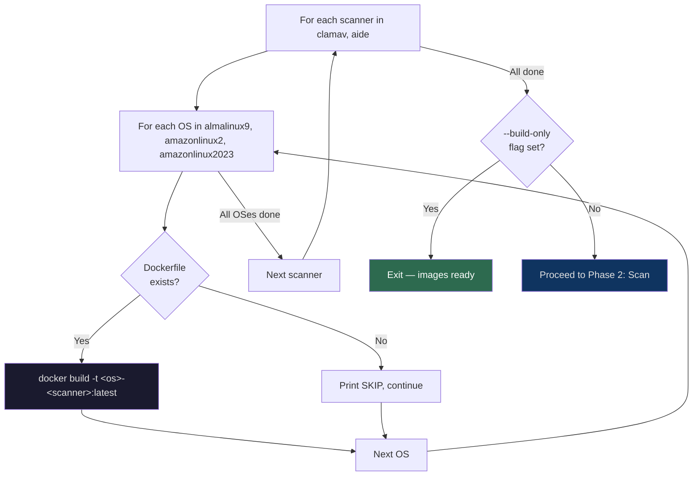
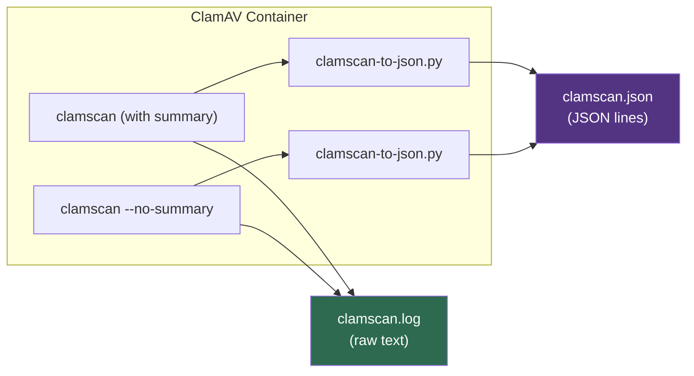
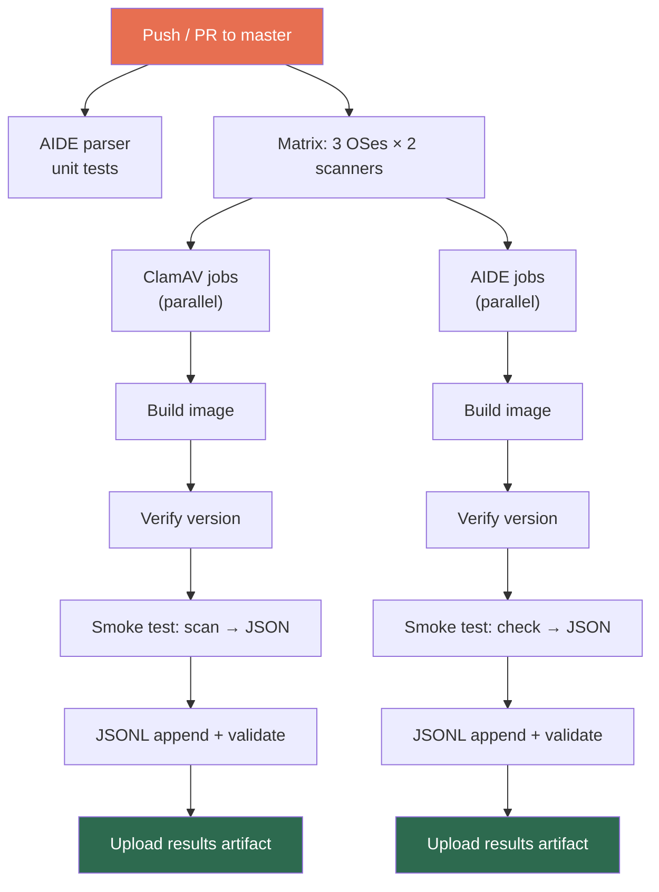

The test runner (`scripts/run-tests.sh`) is the single command that drives the entire local verification loop for this project. Given nothing more than Docker and a checkout of the repository, it will **build** every scanner image, **run** both ClamAV and AIDE scans inside ephemeral containers, **save** the raw and JSON-formatted results to per-OS directories, and finally **generate** a comprehensive Markdown report. This page walks you through each phase, explains every command-line option, shows you what to expect in the output directories, and gives you the confidence to extend the runner for your own scanner/OS combinations.

Sources: [run-tests.sh](scripts/run-tests.sh#L1-L3)

## The Three-Phase Pipeline at a Glance

Before diving into the mechanics, it helps to see the macro-level flow. The runner executes three sequential phases — build, scan, report — each feeding the next:



Each phase is **idempotent in isolation** — you can run `--build-only` to just compile images, or run `generate-report.sh` on existing results without Docker at all. The three phases only couple through the filesystem: Phase 2 writes `.log` and `.json` files into `*/results/` directories, and Phase 3 reads those same files.

Sources: [run-tests.sh](scripts/run-tests.sh#L42-L181), [generate-report.sh](scripts/generate-report.sh#L1-L8)

## Prerequisites

You need exactly three things on your machine before running the test runner:

| Requirement | Why | Verify |
|---|---|---|
| **Docker** (Docker Desktop, Colima, or dockerd) | Builds and runs Linux containers | `docker info` |
| **Bash** 3.2+ | Shell script execution | `bash --version` |
| **Python 3.6+** (host) | Only if running `generate-report.sh` standalone; the scan phase uses Python *inside* containers | `python3 --version` |

No pip packages, no external tools, no cloud credentials. The Dockerfiles install everything they need (ClamAV, AIDE, Python) inside the images.

Sources: [run-tests.sh](scripts/run-tests.sh#L4-L8), [CLAUDE.md](CLAUDE.md#L146-L151)

## Command-Line Options

The runner accepts three flags that let you narrow the scope of what gets built and tested:

```
./scripts/run-tests.sh [--build-only] [--scanner clamav|aide] [--os almalinux9|amazonlinux2|amazonlinux2023]
```

| Flag | Purpose | Example |
|---|---|---|
| `--build-only` | Build all matching images, then stop. Skip scans and report generation. | `./scripts/run-tests.sh --build-only` |
| `--scanner <name>` | Run only the specified scanner (and only build its images). | `./scripts/run-tests.sh --scanner aide` |
| `--os <name>` | Run only on the specified operating system. | `./scripts/run-tests.sh --os almalinux9` |

Flags **combine** freely — `--scanner clamav --os amazonlinux2` builds and tests only the `amazonlinux2-clamav` image. With no flags, the runner builds and tests all six combinations (2 scanners × 3 OSes).

Sources: [run-tests.sh](scripts/run-tests.sh#L14-L35)

### Quick Reference: Common Invocations

| What you want | Command |
|---|---|
| Full run (build + scan + report) | `./scripts/run-tests.sh` |
| Just build all images | `./scripts/run-tests.sh --build-only` |
| Test ClamAV on AlmaLinux 9 only | `./scripts/run-tests.sh --scanner clamav --os almalinux9` |
| Test AIDE across all OSes | `./scripts/run-tests.sh --scanner aide` |
| Re-generate report from existing results | `./scripts/generate-report.sh` |

Sources: [run-tests.sh](scripts/run-tests.sh#L22-L31), [generate-report.sh](scripts/generate-report.sh#L1-L18)

## Phase 1: Building Docker Images

The build phase iterates over every scanner/OS combination and calls `docker build` for each Dockerfile. Image tags follow the naming convention `<os>-<scanner>:latest` — for example, `almalinux9-clamav:latest` or `amazonlinux2023-aide:latest`. If a Dockerfile is missing for a particular combination (which shouldn't happen in this project), the runner prints `SKIP` and continues without error.



Each Dockerfile copies its scanner's Python parser from the `shared/` directory into the image at build time. For example, the ClamAV Dockerfile copies `clamav/shared/clamscan-to-json.py` to `/usr/local/bin/clamscan-to-json.py`, and the AIDE Dockerfile copies `aide/shared/aide-to-json.py` to `/usr/local/bin/aide-to-json.py`. The AIDE images also run `aide --init` during the build to bake a baseline database into the image layer.

Sources: [run-tests.sh](scripts/run-tests.sh#L42-L57), [clamav/almalinux9/Dockerfile](clamav/almalinux9/Dockerfile#L10-L10), [aide/almalinux9/Dockerfile](aide/almalinux9/Dockerfile#L3-L8)

## Phase 2: Running Scans and Collecting Results

After all images are built, the runner enters the scan phase. It loops through each scanner separately, running containerized scan commands and capturing their output to host-side files. The key design principle here is that **containers are ephemeral** — every `docker run --rm` creates a fresh container, runs the scan, and destroys it, ensuring clean and reproducible results.

### ClamAV Scan Execution

For each OS, the runner spins up a ClamAV container and performs **two test scans** to exercise both output modes of `clamscan`:

1. **With summary** (default `clamscan` output) — scans four system files and captures the full output including the `SCAN SUMMARY` block
2. **Without summary** (`clamscan --no-summary`) — scans the same files but omits the summary block, testing that the JSON parser handles this edge case

Both scans target safe system files (`/etc/hostname`, `/etc/hosts`, `/etc/passwd`, `/etc/resolv.conf`) that exist in every container. The raw output is saved to `clamscan.log`, and the JSON-parsed output (piped through `clamscan-to-json.py` inside the container) is saved to `clamscan.json`.



Sources: [run-tests.sh](scripts/run-tests.sh#L64-L115)

### AIDE Scan Execution

AIDE testing follows a similar pattern but with an important difference: AIDE is **stateful**. The baseline database was created during image build (`aide --init`), so when a new container starts, Docker's filesystem layering already causes predictable changes (modified `/etc/hosts`, new hostname, etc.). The runner runs two checks:

1. **Clean check** — runs `aide -C` against the unmodified container (will still report changes due to Docker-injected file differences)
2. **Tampered check** — writes a test file (`/tmp/ci-test-hack`) and changes permissions on `/etc/resolv.conf` (`chmod 777`), then runs `aide -C` again to verify that AIDE detects the deliberate tampering

As with ClamAV, raw output goes to `aide.log` and JSON-parsed output goes to `aide.json`. The tampered check is truncated to 80 lines (`head -80`) to keep the log file manageable, since AIDE produces verbose detail sections for every changed file attribute.

Sources: [run-tests.sh](scripts/run-tests.sh#L117-L172)

### Result File Locations

Every scanner/OS combination deposits its results into a dedicated directory:

```
<scanner>/<os>/results/
├── <scanner-command>.log    # Raw scanner text output
└── <scanner-command>.json   # JSON-parsed output (one JSON line per scan)
```

Concretely, this expands to six result directories:

| Path | Contents |
|---|---|
| `clamav/almalinux9/results/clamscan.log` | Raw ClamAV output on AlmaLinux 9 |
| `clamav/almalinux9/results/clamscan.json` | JSON-parsed ClamAV output on AlmaLinux 9 |
| `clamav/amazonlinux2/results/clamscan.log` | Raw ClamAV output on Amazon Linux 2 |
| `clamav/amazonlinux2/results/clamscan.json` | JSON-parsed ClamAV output on Amazon Linux 2 |
| `clamav/amazonlinux2023/results/clamscan.log` | Raw ClamAV output on Amazon Linux 2023 |
| `clamav/amazonlinux2023/results/clamscan.json` | JSON-parsed ClamAV output on Amazon Linux 2023 |
| `aide/almalinux9/results/aide.log` | Raw AIDE output on AlmaLinux 9 |
| `aide/almalinux9/results/aide.json` | JSON-parsed AIDE output on AlmaLinux 9 |
| `aide/amazonlinux2/results/aide.log` | Raw AIDE output on Amazon Linux 2 |
| `aide/amazonlinux2/results/aide.json` | JSON-parsed AIDE output on Amazon Linux 2 |
| `aide/amazonlinux2023/results/aide.log` | Raw AIDE output on Amazon Linux 2023 |
| `aide/amazonlinux2023/results/aide.json` | JSON-parsed AIDE output on Amazon Linux 2023 |

Sources: [run-tests.sh](scripts/run-tests.sh#L67-L172)

## Phase 3: Generating the Markdown Report

After all scans complete, the runner automatically invokes `scripts/generate-report.sh` as its final step. This script reads the `.log` and `.json` files from every `results/` directory and produces a single, comprehensive Markdown document at the project root: `TEST-RESULTS-BREAKDOWN.md`.

The report generator can also be run **standalone** — it requires no Docker, only the result files:

```bash
# Default output: TEST-RESULTS-BREAKDOWN.md
./scripts/generate-report.sh

# Custom output path
./scripts/generate-report.sh --output my-report.md
```

Sources: [generate-report.sh](scripts/generate-report.sh#L1-L18), [run-tests.sh](scripts/run-tests.sh#L178-L181)

### What Goes Into the Report

The generated report contains four major sections, all populated from actual scan data rather than hardcoded values:

| Section | What It Covers | Data Source |
|---|---|---|
| **Image Inventory** | Table of all 6 images with versions, base images, and install sources | Hardcoded version arrays in the script, cross-referenced with actual log files |
| **ClamAV Results** | Per-OS scan details (version, signatures, scan time, infected count), plus a cross-OS comparison table | `clamav/*/results/clamscan.log` and `.json` |
| **AIDE Results** | Per-OS check details (clean vs. tampered, changed entries, hash algorithms), plus a cross-OS comparison | `aide/*/results/aide.log` and `.json` |
| **JSONL Append Validation** | Confirms each JSON file has exactly 2 lines (one per scan), proving the JSONL append pattern works | Line counts from `.json` files |
| **File Inventory** | Directory tree and file size table of all result artifacts | Filesystem scan of `*/results/` |

The report extracts specific fields from log files using `sed` and `grep` helpers — for example, it pulls the ClamAV engine version by matching the `Engine version:` line, and AIDE changed-entry counts by matching summary lines like `Changed entries:`. If a result file is missing (e.g., you filtered to a single OS with `--os`), the report prints a helpful message telling you which command to run to generate the missing data.

Sources: [generate-report.sh](scripts/generate-report.sh#L20-L200), [generate-report.sh](scripts/generate-report.sh#L528-L631)

### Report Extraction Helpers

The report generator defines a set of `sed`-based helper functions that parse structured fields from the raw log files. Here is a summary of the key helpers and what they extract:

| Helper Function | Input | Extracts |
|---|---|---|
| `get_clamav_version()` | `clamscan.log` | Engine version number (e.g., `1.5.2`) |
| `get_clamav_field()` | `clamscan.log` | Any named summary field (Known viruses, Scanned files, etc.) |
| `get_aide_version()` | `aide.log` | AIDE version from the header line |
| `get_aide_summary()` / `get_aide_summary_stdin()` | `aide.log` | Summary counts (Total entries, Added, Removed, Changed) |
| `get_aide_runtime()` / `get_aide_runtime_stdin()` | `aide.log` | Scan run time string |
| `get_aide_changed_files()` | `aide.log` | List of changed file paths from the clean check section |
| `has_perm_change()` | `aide.log` | Whether the tampered check detected the `chmod 777` permission change |
| `hr_size()` | Any file | Human-readable file size (B, KB, or MB) |

These helpers operate on delimited sections of the log files — for example, AIDE clean-check data is extracted only from the region between `=== CLEAN CHECK` and `=== CHECK WITH TAMPERED` markers, ensuring the statistics are not contaminated by the tampered-check output.

Sources: [generate-report.sh](scripts/generate-report.sh#L39-L138)

## How It Fits into CI

The test runner's logic is mirrored in the project's GitHub Actions pipeline ([ci.yml](.github/workflows/ci.yml)). The CI workflow builds all six images in parallel using a matrix strategy, runs smoke tests (version verification, scan-to-JSON output, JSONL append validation), and uploads sample result artifacts. The key difference is that CI uses `validate-clamav-jsonl.py` and `validate-aide-jsonl.py` for programmatic pass/fail checks rather than generating a human-readable report:



For a deep dive into the CI pipeline structure, see [GitHub Actions CI Pipeline: Parallel Builds, Smoke Tests, and Artifact Upload](17-github-actions-ci-pipeline-parallel-builds-smoke-tests-and-artifact-upload). For details on the validation scripts, see [JSONL Validation Scripts for ClamAV and AIDE](18-jsonl-validation-scripts-for-clamav-and-aide).

Sources: [ci.yml](.github/workflows/ci.yml#L1-L96)

## Troubleshooting Common Issues

Because the runner orchestrates Docker builds and container execution across multiple OSes, certain failure modes are predictable. Here is a reference for the most common issues:

| Symptom | Likely Cause | Fix |
|---|---|---|
| `SKIP: <path>/Dockerfile not found` | You're running from the wrong directory, or files are missing | Run from project root: `cd /path/to/linux-security-scanners` |
| `SKIP: <tag> not built` (during scan phase) | Docker build failed silently (check for errors above) | Run `docker build` manually for that image to see the full error |
| `docker: command not found` | Docker is not installed or not in PATH | Install Docker Desktop (macOS/Windows) or dockerd (Linux) |
| Build hangs at `freshclam` (ClamAV) | Network issue downloading virus definitions | Check internet connection; ClamAV downloads ~200 MB of signatures |
| Empty `.json` files | Python parser crashed inside container | Run the scan command manually: `docker run --rm <tag> bash -c 'clamscan /etc/hosts \| python3 /usr/local/bin/clamscan-to-json.py'` |
| Report shows "No results found" for an OS | You used `--scanner` or `--os` filters but then ran `generate-report.sh` without those filters | Re-run `run-tests.sh` without filters, or accept the partial report |

Sources: [run-tests.sh](scripts/run-tests.sh#L48-L50), [run-tests.sh](scripts/run-tests.sh#L69-L72), [generate-report.sh](scripts/generate-report.sh#L233-L238)

## Where to Go Next

Now that you understand how the test runner works end-to-end, here are logical next steps based on what you want to explore:

- **Understand the architecture** behind the scanner-to-JSON pipeline pattern → [Architecture: The Scanner-to-JSON Pipeline Pattern](4-architecture-the-scanner-to-json-pipeline-pattern)
- **Dive into a specific scanner's internals** → [ClamAV JSON Parser: Text-to-Structured Output (clamscan-to-json.py)](6-clamav-json-parser-text-to-structured-output-clamscan-to-json-py) or [AIDE JSON Parser: Parsing Multi-Section Integrity Reports (aide-to-json.py)](9-aide-json-parser-parsing-multi-section-integrity-reports-aide-to-json-py)
- **Learn about the CI pipeline** that automates this process on every push → [GitHub Actions CI Pipeline: Parallel Builds, Smoke Tests, and Artifact Upload](17-github-actions-ci-pipeline-parallel-builds-smoke-tests-and-artifact-upload)
- **Understand the report generator in detail** → [Generating Test Reports from Scan Results (generate-report.sh)](20-generating-test-reports-from-scan-results-generate-report-sh)
- **Explore the full project layout** → [Project Structure and File Organization](22-project-structure-and-file-organization)