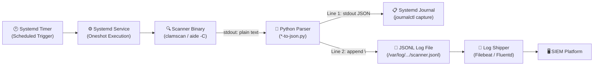
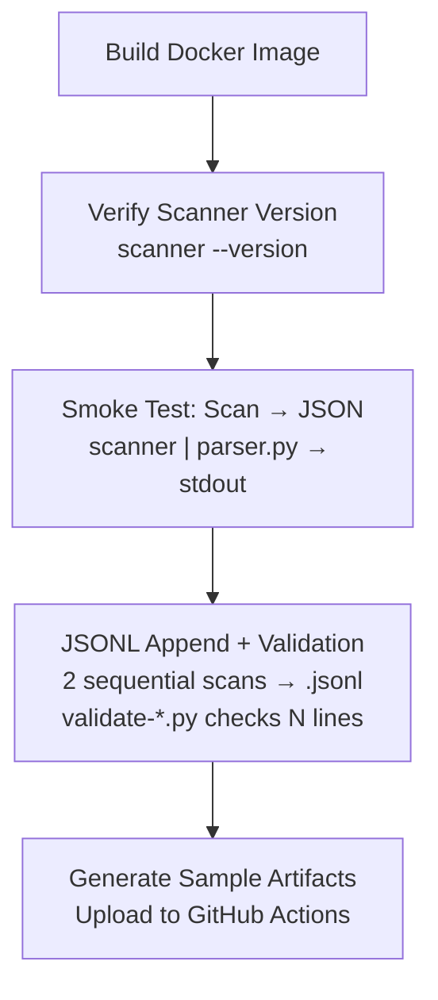

This page explains the core architectural pattern that unifies every scanner in this repository: a **scanner-to-JSON pipeline** that transforms heterogeneous plain-text security tool output into uniform, single-line JSON suitable for SIEM ingestion. Understanding this pattern is the key to working with any scanner in this project — whether ClamAV, AIDE, or future additions — because they all follow the same structural contract despite parsing radically different input formats.

## The Problem: Security Scanners Speak Plain Text

Linux security tools like ClamAV and AIDE were designed for human operators, not log aggregation pipelines. ClamAV's `clamscan` prints a line-per-file status followed by a `--- SCAN SUMMARY ---` block. AIDE's `aide -C` emits a multi-section report with added entries, removed entries, changed entries, detailed attribute diffs, and database hashes. Neither tool produces structured JSON across all supported operating systems — ClamAV lacks a compiled-in `--json` flag, and AIDE's native `report_format=json` only exists in version 0.18+ and is order-sensitive in its configuration file.

This creates a fundamental impedance mismatch: your SIEM (Splunk, Elastic, QRadar) wants structured, parseable events, but your scanners emit line-oriented text that varies by version and OS. The pipeline pattern solves this by inserting a lightweight Python adapter between each scanner and its downstream consumers.

Sources: [CLAUDE.md](CLAUDE.md#L109-L113), [aide/shared/aide-to-json.py](aide/shared/aide-to-json.py#L1-L10), [clamav/shared/clamscan-to-json.py](clamav/shared/clamscan-to-json.py#L1-L11)

## Pipeline Architecture Overview

The pattern is a four-stage pipeline that runs inside a Unix pipe, triggered by a systemd oneshot service on a timer schedule:



**Stage 1 — Scheduled Trigger**: A systemd timer fires on a calendar schedule (daily for ClamAV, every 4 hours for AIDE) with randomized delay to prevent thundering herd across a fleet of hosts. The timer activates a systemd oneshot service.

**Stage 2 — Scanner Execution**: The service's `ExecStart` directive runs the scanner binary via a shell command. The scanner outputs its native plain-text report to stdout.

**Stage 3 — Python Parsing**: The scanner's stdout is piped into a Python script that reads the full text from stdin, parses it into a structured dictionary, enriches it with hostname and UTC timestamp, serializes to compact JSON (no whitespace), and produces dual output: prints to stdout (captured by the journal) and appends to a JSONL log file.

**Stage 4 — SIEM Ingestion**: A log shipper (Filebeat, Fluentd, rsyslog) tails the JSONL file and forwards events to the SIEM. Logrotate manages retention with 30-day rotation.

Sources: [aide/shared/aide-check.service](aide/shared/aide-check.service#L8-L12), [clamav/shared/clamav-scan.service](clamav/shared/clamav-scan.service#L8-L16), [aide/shared/aide-check.timer](aide/shared/aide-check.timer#L4-L8), [clamav/shared/clamav-scan.timer](clamav/shared/clamav-scan.timer#L4-L9)

## The Pipe: Scanner → Parser → Dual Output

The pipeline's core is a single Unix pipe expressed in each service's `ExecStart` directive. Here is how it looks for both scanners:

```
# AIDE (from aide-check.service)
/usr/sbin/aide -C 2>&1 | /usr/local/bin/aide-to-json.py

# ClamAV (from clamav-scan.service)
/usr/local/bin/clamscan -r / | /usr/local/bin/clamscan-to-json.py
```

Notice the structural symmetry: `scanner_binary [args] | parser_script`. AIDE redirects stderr to stdout (`2>&1`) because some versions write status information to stderr. ClamAV does not need this because `clamscan` writes all report content to stdout by default. The parser scripts live at `/usr/local/bin/` and are made executable during the Docker image build.

Sources: [aide/shared/aide-check.service](aide/shared/aide-check.service#L12), [clamav/shared/clamav-scan.service](clamav/shared/clamav-scan.service#L16)

## The Parser Contract: stdin → Enriched JSON

Both parser scripts implement the same **functional contract** despite handling completely different input formats. This contract is what makes the architecture extensible — adding a new scanner means writing a new parser that satisfies the same interface.

| Contract Element | ClamAV Parser | AIDE Parser |
|---|---|---|
| **Input** | `sys.stdin.read()` — full clamscan output | `sys.stdin.read()` — full AIDE check output |
| **Core function** | `parse_clamscan(raw: str) -> dict` | `parse_aide(raw: str) -> dict` |
| **Enrichment** | `hostname` + `timestamp` | `hostname` + `timestamp` + `scanner` |
| **Serialization** | `json.dumps(parsed, separators=(",",":"))` | `json.dumps(parsed, separators=(",",":"))` |
| **Stdout output** | `print(json_line)` | `print(json_line)` |
| **File output** | Append to `/var/log/clamav/clamscan.jsonl` | Append to `/var/log/aide/aide.jsonl` |
| **Error handling** | `PermissionError` → silent fallback | `OSError` → silent fallback |
| **Empty input** | `sys.exit(0)` — no output | `sys.exit(0)` — no output |
| **Dependencies** | stdlib only (`json`, `re`, `sys`, `socket`, `datetime`) | stdlib only (`json`, `re`, `sys`, `socket`, `datetime`) |

The enrichment step is critical and identical in both parsers: each adds `hostname` (via `socket.gethostname()`) and an ISO 8601 UTC timestamp (via `datetime.now(timezone.utc).strftime("%Y-%m-%dT%H:%M:%SZ")`). The AIDE parser additionally tags each event with `"scanner": "aide"` for unambiguous identification in a mixed-scanner SIEM index. Both use `separators=(",",":")` to produce the most compact possible JSON — no unnecessary whitespace — which minimizes JSONL file size and network transfer cost.

Sources: [clamav/shared/clamscan-to-json.py](clamav/shared/clamscan-to-json.py#L54-L80), [aide/shared/aide-to-json.py](aide/shared/aide-to-json.py#L203-L230)

## Dual-Output Strategy: Journal + JSONL File

The parsers write each event to **two destinations simultaneously**, and this is a deliberate architectural choice, not redundancy:

**stdout → systemd journal**: When the parser runs inside a systemd service, `stdout` is captured by the journal. Operators can inspect recent scans with `journalctl -u aide-check.service --since today` or `journalctl -u clamav-scan.service --since today`. This provides immediate, zero-configuration visibility without any log shipper. The journal also serves as a backup if the JSONL file is unavailable.

**JSONL file append → SIEM ingestion**: The parser opens the scanner-specific log file in append mode and writes one line (the JSON object followed by `\n`). This produces a valid JSONL file that a log shipper can tail continuously. The file-based approach decouples the scanner from the SIEM — scans run independently of whether the log shipper is currently connected, and historical data persists across service restarts.

The JSONL write is **best-effort**: both parsers catch file I/O errors silently and fall back to stdout-only output. This ensures the pipeline never fails the scanner run due to a log directory permission issue or a missing `/var/log` path — particularly important during local development and Docker testing where the log directory may not exist.

Sources: [clamav/shared/clamscan-to-json.py](clamav/shared/clamscan-to-json.py#L66-L76), [aide/shared/aide-to-json.py](aide/shared/aide-to-json.py#L216-L226)

## Parser Internals: How Text Becomes Structure

Despite sharing the same contract, the two parsers employ fundamentally different parsing strategies because their input formats have nothing in common.

### ClamAV: Two-Phase State Machine

ClamAV's output has two distinct phases: a **file results** section (one line per scanned file showing path and status) followed by a **scan summary** section (key-value pairs after the `--- SCAN SUMMARY ---` delimiter). The parser uses a boolean flag `in_summary` to toggle between two regex patterns:

```
# File results phase: match "filepath: STATUS"
^(.+?):\s+(OK|FOUND.*)$

# Summary phase: match "Key: Value"
^([\w\s]+?):\s+(.+)$
```

The summary phase also performs type coercion for known numeric fields (`known_viruses`, `scanned_directories`, `scanned_files`, `infected_files`), converting string values to integers. When ClamAV is invoked with `--no-summary`, the summary section is absent, and the parser cleanly omits the `scan_summary` key from output.

Sources: [clamav/shared/clamscan-to-json.py](clamav/shared/clamscan-to-json.py#L17-L51)

### AIDE: Multi-Section Line Scanner with Continuation Handling

AIDE's output is considerably more complex — a single report can contain up to six sections (outline, summary, added entries, removed entries, changed entries, detailed information, database attributes). The parser tracks a `section` variable that advances as it encounters section headers, and uses section-specific regex patterns to extract structured data.

The most intricate part is the **detailed changes** section, which must handle multi-line values. AIDE wraps long hash values and ACL entries across multiple lines. The parser distinguishes between **attribute-introducing lines** (1–2 leading spaces) and **continuation lines** (8+ leading spaces) by counting indentation:

```python
leading_spaces = len(line) - len(line.lstrip(" "))
is_continuation = leading_spaces >= 8
```

Continuation lines are appended to the previous attribute's value. The parser also differentiates between hash-type attributes (where continuation fragments are concatenated with no separator) and multi-value attributes like ACL and XAttrs (where fragments are joined with a space), controlled by the `_MULTIVALUE_ATTRS` set.

Sources: [aide/shared/aide-to-json.py](aide/shared/aide-to-json.py#L21-L200), [aide/shared/aide-to-json.py](aide/shared/aide-to-json.py#L114-L162)

## Docker Image Packaging: Baking the Pipeline

Each scanner/OS combination is packaged as a Docker image that contains three ingredients: the **OS base image**, the **scanner binary** (installed via the OS package manager or direct RPM download), and the **Python parser** (copied from `shared/` and made executable). The Dockerfile pattern is structurally identical across all six images:

```
FROM <base_image>
COPY <scanner>/shared/<parser>.py /usr/local/bin/<parser>.py
RUN <install_scanner_and_python> \
    && chmod +x /usr/local/bin/<parser>.py \
    && <scanner_initialization> \
    && <package_manager> clean all
```

The `COPY` directive uses the project root as its build context (note the path `<scanner>/shared/...`), which is why all `docker build` commands run from the repository root. For AIDE images, initialization includes running `aide --init` and copying the resulting database to the expected location. For ClamAV images, initialization includes downloading virus definitions via `freshclam`. The ClamAV images also handle multi-architecture support through Docker's `TARGETARCH` build argument, selecting the correct RPM and verifying its SHA-256 checksum.

Sources: [aide/almalinux9/Dockerfile](aide/almalinux9/Dockerfile#L1-L10), [clamav/almalinux9/Dockerfile](clamav/almalinux9/Dockerfile#L1-L31), [aide/amazonlinux2/Dockerfile](aide/amazonlinux2/Dockerfile#L1-L9), [clamav/amazonlinux2/Dockerfile](clamav/amazonlinux2/Dockerfile#L1-L11)

## Validation: Ensuring Pipeline Integrity in CI

The CI pipeline validates the entire scanner-to-JSON pipeline end-to-end, not just the parser in isolation. Each matrix job (2 scanners × 3 OSes = 6 parallel builds) performs three validation stages:



**Stage 1 — Version verification**: A trivial `docker run` confirms the scanner binary is installed and functional.

**Stage 2 — JSON smoke test**: The scanner runs against a small set of files (`/etc/hostname`, `/etc/hosts`, etc.), pipes through the parser, and the pipeline succeeds if the parser produces valid JSON to stdout. This verifies the pipe wiring, parser import, and basic output structure.

**Stage 3 — JSONL append validation**: Two sequential scans are run through the parser, then a validation script checks that exactly 2 JSONL lines were written and that each line contains the required fields (`scanner`, `result`, `hostname`, `timestamp` for AIDE; `hostname` and `file_results` for ClamAV). This validates the critical append behavior and ensures the JSONL file is well-formed.

Sources: [.github/workflows/ci.yml](.github/workflows/ci.yml#L44-L59), [.github/workflows/ci.yml](.github/workflows/ci.yml#L122-L137), [scripts/validate-aide-jsonl.py](scripts/validate-aide-jsonl.py#L1-L29), [scripts/validate-clamav-jsonl.py](scripts/validate-clamav-jsonl.py#L1-L27)

## Why Not Native JSON? A Pragmatic Tradeoff

Both scanners have *some* native JSON capability in certain configurations, yet this project wraps all output through Python parsers. The reason is **schema uniformity across OSes**:

| Scanner | OS | Native JSON? | Why Wrap Anyway? |
|---|---|---|---|
| ClamAV | AlmaLinux 9, AL2023 | No (`--json` not compiled in Cisco Talos RPM) | No choice — must wrap |
| ClamAV | Amazon Linux 2 | No (EPEL build lacks `--json`) | No choice — must wrap |
| AIDE | AlmaLinux 9, AL2 | No (AIDE 0.16 lacks `report_format`) | No choice — must wrap |
| AIDE | Amazon Linux 2023 | Yes (`report_format=json` in 0.18.6) | Wrapping for uniform schema + JSONL output across all OSes |

AIDE 0.18.6 on Amazon Linux 2023 does support `report_format=json`, but it has a subtle configuration ordering bug (the directive must precede `report_url=` lines or it silently has no effect), and its native JSON schema differs from the wrapper's schema. Using the Python parser across all three OSes ensures that every event in your SIEM has the same field names, the same enrichment (`hostname`, `timestamp`, `scanner`), and the same JSONL file behavior — regardless of which OS produced the event.

Sources: [CLAUDE.md](CLAUDE.md#L109-L113), [aide/amazonlinux2023/native-json-demo.sh](aide/amazonlinux2023/native-json-demo.sh#L1-L18)

## Extending the Pattern: Adding a New Scanner

The architecture is designed for extensibility. Adding a new scanner (say, `rkhunter` or `lynis`) requires creating four artifacts that follow the established conventions:

1. **Parser script** at `<scanner>/shared/<scanner>-to-json.py` — implement `parse_<scanner>(raw: str) -> dict`, read from stdin, enrich with `hostname` and `timestamp`, output compact JSON to stdout, append to `/var/log/<scanner>/<scanner>.jsonl`.
2. **Systemd service** at `<scanner>/shared/<scanner>-scan.service` — a `Type=oneshot` unit whose `ExecStart` pipes the scanner through the parser.
3. **Systemd timer** at `<scanner>/shared/<scanner>-scan.timer` — schedules the service with `OnCalendar` and `RandomizedDelaySec`.
4. **Logrotate config** at `<scanner>/shared/<scanner>-jsonl.conf` — 30-day rotation with compression.

Then add per-OS Dockerfiles that `COPY` the parser into the image and install the scanner binary. The validation script pattern (`scripts/validate-<scanner>-jsonl.py`) and CI matrix entries follow mechanically from the existing examples.

Sources: [CLAUDE.md](CLAUDE.md#L57-L77), [clamav/shared/clamav-scan.service](clamav/shared/clamav-scan.service#L1-L29), [aide/shared/aide-check.service](aide/shared/aide-check.service#L1-L22)

---

**Next steps**: Dive into scanner-specific details with [Understanding ClamAV OS-Specific Install Methods and Gotchas](5-understanding-clamav-os-specific-install-methods-and-gotchas) or [Understanding AIDE Versions, Stateful Workflow, and OS Differences](8-understanding-aide-versions-stateful-workflow-and-os-differences). For the deployment side, see [JSONL Log Format, Logrotate, and Log Shipper Configuration](12-jsonl-log-format-logrotate-and-log-shipper-configuration) and [Systemd Service and Timer Units for Scheduled Scans](13-systemd-service-and-timer-units-for-scheduled-scans).