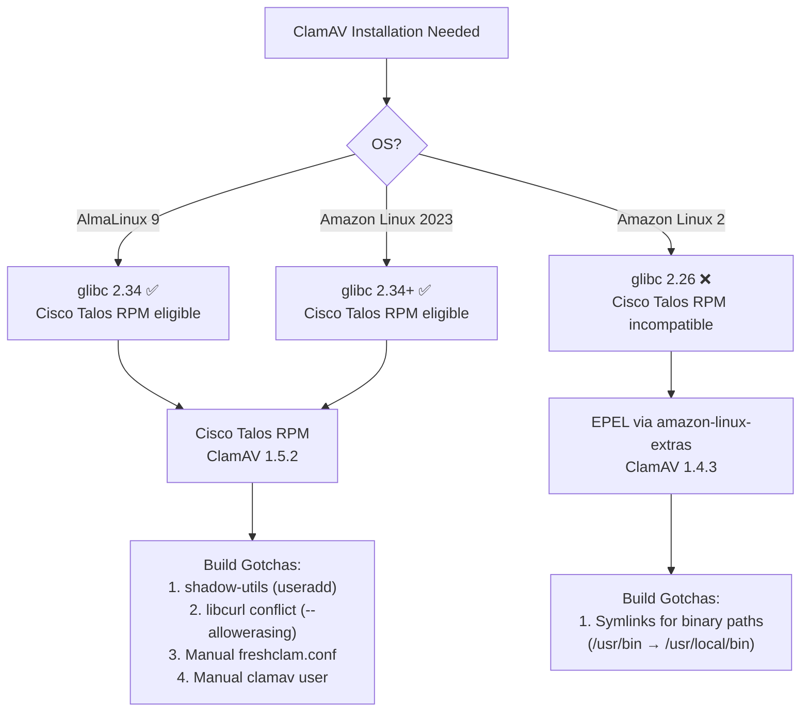
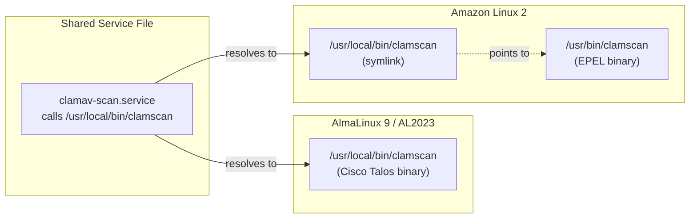

ClamAV is a widely-used open-source antivirus engine, but installing it across different Linux distributions is anything but uniform. This page explains **why** this project uses two completely different installation strategies — Cisco Talos RPMs vs. EPEL packages — across AlmaLinux 9, Amazon Linux 2, and Amazon Linux 2023, and documents the specific gotchas that surfaced during testing. Understanding these differences is essential before deploying ClamAV in any multi-OS environment, and it lays the groundwork for the shared systemd service files and JSON parser that normalize the output across all three platforms.

Sources: [clamav/README.md](clamav/README.md#L1-L33), [CLAUDE.md](CLAUDE.md#L6-L15)

## The Core Problem: One Scanner, Three Package Realities

ClamAV is published by Cisco Talos in two forms: source releases on GitHub and pre-built `.rpm` binaries. Meanwhile, the EPEL (Extra Packages for Enterprise Linux) repository also packages ClamAV for RHEL-compatible distributions. Neither channel provides uniform coverage across every OS this project targets. The result is that each OS lands on a different package source, and each source brings its own set of binary paths, configuration locations, and build-time dependencies.

Sources: [clamav/README.md](clamav/README.md#L82-L110)

### Installation Decision Tree

The following diagram shows how the installation method is chosen for each OS. The critical branching point is **glibc version compatibility** — the Cisco Talos RPM requires glibc ≥ 2.28, which immediately disqualifies Amazon Linux 2.



Sources: [clamav/almalinux9/Dockerfile](clamav/almalinux9/Dockerfile#L1-L32), [clamav/amazonlinux2/Dockerfile](clamav/amazonlinux2/Dockerfile#L1-L12), [clamav/amazonlinux2023/Dockerfile](clamav/amazonlinux2023/Dockerfile#L1-L32)

## OS-by-OS Installation Breakdown

### AlmaLinux 9 — Cisco Talos RPM (ClamAV 1.5.2)

AlmaLinux 9 is a RHEL 9 compatible distribution with glibc 2.34, which satisfies the Cisco Talos RPM's glibc ≥ 2.28 requirement. The Dockerfile downloads the RPM directly from `github.com/Cisco-Talos/clamav/releases`, verifies it with a SHA-256 checksum, and installs it with `dnf install --allowerasing`. The `--allowerasing` flag is necessary because the RPM depends on the full `libcurl` package, but the base AlmaLinux 9 image ships `libcurl-minimal` instead — the flag lets DNF replace the minimal variant without aborting the transaction.

The Dockerfile also handles three things the RPM's post-install script does not: creating the `clamav` system user (via `shadow-utils`), writing a minimal `freshclam.conf` to `/usr/local/etc/`, and creating the `/var/lib/clamav` database directory with correct ownership. Without these steps, `freshclam` would fail because it has no configuration file, no database directory, and no user to run as.

```dockerfile
RUN set -eux \
    && case "${TARGETARCH:-amd64}" in \
         amd64) RPM_ARCH=x86_64;  RPM_SHA=${CLAMAV_SHA256_AMD64} ;; \
         arm64) RPM_ARCH=aarch64; RPM_SHA=${CLAMAV_SHA256_ARM64} ;; \
         *) echo "Unsupported TARGETARCH: ${TARGETARCH}" >&2; exit 1 ;; \
       esac \
    && RPM_URL="https://github.com/Cisco-Talos/clamav/releases/download/clamav-${CLAMAV_VERSION}/clamav-${CLAMAV_VERSION}.linux.${RPM_ARCH}.rpm" \
    && dnf install -y python3 wget shadow-utils \
    && wget -q "${RPM_URL}" -O /tmp/clamav.rpm \
    && echo "${RPM_SHA}  /tmp/clamav.rpm" | sha256sum -c - \
    && dnf install -y --allowerasing /tmp/clamav.rpm \
    && rm -f /tmp/clamav.rpm \
    && chmod +x /usr/local/bin/clamscan-to-json.py \
    && useradd -r -s /sbin/nologin clamav || true \
    && mkdir -p /var/lib/clamav \
    && chown clamav:clamav /var/lib/clamav \
    && echo "DatabaseMirror database.clamav.net" > /usr/local/etc/freshclam.conf \
    && echo "DatabaseDirectory /var/lib/clamav" >> /usr/local/etc/freshclam.conf \
    && freshclam \
    && dnf clean all
```

Note the `TARGETARCH` build argument pattern — Docker BuildKit automatically sets this when building for different architectures, allowing the same Dockerfile to select either the `x86_64` or `aarch64` RPM. This is a multi-architecture build pattern covered in detail on [Dockerfile Patterns: Multi-Architecture Builds and Shared Assets](15-dockerfile-patterns-multi-architecture-builds-and-shared-assets).

Sources: [clamav/almalinux9/Dockerfile](clamav/almalinux9/Dockerfile#L1-L32)

### Amazon Linux 2 — EPEL Package (ClamAV 1.4.3)

Amazon Linux 2 ships with glibc 2.26, which is below the Cisco Talos RPM's minimum requirement of glibc 2.28. This is a hard incompatibility — you cannot install the Cisco RPM on AL2 without upgrading glibc, which would effectively break the entire OS. The solution is to use the EPEL repository, which provides a compatible ClamAV package at version 1.4.3 (one minor version behind).

The installation is notably simpler. `amazon-linux-extras` enables the EPEL channel, and then `yum install` pulls ClamAV and its update utility as standard packages. However, EPEL installs binaries to `/usr/bin/` while the shared systemd service file expects them at `/usr/local/bin/`. The Dockerfile resolves this with two symlinks:

```dockerfile
RUN amazon-linux-extras install -y epel \
    && yum install -y clamav clamav-update python3 \
    && chmod +x /usr/local/bin/clamscan-to-json.py \
    && ln -s /usr/bin/freshclam /usr/local/bin/freshclam \
    && ln -s /usr/bin/clamscan /usr/local/bin/clamscan \
    && freshclam \
    && yum clean all
```

These symlinks are the bridge that allows a single [clamav-scan.service](clamav/shared/clamav-scan.service#L12-L16) unit file to work identically on all three operating systems. The service calls `/usr/local/bin/clamscan` and `/usr/local/bin/freshclam`, which on AL2 are symlinks to the real EPEL binaries at `/usr/bin/`.

Sources: [clamav/amazonlinux2/Dockerfile](clamav/amazonlinux2/Dockerfile#L1-L12), [clamav/shared/clamav-scan.service](clamav/shared/clamav-scan.service#L12-L16)

### Amazon Linux 2023 — Cisco Talos RPM (ClamAV 1.5.2)

Amazon Linux 2023 uses glibc 2.34+, making it compatible with the Cisco Talos RPM. Its Dockerfile is structurally identical to the AlmaLinux 9 Dockerfile — same `TARGETARCH` pattern, same `--allowerasing` workaround for `libcurl-minimal`, same manual user and config creation steps. The only meaningful difference is the base image (`amazonlinux:2023` vs `almalinux:9`).

This raises an important observation: **two of the three Dockerfiles are near-identical**. The duplication exists because the base images use different package managers (`dnf` on both, but with different repository configurations), and keeping them separate makes each Dockerfile self-contained and easy to debug independently. A future optimization could extract the Cisco Talos RPM installation into a shared shell script, but the current approach prioritizes clarity over DRY-ness.

Sources: [clamav/amazonlinux2023/Dockerfile](clamav/amazonlinux2023/Dockerfile#L1-L32)

## The Four Gotchas in Detail

During testing, four specific gotchas were discovered that affect AlmaLinux 9 and Amazon Linux 2023 (the Cisco Talos RPM path). Each one causes a silent failure or a misleading error message if not handled.

### Gotcha 1: The libcurl Conflict

**Symptom:** `dnf install /tmp/clamav.rpm` fails with a message like `package libcurl-minimal-*.el9.x86_64 conflicts with libcurl provided by libcurl-*.x86_64`.

**Root Cause:** Both AlmaLinux 9 and Amazon Linux 2023 minimal images ship with `libcurl-minimal`, a stripped-down version of libcurl that satisfies most basic use cases. The Cisco Talos RPM depends on the full `libcurl` package. DNF sees these as conflicting packages and refuses to proceed.

**Fix:** Use `--allowerasing` to let DNF replace `libcurl-minimal` with the full `libcurl` as a dependency resolution:

```bash
dnf install -y --allowerasing /tmp/clamav.rpm
```

Sources: [clamav/almalinux9/Dockerfile](clamav/almalinux9/Dockerfile#L22), [clamav/README.md](clamav/README.md#L106-L107)

### Gotcha 2: Missing `useradd` Command

**Symptom:** `useradd -r -s /sbin/nologin clamav` fails with `bash: useradd: command not found`.

**Root Cause:** Minimal Docker base images (both AlmaLinux 9 and Amazon Linux 2023) do not include the `shadow-utils` package, which provides `useradd`, `groupadd`, and related user management tools.

**Fix:** Install `shadow-utils` before attempting to create the user:

```bash
dnf install -y python3 wget shadow-utils
```

The `|| true` suffix on the `useradd` command handles the edge case where the package might already exist from a previous layer.

Sources: [clamav/almalinux9/Dockerfile](clamav/almalinux9/Dockerfile#L19-L25), [clamav/README.md](clamav/README.md#L107-L108)

### Gotcha 3: No freshclam.conf After RPM Install

**Symptom:** `freshclam` fails with `ERROR: Can't open/parse the config file /usr/local/etc/freshclam.conf`.

**Root Cause:** The Cisco Talos RPM installs its binaries to the `/usr/local/` prefix (`/usr/local/bin/clamscan`, `/usr/local/bin/freshclam`) but does **not** create a default configuration file. Freshclam expects `freshclam.conf` at `/usr/local/etc/freshclam.conf` but finds nothing there.

**Fix:** Write the minimum required configuration directives directly in the Dockerfile:

```bash
echo "DatabaseMirror database.clamav.net" > /usr/local/etc/freshclam.conf
echo "DatabaseDirectory /var/lib/clamav" >> /usr/local/etc/freshclam.conf
```

This is a two-line config that tells freshclam where to download definitions and where to store them. Production deployments would add `ScriptedUpdates`, `SafeBrowsing`, and `Bytecode` directives, but these two lines are sufficient for a functional baseline.

Sources: [clamav/almalinux9/Dockerfile](clamav/almalinux9/Dockerfile#L28-L30), [clamav/README.md](clamav/README.md#L108-L109)

### Gotcha 4: No `clamav` User Created by RPM

**Symptom:** `chown clamav:clamav /var/lib/clamav` fails with `chown: invalid user: 'clamav:clamav'`.

**Root Cause:** The Cisco Talos RPM's post-install script does not create the `clamav` system user. This contrasts with the EPEL package on Amazon Linux 2, which creates the user automatically as part of the package's `%post` scriptlet.

**Fix:** Create the user explicitly before creating the database directory:

```bash
useradd -r -s /sbin/nologin clamav || true
mkdir -p /var/lib/clamav
chown clamav:clamav /var/lib/clamav
```

The `-r` flag creates a system user (no home directory, low UID range), and `-s /sbin/nologin` prevents interactive login. The `|| true` handles re-runs gracefully.

Sources: [clamav/almalinux9/Dockerfile](clamav/almalinux9/Dockerfile#L25-L27), [clamav/README.md](clamav/README.md#L109)

## Cross-OS Comparison Matrix

The following table consolidates every dimension where the three OS installations differ. The binary path divergence (`/usr/local/bin/` vs `/usr/bin/`) is the most impactful for production deployments because systemd service files and cron jobs must reference the correct path.

| Dimension | AlmaLinux 9 | Amazon Linux 2 | Amazon Linux 2023 |
|---|---|---|---|
| **ClamAV Version** | 1.5.2 | 1.4.3 | 1.5.2 |
| **Package Source** | Cisco Talos RPM | EPEL (`amazon-linux-extras`) | Cisco Talos RPM |
| **Package Manager** | `dnf` | `yum` | `dnf` |
| **Binary Location** | `/usr/local/bin/clamscan` | `/usr/bin/clamscan` | `/usr/local/bin/clamscan` |
| **Config Location** | `/usr/local/etc/freshclam.conf` | `/etc/freshclam.conf` | `/usr/local/etc/freshclam.conf` |
| **glibc Version** | 2.34 | 2.26 | 2.34+ |
| **`shadow-utils` Required** | ✅ Yes | ❌ No | ✅ Yes |
| **`--allowerasing` Required** | ✅ Yes | ❌ No | ✅ Yes |
| **Manual `freshclam.conf`** | ✅ Required | ❌ Auto-created | ✅ Required |
| **Manual `clamav` User** | ✅ Required | ❌ Auto-created | ✅ Required |
| **Symlinks Needed** | ❌ No | ✅ Yes (`/usr/bin/` → `/usr/local/bin/`) | ❌ No |
| **Multi-Arch Support** | ✅ x86_64 + aarch64 | N/A (EPEL package) | ✅ x86_64 + aarch64 |

Sources: [clamav/README.md](clamav/README.md#L82-L91), [clamav/almalinux9/Dockerfile](clamav/almalinux9/Dockerfile#L1-L32), [clamav/amazonlinux2/Dockerfile](clamav/amazonlinux2/Dockerfile#L1-L12), [clamav/amazonlinux2023/Dockerfile](clamav/amazonlinux2023/Dockerfile#L1-L32)

## The `--json` Flag Gap

One finding that applies uniformly across all three operating systems: **none of the tested ClamAV builds support the `--json` output flag**. This is true regardless of whether ClamAV was installed from EPEL or the Cisco Talos RPM. The flag exists in ClamAV's source code but is not compiled into these distribution builds. This is precisely why the project includes a Python-based text parser — [clamscan-to-json.py](clamav/shared/clamscan-to-json.py) — that converts the plain-text `clamscan` output into structured JSON.

The implication for you as a developer is that any pipeline expecting machine-readable ClamAV output must go through the custom parser. You cannot rely on a future ClamAV update to suddenly provide `--json` support unless you compile from source with the appropriate build flags, which is outside the scope of this project's Docker-based approach.

Sources: [clamav/README.md](clamav/README.md#L27-L29), [CLAUDE.md](CLAUDE.md#L109-L112)

## How Binary Paths Are Normalized

The shared systemd service file [clamav-scan.service](clamav/shared/clamav-scan.service#L12-L16) hardcodes `/usr/local/bin/clamscan` and `/usr/local/bin/freshclam` as the binary paths:

```ini
ExecStartPre=/usr/local/bin/freshclam --quiet
ExecStart=/bin/bash -c '/usr/local/bin/clamscan -r / | /usr/local/bin/clamscan-to-json.py'
```

On AlmaLinux 9 and Amazon Linux 2023, the Cisco Talos RPM installs directly to `/usr/local/bin/`, so these paths resolve correctly. On Amazon Linux 2, the EPEL package installs to `/usr/bin/`, which would break the service file. The Dockerfile resolves this with symlinks that make `/usr/local/bin/clamscan` and `/usr/local/bin/freshclam` point to the real EPEL binaries at `/usr/bin/`.



This normalization pattern means that the systemd unit files, timer files, and logrotate configurations in `clamav/shared/` are truly cross-platform — they never need OS-specific conditional logic.

Sources: [clamav/shared/clamav-scan.service](clamav/shared/clamav-scan.service#L12-L16), [clamav/amazonlinux2/Dockerfile](clamav/amazonlinux2/Dockerfile#L8-L9), [clamav/README.md](clamav/README.md#L299)

## CI Verification Across All Three OSes

The GitHub Actions CI pipeline at [.github/workflows/ci.yml](.github/workflows/ci.yml#L19-L95) builds all three ClamAV images in parallel using a matrix strategy, then runs a sequence of verification steps on each: version check, smoke test with JSON output, JSONL append and validation, and sample result generation. This parallel build catches OS-specific regressions — for example, if a new Cisco Talos RPM version introduces a different dependency conflict, the AL9 and AL2023 jobs would fail while AL2 (on EPEL) would pass.

The smoke test step is particularly instructive. It runs `clamscan` inside each image and pipes the output through `clamscan-to-json.py`, then validates the resulting JSONL file with a dedicated validation script. This proves end-to-end that the scanner, the parser, and the JSONL append mechanism all work correctly on each OS, despite the different installation methods and binary paths described on this page.

Sources: [.github/workflows/ci.yml](.github/workflows/ci.yml#L19-L95)

## Where to Go Next

Now that you understand *why* and *how* ClamAV is installed differently across operating systems, the following pages cover the next layers of the pipeline:

- **[ClamAV JSON Parser: Text-to-Structured Output (clamscan-to-json.py)](6-clamav-json-parser-text-to-structured-output-clamscan-to-json-py)** — Deep dive into how the Python parser converts raw `clamscan` text output into structured JSON, handling both summary and no-summary modes.
- **[ClamAV JSON Schema and Output Formats](7-clamav-json-schema-and-output-formats)** — Reference for every field in the JSON output, including the `file_results` array, `scan_summary` object, and JSONL file format.
- **[Cross-OS Comparison: Binary Paths, Package Sources, and Version Matrix](16-cross-os-comparison-binary-paths-package-sources-and-version-matrix)** — Broader comparison of both ClamAV and AIDE across all three operating systems, including version pinning strategies.