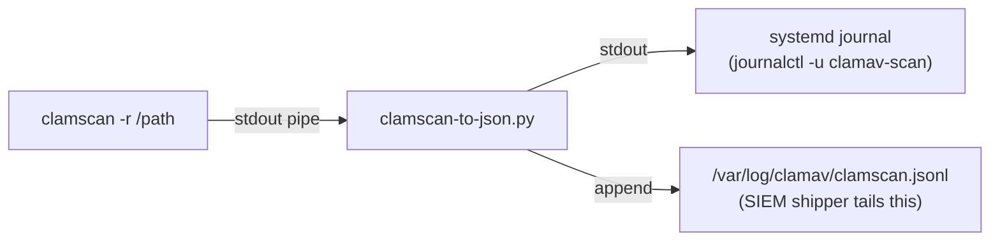
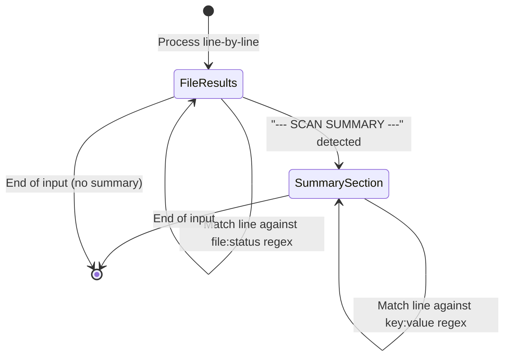

ClamAV's `clamscan` command emits human-readable, line-oriented text — not structured JSON. The `--json` flag is **not compiled** into any of the three ClamAV builds this project targets (AlmaLinux 9 at 1.5.2, Amazon Linux 2 at 1.4.3, Amazon Linux 2023 at 1.5.2). That means every SIEM, dashboard, or automation pipeline that needs to consume scan results must first convert that text into structured data. **`clamscan-to-json.py`** is the 81-line Python script that bridges this gap: it reads raw `clamscan` output from stdin, parses it into a structured JSON object, emits that object as a single JSONL line to stdout, and appends it to `/var/log/clamav/clamscan.jsonl` for log-shipper tailing. The script uses zero external dependencies — only Python 3 stdlib modules — and is designed to be the right-hand side of a pipe in a systemd service unit.

Sources: [clamscan-to-json.py](clamav/shared/clamscan-to-json.py#L1-L11), [README.md](clamav/README.md#L27-L29)

## The Problem: ClamAV's Text-Only Output

Before examining the parser's internals, it's worth understanding what it has to transform. A typical `clamscan` run with default flags produces output in two distinct phases: a list of per-file verdicts, followed by a demarcated summary block. Here's what the raw text looks like on a clean scan:

```
/etc/hostname: OK
/etc/hosts: OK
/etc/passwd: OK
/etc/resolv.conf: OK

----------- SCAN SUMMARY -----------
Known viruses: 3627837
Engine version: 1.5.2
Scanned directories: 0
Scanned files: 4
Infected files: 0
Data scanned: 0.00 MB
Data read: 0.00 MB (ratio 0.00:1)
Time: 7.349 sec (0 m 7 s)
Start Date: 2026:04:22 10:11:37
End Date:   2026:04:22 10:11:45
```

When a file is infected, the status field changes from `OK` to something like `FOUND Eicar-Test-Signature`. When `--no-summary` is passed, the entire block after the dashed line is suppressed. Neither format is machine-parseable without custom logic — there's no consistent delimiter, keys contain spaces and colons, and the summary block uses a different key-value syntax than the file results section. This is precisely the parsing challenge that `clamscan-to-json.py` solves.

Sources: [README.md](clamav/README.md#L39-L57)

## Architecture: The Stdin-to-JSONL Pipeline

The parser sits as a filter between `clamscan` and two downstream consumers. This is the fundamental data-flow pattern:



The pipeline is invoked in the systemd service unit as a single shell pipeline:

```
/usr/local/bin/clamscan -r / | /usr/local/bin/clamscan-to-json.py
```

Every scan produces exactly **one** JSON object on exactly **one** line. This JSONL (JSON Lines) format means the log file grows by one line per scan — no wrapping arrays, no comma delimiters between records. A log shipper like Filebeat or Fluentd can tail the file and ship each line as an independent event. The dual-output design ensures no data is lost: if the JSONL file is unwritable (e.g., permission issues in a hardened environment), the stdout path still delivers the JSON to `journalctl`, where it can be retrieved with `journalctl -u clamav-scan.service --since today`.

Sources: [clamav-scan.service](clamav/shared/clamav-scan.service#L14-L16), [clamscan-to-json.py](clamav/shared/clamscan-to-json.py#L54-L76)

## Two-Phase State Machine: How the Parser Works

The `parse_clamscan()` function implements a simple but effective **two-phase state machine**. It iterates over each line of the raw text, toggling between two parsing modes based on whether the `--- SCAN SUMMARY ---` sentinel has been encountered.



**Phase 1 — File Results** applies the regex `^(.+?):\s+(OK|FOUND.*)$` to each line. The non-greedy `.+?` captures the file path up to the first colon, and the alternation captures either `OK` or any string starting with `FOUND` (which includes the signature name, e.g., `FOUND Eicar-Test-Signature`). Each match appends a `{"file": ..., "status": ...}` object to the `file_results` array.

**Phase 2 — Summary Section** activates after the sentinel line. It applies a different regex, `^([\w\s]+?):\s+(.+)$`, to capture key-value pairs where keys contain word characters and spaces (e.g., `Known viruses`, `Engine version`). Keys are normalized by lowering case and replacing spaces with underscores (`known_viruses`, `engine_version`). Four specific keys — `known_viruses`, `scanned_directories`, `scanned_files`, `infected_files` — are converted from strings to integers for proper JSON typing. This selective conversion avoids accidentally casting fields like `time` or `data_scanned` that legitimately contain non-numeric values.

Sources: [clamscan-to-json.py](clamav/shared/clamscan-to-json.py#L17-L51)

## Regex Design and the Two-Pattern Strategy

The parser uses two distinct regular expressions rather than one unified pattern, and understanding *why* reveals the underlying text-structure asymmetry:

| Aspect | File Results Regex | Summary Section Regex |
|--------|-------------------|----------------------|
| **Pattern** | `^(.+?):\s+(OK\|FOUND.*)$` | `^([\w\s]+?):\s+(.+)$` |
| **Captures** | File path + fixed-status prefix | Key with spaces + arbitrary value |
| **Constraint** | Status must start with `OK` or `FOUND` | Key is word chars + spaces only |
| **Purpose** | Filters out non-result lines (warnings, errors) | Captures all summary key-value pairs |

The file-results pattern is deliberately restrictive: it only matches lines ending in `OK` or `FOUND...`. This means that lines like `LibClamAV Warning: ...` or empty lines are silently ignored — no false positives. The summary pattern, by contrast, is more permissive because every line in the summary block follows the `Key: Value` convention, so a broader capture is safe. The `[\w\s]+?` constraint on the key side still prevents matching against indented continuation lines or malformed input.

Sources: [clamscan-to-json.py](clamscan-to-json.py#L29-L46)

## Output Schema: With and Without Summary

The parser produces two distinct JSON shapes depending on whether `clamscan` was invoked with `--no-summary`. The structural difference is handled elegantly: if the `scan_summary` dictionary remains empty after parsing (meaning no summary sentinel was encountered), it is removed from the output entirely.

**With summary** (default `clamscan` invocation):

```json
{
  "file_results": [
    {"file": "/etc/hostname", "status": "OK"},
    {"file": "/etc/hosts", "status": "OK"},
    {"file": "/etc/passwd", "status": "OK"},
    {"file": "/etc/resolv.conf", "status": "OK"}
  ],
  "scan_summary": {
    "known_viruses": 3627837,
    "engine_version": "1.5.2",
    "scanned_directories": 0,
    "scanned_files": 4,
    "infected_files": 0,
    "data_scanned": "0.00 MB",
    "data_read": "0.00 MB (ratio 0.00:1)",
    "time": "7.349 sec (0 m 7 s)",
    "start_date": "2026:04:22 10:11:37",
    "end_date": "2026:04:22 10:11:45"
  },
  "hostname": "server01.example.com",
  "timestamp": "2026-04-22T10:11:45Z"
}
```

**Without summary** (`--no-summary` flag):

```json
{
  "file_results": [
    {"file": "/etc/hostname", "status": "OK"},
    {"file": "/etc/hosts", "status": "OK"}
  ],
  "hostname": "server01.example.com",
  "timestamp": "2026-04-22T10:11:45Z"
}
```

The `hostname` and `timestamp` fields are always present — they're added by the `main()` function after parsing, not extracted from `clamscan` output. The `json.dumps()` call uses `separators=(",", ":")` to produce the most compact possible JSON (no spaces), which minimizes JSONL line length for network transport and storage.

Sources: [clamscan-to-json.py](clamav/shared/clamscan-to-json.py#L48-L67), [README.md](clamav/README.md#L132-L165)

## Enrichment: Hostname and Timestamp Injection

The `parse_clamscan()` function returns only what it extracted from the text — file results and an optional summary. The `main()` function then enriches the object with two fields that `clamscan` itself doesn't provide in a SIEM-friendly format:

| Field | Source | Format |
|-------|--------|--------|
| `hostname` | `socket.gethostname()` | The system's hostname (e.g., `server01.example.com`) |
| `timestamp` | `datetime.now(timezone.utc)` | ISO 8601 UTC: `2026-04-22T10:11:45Z` |

The timestamp uses **UTC** via `timezone.utc`, which is critical for SIEM correlation — all events from all hosts share the same time zone reference. Note that `clamscan`'s own `Start Date` and `End Date` fields in the summary use local time and a non-standard format (`2026:04:22 10:11:37`), making the injected `timestamp` the reliable time field for log aggregation. The placement of enrichment after parsing (line 61–62) keeps the `parse_clamscan()` function pure and testable — it only transforms text to data, with no side effects.

Sources: [clamscan-to-json.py](clamav/shared/clamscan-to-json.py#L59-L64)

## Dual-Output Design: stdout and JSONL Append

After building the JSON line, the script writes it to two destinations:

```python
print(json_line)  # stdout → captured by systemd journal

with open("/var/log/clamav/clamscan.jsonl", "a") as f:
    f.write(json_line + "\n")  # append → SIEM shipper tails this
```

The **stdout path** ensures that `journalctl -u clamav-scan.service` always contains the structured JSON, even if the JSONL file is missing or has wrong permissions. The **file-append path** creates a persistent JSONL log that log shippers can tail continuously. The `PermissionError` exception handler on the file write is a deliberate design choice: in containerized or locked-down environments, the script may lack write access to `/var/log/clamav/`. Rather than failing the entire scan, it silently falls back to stdout-only output. The logrotate configuration at `clamav-jsonl.conf` manages this file with 30-day rotation, compression, and proper ownership (`0640 root:clamupdate`).

Sources: [clamscan-to-json.py](clamav/shared/clamscan-to-json.py#L66-L76), [clamav-jsonl.conf](clamav/shared/clamav-jsonl.conf#L1-L13)

## Deployment: How the Script Reaches Production

The parser is embedded into each Docker image during the `COPY` stage of the build process. Every ClamAV Dockerfile — AlmaLinux 9, Amazon Linux 2, and Amazon Linux 2023 — includes this line:

```dockerfile
COPY clamav/shared/clamscan-to-json.py /usr/local/bin/clamscan-to-json.py
```

The build context is always the project root (`linux-security-scanners/`), so the COPY path references `clamav/shared/` regardless of which OS subdirectory the Dockerfile lives in. After copying, the Dockerfile makes it executable with `chmod +x`. The systemd service unit then references it via the full path `/usr/local/bin/clamscan-to-json.py`. This consistent `/usr/local/bin/` placement works across all three OS images because none of them ship a conflicting binary at that path.

Sources: [Dockerfile](clamav/almalinux9/Dockerfile#L10-L24), [clamav-scan.service](clamav/shared/clamav-scan.service#L16)

## Production vs. Development: `clamscan-to-json.py` and `parse_to_json.py`

The `clamav/shared/` directory contains two Python parsers that share the same core regex logic but serve different roles:

| Aspect | `clamscan-to-json.py` (Production) | `parse_to_json.py` (Development) |
|--------|-------------------------------------|----------------------------------|
| **Input source** | `sys.stdin.read()` (pipe-friendly) | Hardcoded file paths (`/tmp/with_summary.txt`) |
| **Hostname** | `socket.gethostname()` | Reads `/etc/hostname` directly |
| **Timestamp** | `datetime.now(timezone.utc)` (aware) | `datetime.utcnow()` (naive) |
| **Output** | Single compact JSONL line to stdout + file append | Multi-section text report to `/output/clamscan-json.txt` |
| **Error handling** | Graceful `PermissionError` fallback | None |
| **Status regex** | `OK\|FOUND.*` | `OK\|FOUND\|ERROR.*` |
| **Numeric conversion** | Converts 4 summary fields to `int` | All summary values remain strings |
| **Use case** | Systemd service / SIEM pipeline | One-off Docker test runs |

The development parser (`parse_to_json.py`) is the earlier iteration that was used during initial testing. It reads from hardcoded temp files and writes a human-readable report with both compact and pretty-printed JSON. It also matches an additional `ERROR.*` status variant that the production parser omits. The production parser refines this with proper stdin handling, timezone-aware timestamps, and the JSONL append pattern — making it suitable for unattended scheduled scans.

Sources: [clamscan-to-json.py](clamav/shared/clamscan-to-json.py#L1-L81), [parse_to_json.py](clamav/shared/parse_to_json.py#L1-L66)

## CI Validation: How the Parser Is Tested

The GitHub Actions CI pipeline validates the parser through two sequential smoke tests in every ClamAV matrix job. The first test pipes a multi-file scan through the parser and confirms it produces output without errors:

```bash
clamscan /etc/hostname /etc/hosts /etc/passwd /etc/resolv.conf | \
  python3 /usr/local/bin/clamscan-to-json.py
```

The second test runs two sequential scans (one file, then two files), then validates the resulting JSONL file using `validate-clamav-jsonl.py`. That validation script checks two things: the expected line count (2 lines for 2 scans) and valid JSON parseability of each line, confirming the `hostname` field exists and the `file_results` array is present. This ensures the append-to-JSONL mechanism works correctly across multiple invocations — a critical property for a log file that grows indefinitely in production.

Sources: [ci.yml](.github/workflows/ci.yml#L44-L59), [validate-clamav-jsonl.py](scripts/validate-clamav-jsonl.py#L1-L27)

## Design Decisions and Trade-offs

Several deliberate choices shape the parser's behavior. Understanding these helps when extending or debugging the pipeline:

**Why not use `clamscan --infected` to filter results?** The parser captures *all* file results (both `OK` and `FOUND`), not just infections. This is intentional for SIEM use cases where you need the total file count to calculate infection ratios and confirm that a scan actually ran. Filtering to `FOUND`-only at the parser level would discard this visibility.

**Why compact JSON with `separators=(",", ":")`?** Each JSONL line is a single event destined for network transport. Removing whitespace reduces line length by roughly 30-40%, which matters when log shippers buffer thousands of events or when JSONL files grow to hundreds of megabytes across months of daily scans.

**Why `int()` conversion only for four specific fields?** The four numeric fields — `known_viruses`, `scanned_directories`, `scanned_files`, `infected_files` — are the ones most likely to be used in numeric comparisons by SIEM alert rules (e.g., `infected_files > 0`). Fields like `time` (`7.349 sec (0 m 7 s)`) and `data_scanned` (`0.00 MB`) contain units and aren't pure numbers, so they're left as strings. The `try/except ValueError` guard ensures that if ClamAV ever changes the format of these fields, the parser degrades gracefully to string values instead of crashing.

**Why `sys.stdin.read()` instead of line-by-line iteration?** Reading the entire input at once means the parser doesn't start emitting JSON until `clamscan` finishes. This is correct behavior because the JSON object must include the summary (if present), which appears at the *end* of `clamscan` output. A streaming approach would require buffering the file results and then amending the JSON after seeing the summary — effectively the same approach but more complex. The simplicity of `read()` → `parse()` → `output()` is the right trade-off for a scanner that runs on a schedule (not interactively).

Sources: [clamscan-to-json.py](clamav/shared/clamscan-to-json.py#L17-L80)

## Where to Go Next

Now that you understand how the parser transforms `clamscan` text into structured JSON, these pages explore the surrounding ecosystem:

- **[ClamAV JSON Schema and Output Formats](7-clamav-json-schema-and-output-formats)** — Deep dive into every field, type, and variant in the JSON output, including how the schema differs across OS builds.
- **[Understanding ClamAV OS-Specific Install Methods and Gotchas](5-understanding-clamav-os-specific-install-methods-and-gotchas)** — Why ClamAV lacks `--json` in the first place, and the build differences across AlmaLinux 9, Amazon Linux 2, and Amazon Linux 2023.
- **[JSONL Log Format, Logrotate, and Log Shipper Configuration](12-jsonl-log-format-logrotate-and-log-shipper-configuration)** — How the JSONL append pattern integrates with Filebeat, Fluentd, and logrotate for production SIEM ingestion.
- **[Systemd Service and Timer Units for Scheduled Scans](13-systemd-service-and-timer-units-for-scheduled-scans)** — How the systemd service unit wires the `clamscan | clamscan-to-json.py` pipeline into a scheduled, production-hardened workflow.
- **[JSONL Validation Scripts for ClamAV and AIDE](18-jsonl-validation-scripts-for-clamav-and-aide)** — How `validate-clamav-jsonl.py` verifies parser output in CI.