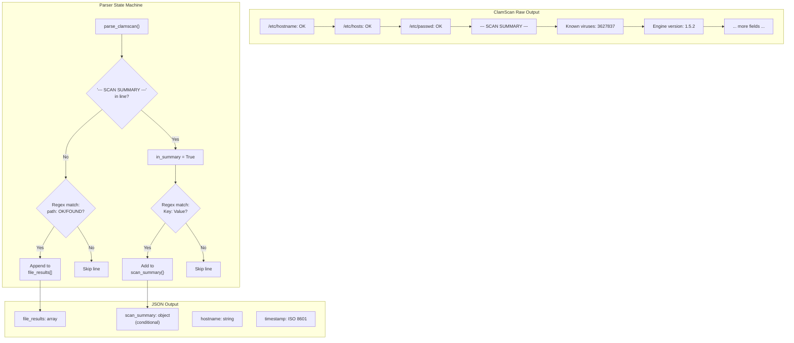

This page provides a complete reference for the JSON objects produced by [clamscan-to-json.py](clamav/shared/clamscan-to-json.py) — the Python script that transforms raw `clamscan` text output into structured, SIEM-ingestible JSON. Because none of the tested ClamAV builds (EPEL or Cisco Talos RPM) support a native `--json` flag, this parser is the sole mechanism for producing structured output. Every field, its type derivation, and the conditions under which it appears are documented here, along with the compact JSONL wire format consumed by log shippers like Filebeat and Fluentd.

Sources: [clamscan-to-json.py](clamav/shared/clamscan-to-json.py#L1-L11), [README.md](clamav/README.md#L28-L29)

## Schema Overview

The parser emits a single JSON object per scan invocation. The object has a fixed envelope — `hostname` and `timestamp` are always present — while the body varies depending on whether ClamAV's `--no-summary` flag was used. The diagram below shows the two structural variants and how the parser transitions between scanning individual file results and the summary section.



The parser operates as a **single-pass state machine**: it iterates through every line of `clamscan` output, starts in "file results" mode, and flips to "summary" mode upon encountering the `--- SCAN SUMMARY ---` sentinel. Top-level metadata (`hostname`, `timestamp`) is injected after parsing completes.

Sources: [clamscan-to-json.py](clamav/shared/clamscan-to-json.py#L17-L51), [clamscan-to-json.py](clamav/shared/clamscan-to-json.py#L54-L67)

## Complete Field Reference

### Top-Level Object

| Field | Type | Always Present | Source | Description |
|-------|------|----------------|--------|-------------|
| `file_results` | `array` of objects | Yes | Parser: per-line regex on file status lines | One entry per file scanned by ClamAV |
| `scan_summary` | `object` | **No** — absent when `--no-summary` is used | Parser: per-line regex on summary block | Aggregate statistics from the `SCAN SUMMARY` section |
| `hostname` | `string` | Yes | `socket.gethostname()` | System hostname at scan time |
| `timestamp` | `string` | Yes | `datetime.now(timezone.utc)` | ISO 8601 UTC timestamp when the JSON was produced |

The `scan_summary` key is conditionally present. When ClamAV is invoked with `--no-summary`, the entire summary block is suppressed from raw output, the parser never populates the dictionary, and the key is explicitly deleted before the object is returned (to avoid emitting an empty `{}` object).

Sources: [clamscan-to-json.py](clamav/shared/clamscan-to-json.py#L18-L50), [clamscan-to-json.py](clamav/shared/clamscan-to-json.py#L61-L64)

### `file_results` Array Elements

Each element in `file_results` is an object with exactly two keys:

| Field | Type | Description | Example Values |
|-------|------|-------------|----------------|
| `file` | `string` | Absolute path of the scanned file (stripped of leading/trailing whitespace) | `"/etc/hostname"`, `"/var/www/uploads/shell.php"` |
| `status` | `string` | ClamAV's scan verdict — either `"OK"` or `"FOUND <signature-name>"` (stripped) | `"OK"`, `"FOUND Eicar-Test-Signature"`, `"FOUND Php.Backdoor.Shell-177"` |

The file-matching regex is `r"^(.+?):\s+(OK|FOUND.*)$"` — the lazy `.+?` captures the file path up to the first colon-space delimiter, while `FOUND.*` captures the entire verdict including the virus signature name. This is an intentional design choice: the signature name is preserved verbatim within the `status` string rather than split into a separate field, keeping the schema flat and simple for SIEM field extraction.

**Important regex behavior**: the `.+?` (lazy match) means paths containing colons are handled correctly because the regex anchors on `\s+` after the colon. However, file paths with unusual characters that precede the first `: ` sequence could theoretically be misinterpreted — a known acceptable trade-off given standard Linux filesystem conventions.

Sources: [clamscan-to-json.py](clamav/shared/clamscan-to-json.py#L29-L34)

### `scan_summary` Object Fields

All keys are derived from ClamAV's summary section by converting the human-readable label to lowercase and replacing spaces with underscores (e.g., `"Known viruses"` → `"known_viruses"`). The regex `r"^([\w\s]+?):\s+(.+)$"` captures the key-value pair.

| Key | Type | Raw Label | Description |
|-----|------|-----------|-------------|
| `known_viruses` | `integer` (coerced) | `Known viruses` | Total virus definitions loaded |
| `engine_version` | `string` | `Engine version` | ClamAV engine version string |
| `scanned_directories` | `integer` (coerced) | `Scanned directories` | Number of directories traversed |
| `scanned_files` | `integer` (coerced) | `Scanned files` | Total files scanned |
| `infected_files` | `integer` (coerced) | `Infected files` | Count of files matching signatures |
| `data_scanned` | `string` | `Data scanned` | Human-readable volume scanned (e.g., `"2.26 KiB"`, `"0.00 MB"`) |
| `data_read` | `string` | `Data read` | Volume read with compression ratio (e.g., `"1.13 KiB (ratio 2.00:1)"`) |
| `time` | `string` | `Time` | Elapsed scan time (e.g., `"7.181 sec (0 m 7 s)"`) |
| `start_date` | `string` | `Start Date` | Scan start timestamp in ClamAV's format: `YYYY:MM:DD HH:MM:SS` |
| `end_date` | `string` | `End Date` | Scan end timestamp in ClamAV's format: `YYYY:MM:DD HH:MM:SS` |

**Integer coercion** is applied to four fields: `known_viruses`, `scanned_directories`, `scanned_files`, and `infected_files`. If the conversion fails (non-numeric value), the original string is preserved — a defensive fallback that prevents parser crashes on unexpected ClamAV output formats.

Sources: [clamscan-to-json.py](clamav/shared/clamscan-to-json.py#L36-L46)

## Schema Variants in Practice

The two structural variants — **with summary** and **without summary** — are produced by running ClamAV with and without the `--no-summary` flag. In production, the summary-enabled variant is recommended because the metadata (engine version, infected file count, scan duration) provides critical context for SIEM alerting and dashboards. The test runner exercises both variants to validate the parser's conditional logic.

### Variant 1: With Summary (Default)

This is the standard production output. The `scan_summary` object is fully populated with all fields from ClamAV's summary block. The following example is from an actual test run on AlmaLinux 9 with ClamAV 1.5.2:

```json
{
  "file_results": [
    {"file": "/etc/hostname", "status": "OK"},
    {"file": "/etc/hosts", "status": "OK"},
    {"file": "/etc/passwd", "status": "OK"},
    {"file": "/etc/resolv.conf", "status": "OK"}
  ],
  "scan_summary": {
    "known_viruses": 3627837,
    "engine_version": "1.5.2",
    "scanned_directories": 0,
    "scanned_files": 4,
    "infected_files": 0,
    "data_scanned": "2.26 KiB",
    "data_read": "1.13 KiB (ratio 2.00:1)",
    "time": "7.181 sec (0 m 7 s)",
    "start_date": "2026:04:23 13:56:42",
    "end_date": "2026:04:23 13:56:50"
  },
  "hostname": "ae1e553cdb71",
  "timestamp": "2026-04-23T13:56:50Z"
}
```

### Variant 2: Without Summary (`--no-summary`)

When `--no-summary` is passed to `clamscan`, the `SCAN SUMMARY` section is completely absent from raw output. The parser produces a lighter payload containing only file-level results and metadata. This variant has no `scan_summary` key at all — the key is deleted rather than set to `null` or `{}`.

```json
{
  "file_results": [
    {"file": "/etc/hostname", "status": "OK"},
    {"file": "/etc/hosts", "status": "OK"},
    {"file": "/etc/passwd", "status": "OK"},
    {"file": "/etc/resolv.conf", "status": "OK"}
  ],
  "hostname": "ae1e553cdb71",
  "timestamp": "2026-04-23T13:56:57Z"
}
```

### Variant 3: Infected File Detected

When ClamAV identifies a threat, the `status` field carries the full `FOUND <signature-name>` string and `infected_files` increments accordingly. This example shows how a real detection would appear:

```json
{
  "file_results": [
    {"file": "/tmp/eicar.com", "status": "FOUND Eicar-Test-Signature"}
  ],
  "scan_summary": {
    "known_viruses": 3627837,
    "engine_version": "1.5.2",
    "scanned_files": 4,
    "infected_files": 1
  },
  "hostname": "server01",
  "timestamp": "2026-04-24T11:03:44Z"
}
```

Sources: [clamav/almalinux9/results/clamscan.json](clamav/almalinux9/results/clamscan.json#L1-L6), [clamav/amazonlinux2/results/clamscan.json](clamav/amazonlinux2/results/clamscan.json#L1-L6), [clamav/amazonlinux2023/results/clamscan.json](clamav/amazonlinux2023/results/clamscan.json#L1-L6), [README.md](clamav/README.md#L515-L548)

## Cross-OS Schema Consistency

All three tested distributions produce **structurally identical** JSON output. The schema does not vary by operating system. The only differences are in the *values* — specifically `engine_version` and `data_scanned` units — because Amazon Linux 2 runs the older ClamAV 1.4.3 (via EPEL) while AlmaLinux 9 and Amazon Linux 2023 run ClamAV 1.5.2 (via Cisco Talos RPM).

| Field | AlmaLinux 9 | Amazon Linux 2 | Amazon Linux 2023 |
|-------|-------------|----------------|-------------------|
| `engine_version` | `"1.5.2"` | `"1.4.3"` | `"1.5.2"` |
| `known_viruses` | `3627837` | `3627837` | `3627837` |
| `data_scanned` unit | `"2.26 KiB"` | `"0.00 MB"` | `"1.92 KiB"` |
| `data_read` unit | `"1.13 KiB (ratio 2.00:1)"` | `"0.00 MB (ratio 0.00:1)"` | `"985 B (ratio 2.00:1)"` |
| `time` | `"7.181 sec (0 m 7 s)"` | `"13.023 sec (0 m 13 s)"` | `"7.676 sec (0 m 7 s)"` |
| Schema shape | Identical | Identical | Identical |

The `data_scanned` field illustrates a subtle behavioral difference: ClamAV 1.4.3 reports in megabytes with `"0.00 MB"` for small scans, while 1.5.2 uses more granular units (`KiB`, `B`). Both are passed through as raw strings — the parser performs no unit normalization, which means SIEM dashboards consuming this field should account for mixed unit formats across fleet hosts running different ClamAV versions.

Sources: [clamav/almalinux9/results/clamscan.json](clamav/almalinux9/results/clamscan.json#L1-L6), [clamav/amazonlinux2/results/clamscan.json](clamav/amazonlinux2/results/clamscan.json#L1-L6), [clamav/amazonlinux2023/results/clamscan.json](clamav/amazonlinux2023/results/clamscan.json#L1-L6), [README.md](clamav/README.md#L80-L91)

## JSONL Wire Format and Serialization

Each scan produces **exactly one line** of compact JSON written to the JSONL file. The serializer uses `separators=(",", ":")` to strip all unnecessary whitespace, producing the smallest possible representation per scan. This compact format is critical for the append-only JSONL design: each line is independently parseable, enabling log shippers to tail the file without needing to understand multi-line JSON boundaries.

```
{"file_results":[{"file":"/etc/hostname","status":"OK"},{"file":"/etc/hosts","status":"OK"}],"scan_summary":{"known_viruses":3627837,"engine_version":"1.5.2","scanned_directories":0,"scanned_files":4,"infected_files":0,"data_scanned":"2.26 KiB","data_read":"1.13 KiB (ratio 2.00:1)","time":"7.181 sec (0 m 7 s)","start_date":"2026:04:23 13:56:42","end_date":"2026:04:23 13:56:50"},"hostname":"ae1e553cdb71","timestamp":"2026-04-23T13:56:50Z"}
```

The output is written to **two destinations simultaneously**: stdout (captured by systemd's journal) and the JSONL file at `/var/log/clamav/clamscan.jsonl` (opened in append mode). If the file write fails due to a `PermissionError`, the script silently falls back to stdout-only output, ensuring the scan result is never lost entirely — the systemd journal acts as a persistent backup.

The logrotate configuration at [clamav-jsonl.conf](clamav/shared/clamav-jsonl.conf) rotates the JSONL file daily, keeps 30 days of compressed archives, and handles missing/empty files gracefully — ensuring the SIEM pipeline has a bounded retention window without manual intervention.

Sources: [clamscan-to-json.py](clamav/shared/clamscan-to-json.py#L64-L76), [clamav-jsonl.conf](clamav/shared/clamav-jsonl.conf#L1-L13)

## CI Validation Expectations

The [validate-clamav-jsonl.py](scripts/validate-clamav-jsonl.py) script enforces schema conformance during CI smoke tests. It operates at two levels: **line count** and **field presence**. Understanding what it validates — and what it intentionally does not — clarifies the contract between the parser and downstream consumers.

| Validation Check | Pass Condition | Failure Behavior |
|------------------|----------------|------------------|
| Line count | Exactly N lines (default 2) | `sys.exit(1)` with error message |
| JSON parse | Each line parses via `json.loads()` | `sys.exit(1)` with exception message |
| `hostname` presence | `obj.get("hostname")` exists | Reports `"MISSING"` but does not fail |
| `file_results` count | `obj.get("file_results", [])` is iterable | Reports count per line |

**What the validator does not check** — and this is by design for a smoke test: individual `file_results` element structure, `scan_summary` key names or types, `timestamp` format compliance, or value ranges for numeric fields. These deeper validations would belong in the [AIDE Parser Unit Tests](19-aide-parser-unit-tests-multi-line-acls-hash-continuations-and-edge-cases) pattern but have not yet been implemented for ClamAV.

The default line count of 2 corresponds to the test runner's two-scan-per-image pattern (one with summary, one without). The validator accepts an optional second CLI argument to override this expectation for custom test scenarios.

Sources: [validate-clamav-jsonl.py](scripts/validate-clamav-jsonl.py#L1-L27), [run-tests.sh](scripts/run-tests.sh#L103-L113)

## Type System and Edge Cases

The parser implements a minimal type system with **four explicitly coerced integer fields** and everything else passed as raw strings. This section documents the exact coercion logic and known edge cases.

**Integer coercion** applies only to `known_viruses`, `scanned_directories`, `scanned_files`, and `infected_files`. The coercion uses Python's `int()` constructor with a `try/except ValueError` guard — if the raw value contains non-digit characters, the fallback preserves the original string. This means a hypothetical ClamAV output like `"Infected files: N/A"` would produce `"infected_files": "N/A"` rather than raising an exception.

**String fields are never coerced.** Fields like `data_scanned`, `time`, `start_date`, and `end_date` retain their exact ClamAV representation. Notably, `start_date` and `end_date` use ClamAV's native format (`"2026:04:23 13:56:42"`) — not ISO 8601. The top-level `timestamp` field, by contrast, is generated by the parser itself using `strftime("%Y-%m-%dT%H:%M:%SZ")` with an explicit UTC timezone, ensuring consistent ISO 8601 compliance independent of system locale.

**Empty summary handling** — when `--no-summary` is used, the `scan_summary` dictionary is never populated. The parser detects this condition (`if not result["scan_summary"]`) and deletes the key entirely. This avoids emitting `"scan_summary": {}` or `"scan_summary": null`, both of which would require downstream consumers to handle multiple null-like representations.

Sources: [clamscan-to-json.py](clamav/shared/clamscan-to-json.py#L40-L49), [clamscan-to-json.py](clamav/shared/clamscan-to-json.py#L62-L62)

## Design Rationale: Parser vs. `parse_to_json.py`

The repository contains two parser implementations: the production [clamscan-to-json.py](clamav/shared/clamscan-to-json.py) and an earlier prototype [parse_to_json.py](clamav/shared/parse_to_json.py). The following comparison documents the architectural evolution and explains why the production parser made specific design decisions.

| Aspect | `clamscan-to-json.py` (Production) | `parse_to_json.py` (Prototype) |
|--------|-------------------------------------|-------------------------------|
| Input source | `sys.stdin.read()` — pipe from `clamscan` | Hardcoded file paths (`/tmp/with_summary.txt`) |
| Integer coercion | Yes — four numeric fields coerced to `int` | No — all values remain strings |
| Timestamp source | `datetime.now(timezone.utc)` — explicit UTC | `datetime.utcnow()` — deprecated API, no timezone |
| Hostname source | `socket.gethostname()` — runtime | `open("/etc/hostname")` — filesystem |
| Output destination | stdout + JSONL file append | Direct file write to `/output/` |
| Status regex | `OK\|FOUND.*` | `OK\|FOUND\|ERROR.*` — includes ERROR handling |
| Summary key deletion | Explicit `del` when empty | Same pattern |
| Error handling | `PermissionError` catch on file write | No error handling |

The production parser dropped `ERROR.*` from the status regex, narrowing to only `OK` and `FOUND.*`. This is a deliberate simplification: ClamAV reports errors as stderr lines (not in the `path: STATUS` format), so the broader regex was unnecessary. The prototype's `ERROR.*` matching was speculative and never triggered in testing.

Sources: [clamscan-to-json.py](clamav/shared/clamscan-to-json.py#L1-L81), [parse_to_json.py](clamav/shared/parse_to_json.py#L1-L66)

## Related Pages

- **[ClamAV JSON Parser: Text-to-Structured Output (clamscan-to-json.py)](6-clamav-json-parser-text-to-structured-output-clamscan-to-json-py)** — Deep dive into the parser's implementation, regex patterns, and state machine logic
- **[JSONL Log Format, Logrotate, and Log Shipper Configuration](12-jsonl-log-format-logrotate-and-log-shipper-configuration)** — How the JSONL file integrates with Filebeat, Fluentd, and rsyslog
- **[Querying Scanner Output with jq](14-querying-scanner-output-with-jq)** — Practical jq queries against the ClamAV JSONL format
- **[JSONL Validation Scripts for ClamAV and AIDE](18-jsonl-validation-scripts-for-clamav-and-aide)** — How CI validates the schema conformance of every scan result