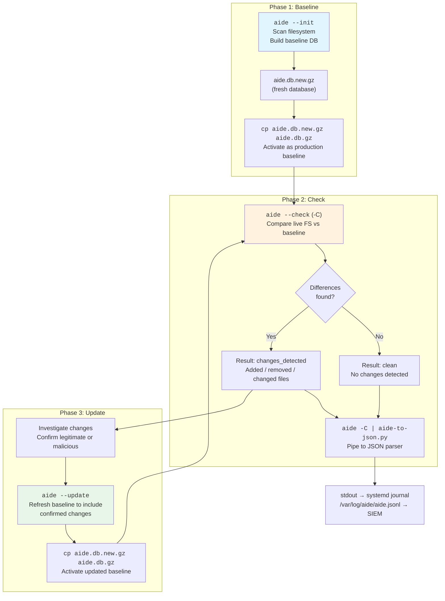

AIDE (Advanced Intrusion Detection Environment) is the file integrity scanner in this project — and it behaves fundamentally differently from the antivirus scanner ClamAV. Where ClamAV is stateless (scan files, report results, done), AIDE is **stateful**: it builds a cryptographic snapshot of your filesystem, then compares the live system against that snapshot to detect tampering. This single architectural difference cascades into version-dependent behavior across the three operating systems this project supports (AlmaLinux 9, Amazon Linux 2, Amazon Linux 2023), because each ships a different AIDE version with different capabilities. This page explains the stateful workflow, maps the version and capability matrix, and clarifies why even "clean" tests in Docker report changes.

Sources: [README.md](aide/README.md#L1-L37), [CLAUDE.md](CLAUDE.md#L86-L113)

## AIDE's Three-Phase Stateful Workflow

AIDE operates in three distinct phases, each corresponding to a specific command. Understanding this lifecycle is critical because the Docker images in this project bake Phase 1 (initialization) into the build step, while production deployments run Phase 2 on a schedule and Phase 3 manually after confirmed changes.

The diagram below shows how the three phases relate to each other and to the JSON output pipeline:



**Phase 1 — Initialize (`aide --init`)** scans the filesystem and creates a compressed baseline database at `/var/lib/aide/aide.db.new.gz`. This file must then be copied to `/var/lib/aide/aide.db.gz` to become the active baseline. In this project's Docker images, this step runs during `docker build` so every container starts with a pre-built baseline.

**Phase 2 — Check (`aide --check` or `aide -C`)** compares the current filesystem against the baseline. If nothing changed, AIDE reports "NO differences." If files were added, removed, or modified, AIDE lists them with flag strings indicating which attributes differ (permissions, hashes, timestamps, etc.). This is the phase that runs on a schedule via systemd timers in production.

**Phase 3 — Update (`aide --update`)** is a manual step after you investigate detected changes. It creates a new baseline that includes the confirmed changes, and you then copy it over the old baseline. Skipping this step means the same changes will be reported on every subsequent check.

Sources: [README.md](aide/README.md#L31-L33), [almalinux9/Dockerfile](aide/almalinux9/Dockerfile#L5-L9), [aide-check.service](aide/shared/aide-check.service#L11-L12)

## Why Docker "Clean" Checks Show Changes

If you examine the test results, you will notice that even the "clean" checks report `changes_detected` rather than `clean`. This is **expected Docker behavior**, not a bug. When Docker creates a container from an image, it modifies several files that AIDE baselined at build time:

| File | Why It Changes Between Build and Run |
|------|--------------------------------------|
| `/etc/hostname` | Docker assigns a random container ID as the hostname |
| `/etc/hosts` | Docker injects hostname-to-IP mappings for the container |
| `/etc/resolv.conf` | Docker configures DNS to point to its internal DNS server |
| `/var/log/aide/` | The test script creates this directory at runtime |

On a **production host** (not Docker), running `aide --init` followed immediately by `aide --check` with no intervening file modifications would produce `"result": "clean"` with zero changes. The Docker noise exists because the build-time baseline and the runtime container filesystem inevitably diverge in the files Docker manages.

Sources: [TEST-RESULTS-BREAKDOWN.md](TEST-RESULTS-BREAKDOWN.md#L187-L200), [run-tests.sh](scripts/run-tests.sh#L140-L154)

## The Version Matrix: Three OSes, Three AIDE Versions

The single most important fact about AIDE in this project is that each operating system ships a different version, and the version gap between 0.16.x and 0.18.x introduces a capability cliff. The table below captures the full comparison:

| Feature | AlmaLinux 9 | Amazon Linux 2 | Amazon Linux 2023 |
|---------|:-----------:|:--------------:|:-----------------:|
| **AIDE Version** | 0.16 | 0.16.2 | 0.18.6 |
| **Install Command** | `dnf install aide` | `yum install aide` | `dnf install aide` |
| **Config Location** | `/etc/aide.conf` | `/etc/aide.conf` | `/etc/aide.conf` |
| **Database Path** | `/var/lib/aide/aide.db.gz` | `/var/lib/aide/aide.db.gz` | `/var/lib/aide/aide.db.gz` |
| **Default Hash** | SHA512 | SHA256 | SHA256/SHA512 |
| **Multi-threaded** | No | No | Yes (`--workers=N`) |
| **Native JSON Output** | No | No | Yes (`report_format=json`) |
| **Inode Tracking (default)** | No | No | Yes |
| **`--json` CLI Flag** | Does not exist | Does not exist | Does not exist |

The version numbers come directly from the package repositories — there is no manual AIDE compilation in any of these Docker images. AlmaLinux 9 and Amazon Linux 2 both ship from the 0.16.x branch (no JSON support), while Amazon Linux 2023 ships 0.18.6 (JSON support added in 0.18). The `--json` CLI flag does **not** exist in any version; the correct mechanism on 0.18.6 is the `report_format` configuration directive.

Sources: [README.md](aide/README.md#L45-L54), [TEST-RESULTS-BREAKDOWN.md](TEST-RESULTS-BREAKDOWN.md#L261-L271), [almalinux9/Dockerfile](aide/almalinux9/Dockerfile#L5-L6), [amazonlinux2/Dockerfile](aide/amazonlinux2/Dockerfile#L5-L6), [amazonlinux2023/Dockerfile](aide/amazonlinux2023/Dockerfile#L6-L7)

## Hash Algorithm Support by Version

AIDE 0.18.6 on Amazon Linux 2023 supports significantly more hash algorithms than the older versions, which directly affects the database integrity hashes captured in JSON output:

| Algorithm | AL9 (0.16) | AL2 (0.16.2) | AL2023 (0.18.6) |
|-----------|:----------:|:------------:|:----------------:|
| MD5 | Yes | Yes | Yes |
| SHA1 | Yes | Yes | Yes |
| RMD160 | Yes | Yes | Yes |
| TIGER | Yes | Yes | Yes |
| SHA256 | Yes | Yes | Yes |
| SHA512 | Yes | Yes | Yes |
| CRC32 | | | Yes |
| WHIRLPOOL | | | Yes |
| GOST | | | Yes |
| STRIBOG256 | | | Yes |
| STRIBOG512 | | | Yes |

The additional algorithms on AL2023 (GOST, Whirlpool, Stribog) are Russian cryptographic standards and wide-block ciphers added in the 0.18.x series. This means AIDE database integrity hashes in the JSON output will have more entries on AL2023 than on AL9 or AL2 — the parser handles this gracefully because it reads whatever hash lines AIDE emits.

Sources: [TEST-RESULTS-BREAKDOWN.md](TEST-RESULTS-BREAKDOWN.md#L273-L286), [README.md](aide/README.md#L52)

## The `report_format=json` Gotcha on Amazon Linux 2023

AIDE 0.18.6 introduces `report_format=json` as a configuration option, and it works correctly — but it is **order-sensitive** in the configuration file. AIDE applies `report_format` to each `report_url` at the moment the URL is declared, not globally. The default `/etc/aide.conf` on AL2023 declares its `report_url=` lines near the top of the file. If you append `report_format=json` to the end of the file, it arrives *after* both URLs have already been bound to the default `plain` format, and the scan silently produces plain text instead of JSON.

| Approach | Result |
|---|---|
| `aide --check -B 'report_format=json'` on the CLI | ✅ JSON output |
| `report_format=json` **inserted before** `report_url=` lines in `aide.conf` | ✅ JSON output |
| `report_format=json` **appended to end** of `aide.conf` | ❌ Plain text (silent failure) |
| `report_url=stdout?report_format=json` per-URL query string | ❌ `unknown URL-type` error |

The `-B` CLI flag is the safest approach because it overrides the config file without requiring file edits. The project ships a reproducer script ([native-json-demo.sh](aide/amazonlinux2023/native-json-demo.sh)) that demonstrates all four approaches inside the AL2023 Docker container. Despite native JSON being available, this project uses the Python parser as the default pipeline for all three OSes to maintain a uniform output schema — see [Native JSON vs Python Wrapper on Amazon Linux 2023](10-native-json-vs-python-wrapper-on-amazon-linux-2023-report_format-json) for that comparison.

Sources: [README.md](aide/README.md#L56-L97), [native-json-demo.sh](aide/amazonlinux2023/native-json-demo.sh#L1-L68), [CLAUDE.md](CLAUDE.md#L113)

## Dockerfile Differences Across OSes

All three AIDE Dockerfiles follow the same structural pattern — base image, copy shared parser, install packages, initialize the AIDE database, clean up — but there are subtle differences driven by the underlying package managers and AIDE versions:

```
# Common pattern (all three):
COPY aide/shared/aide-to-json.py /usr/local/bin/aide-to-json.py
RUN <install aide + python3> \
    && chmod +x /usr/local/bin/aide-to-json.py \
    && aide --init <flags> \
    && cp /var/lib/aide/aide.db.new.gz /var/lib/aide/aide.db.gz \
    && <clean package cache>
```

| Aspect | AlmaLinux 9 | Amazon Linux 2 | Amazon Linux 2023 |
|--------|-------------|----------------|-------------------|
| Package manager | `dnf` | `yum` | `dnf` |
| `--init` config flag | `-c /etc/aide.conf` (explicit) | None (relies on default) | `-c /etc/aide.conf` (explicit) |
| Cache cleanup | `dnf clean all` | `yum clean all` | `dnf clean all` |
| Extra COPY | None | None | `native-json-demo.sh` |

The Amazon Linux 2 Dockerfile uses `yum` instead of `dnf` because AL2 predates the dnf transition. The AL2023 Dockerfile additionally copies the `native-json-demo.sh` reproducer script. The explicit `-c /etc/aide.conf` flag on AL9 and AL2023 ensures the config file is loaded from the default path even if the environment differs, while AL2's older AIDE reads it by default.

Sources: [almalinux9/Dockerfile](aide/almalinux9/Dockerfile#L1-L10), [amazonlinux2/Dockerfile](aide/amazonlinux2/Dockerfile#L1-L10), [amazonlinux2023/Dockerfile](aide/amazonlinux2023/Dockerfile#L1-L11)

## Test Results: What Each OS Reports

The test runner executes two AIDE checks per image: a "clean" check against the unmodified container, and a "tampered" check after writing a file to `/tmp/ci-test-hack` and changing permissions on `/etc/resolv.conf`. The results differ significantly across OSes:

| Metric | AL9 (0.16) | AL2 (0.16.2) | AL2023 (0.18.6) |
|--------|:----------:|:------------:|:----------------:|
| Total entries | ~9,312 | ~22,468 | ~8,294 |
| Changed (clean) | 4 | 3 | 24 |
| Added (clean) | 0 | 1 | 1 |
| Run time | ~0m 0s | ~0m 0s | ~0m 0s |

The entry count variation stems from different default `aide.conf` configurations — AL2 monitors broader directory trees (22k+ entries), while AL2023's config is more selective. The large "changed" count on AL2023 is because AIDE 0.18.6 tracks **Inode** and **Ctime** by default; Docker's layer copy shifts every inode and ctime, inflating the change count. On a production host these would not appear.

Sources: [TEST-RESULTS-BREAKDOWN.md](TEST-RESULTS-BREAKDOWN.md#L201-L271), [almalinux9/results/aide.json](aide/almalinux9/results/aide.json#L1-L6), [amazonlinux2/results/aide.json](aide/amazonlinux2/results/aide.json#L1-L6), [amazonlinux2023/results/aide.json](aide/amazonlinux2023/results/aide.json#L1-L6)

## Where to Go Next

Now that you understand how AIDE versions, stateful workflow, and OS differences interact, the logical next steps are:

- **[AIDE JSON Parser: Parsing Multi-Section Integrity Reports](9-aide-json-parser-parsing-multi-section-integrity-reports-aide-to-json-py)** — dive into how `aide-to-json.py` handles the multi-section plain text output (added entries, changed entries, detailed changes, database hashes) and converts it to structured JSON
- **[Native JSON vs Python Wrapper on Amazon Linux 2023](10-native-json-vs-python-wrapper-on-amazon-linux-2023-report_format-json)** — compare the native `report_format=json` output against the Python parser output, with schema analysis and recommendations
- **[Cross-OS Comparison: Binary Paths, Package Sources, and Version Matrix](16-cross-os-comparison-binary-paths-package-sources-and-version-matrix)** — see the full version and path matrix across both ClamAV and AIDE