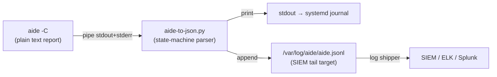
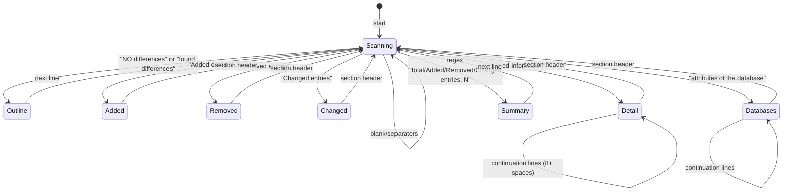

The `aide-to-json.py` script is a **231-line stdlib-only Python parser** that transforms AIDE's multi-section human-readable text output into a single-line JSON object suitable for SIEM ingestion. It operates as a stdin-to-stdout pipe — `aide -C` writes its report to stdout, and the parser reads it, extracts structured data from each section, enriches the result with host metadata, and emits one compact JSON line. A best-effort sidecar append to `/var/log/aide/aide.jsonl` provides persistent JSONL storage for log shippers to tail. The parser is the **uniform output layer** across all three supported operating systems (AlmaLinux 9, Amazon Linux 2, Amazon Linux 2023), hiding the fact that AIDE versions differ significantly in native JSON capability — 0.16/0.16.2 have none at all, while 0.18.6 supports `report_format=json` but with non-trivial configuration gotchas. The parser abstracts away those differences entirely.

Sources: [aide-to-json.py](aide/shared/aide-to-json.py#L1-L231), [aide-check.service](aide/shared/aide-check.service#L11-L12)

## Pipeline Architecture

The parser sits at the center of a three-stage pipeline. AIDE produces its check report as plain text on stdout (and stderr), which is redirected into the parser via a pipe. The parser's output fans out to two destinations: stdout (captured by the systemd journal when run as a service) and the JSONL log file (tailed by Filebeat, Fluentd, or rsyslog).



The invocation is a one-liner embedded in the systemd service unit:

```
/usr/sbin/aide -C 2>&1 | /usr/local/bin/aide-to-json.py
```

Both stdout and stderr from AIDE are merged (`2>&1`) before piping, because some AIDE versions emit important data to stderr. The parser tolerates mixed streams — it simply ignores lines that don't match any known pattern.

Sources: [aide-check.service](aide/shared/aide-check.service#L11-L12), [aide-to-json.py](aide/shared/aide-to-json.py#L203-L226)

## AIDE's Text Report: The Input Format

Before understanding how the parser works, it's essential to understand what it consumes. AIDE's `--check` output is a **multi-section plain-text report** with well-defined section boundaries. Each section is delimited by a header line and a `---` separator. A clean run contains only the outline message and timestamps. A run with changes contains up to seven distinct sections:

| Section | Header Pattern | Content |
|---------|---------------|---------|
| **Outline** | `AIDE found NO differences…` or `AIDE found differences…` | Single status line |
| **Summary** | `Summary:` | Entry counts (total, added, removed, changed) |
| **Added entries** | `Added entries:` | File paths with `f++++++++++++++++` flags |
| **Removed entries** | `Removed entries:` | File paths with `f----------------` flags |
| **Changed entries** | `Changed entries:` | File paths with change-type flags |
| **Detailed changes** | `Detailed information about changes:` | Per-file, per-attribute old→new diffs |
| **Database hashes** | `attributes of the (uncompressed) database` | Integrity hashes of the AIDE DB files |

A typical "changes detected" report looks like this (from the unit test fixture):

```
AIDE found differences between database and filesystem!!

Summary:
  Total number of entries:  100
  Added entries:            0
  Removed entries:          0
  Changed entries:          1

---------------------------------------------------
Changed entries:
---------------------------------------------------

f > p..    .HA.  : /etc/resolv.conf

---------------------------------------------------
Detailed information about changes:
---------------------------------------------------

File: /etc/resolv.conf
 Size      : 24                               | 222
 Perm      : -rw-r--r--                       | -rwxrwxrwx
 SHA256    : BdNg+yp9IvgPU88Z3Zsm6eymhdJ03z7m | VTMqVqehbR08xAwF8tHwOJ6jgLhTfsxO
              i7Ok9u6WtTM=                     | /y42kstcCWo=
 ACL       : A: user::rw-                     | A: user::rwx
              A: group::r--                    | A: group::rwx
              A: other::r--                    | A: other::rwx
```

The **detailed changes** section is where the parsing complexity lives. Hash values and ACL entries can **span multiple lines** — SHA512 hashes typically break across three lines, and ACL entries are one line per access control entry. Each line contains an `old | new` pair, and continuation lines are indented with 8+ spaces to distinguish them from new attribute headers.

Sources: [test-aide-parser.py](scripts/test-aide-parser.py#L23-L56), [README.md](aide/README.md#L100-L163)

## The State-Machine Parser

The `parse_aide()` function implements a **single-pass line-oriented state machine**. It iterates through every line of the input exactly once, tracking the current section and file context via four state variables:

| Variable | Purpose |
|----------|---------|
| `section` | Which report section we're currently in (`added`, `removed`, `changed`, `detail`, `databases`, or `None`) |
| `current_file` | The file path currently being detailed in the "Detailed changes" section |
| `current_db` | The database file path currently being parsed in the "databases" section |
| `current_hash_name` | The attribute name (e.g. `SHA256`, `ACL`) whose value may span multiple lines |



Each line is matched against patterns in priority order. The parser first checks for the outline status message, then the run-time timestamp, then summary counts. If none of those match, it checks for section headers. Once a section is identified, section-specific parsing rules apply. The `continue` statements after section headers and entry matches ensure that each line is consumed by exactly one rule.

Sources: [aide-to-json.py](aide/shared/aide-to-json.py#L21-L200)

## Multi-Line Continuation: The Hardest Problem

The trickiest aspect of parsing AIDE output is correctly handling **multi-line values** in the detailed changes section. AIDE wraps long hash values and multi-entry ACLs across subsequent lines. Consider this SHA512 entry:

```
 SHA512    : z4/WlF+yww5Lrxg5hpIMyn/2X7G727yY | F0TfXyPt0eMVpAsUqdLyPzxXqAsbCE3a
              iIZ0hee1cC4CPKRuTTwqOqR+a4PrwaQ+ | Ps9d/QIjbQckCNy3Zo8mgMYkmJo8dLBJ
              dELMHdsn+4/f8UNrnXzvzg==         | GYvKHfk90Q7JvAsL==
```

And this ACL entry:

```
 ACL       : A: user::rw-                     | A: user::rwx
              A: group::r--                    | A: group::rwx
              A: other::r--                    | A: other::rwx
```

The parser distinguishes continuation lines from new attribute headers using **indentation level**. Continuation lines have 8 or more leading spaces, while new attribute lines have only 1–2. This indentation heuristic avoids a critical pitfall: ACL continuation lines contain `A: group::r--` which, if matched naively by a regex like `^(\w+):\s+(.+)$`, would be misinterpreted as a new attribute named `A` with value `group::r--`. This was an actual regression (issue #8) that the indentation check prevents.

The joining strategy differs by attribute type. **Hash values** (SHA256, SHA512, etc.) are concatenated without any separator — the base64 fragments merge directly into a single valid hash string. **ACL and XAttrs values** are joined with a space separator to preserve readability of the individual access control entries. This distinction is governed by the `_MULTIVALUE_ATTRS` set:

```python
_MULTIVALUE_ATTRS = {"ACL", "XAttrs"}
```

When appending continuation fragments, the parser checks this set to decide the separator:

```python
sep = " " if last["attribute"] in _MULTIVALUE_ATTRS else ""
last["old"] += sep + old_frag
last["new"] += sep + new_frag
```

Sources: [aide-to-json.py](aide/shared/aide-to-json.py#L16-L18), [aide-to-json.py](aide/shared/aide-to-json.py#L114-L162), [test-aide-parser.py](scripts/test-aide-parser.py#L92-L123)

## Entry Parsing: Flags and File Types

The added, removed, and changed entry sections follow a consistent format where each line contains a **file-type indicator + flags** followed by a colon and the file path:

| Pattern | Meaning |
|---------|---------|
| `f++++++++++++++++: /etc/hostname` | File added (not in baseline) |
| `f----------------: /tmp/old.txt` | File removed (missing from filesystem) |
| `f > p..    .HA.  : /etc/resolv.conf` | File changed (permissions, hash altered) |
| `d   ...   i  .` | Directory changed (inode metadata) |

The first character indicates file type: `f` (regular file), `d` (directory), `l` (symlink), `b` (block device), `c` (character device), `p` (pipe), `s` (socket). The regex `^([fdlbcps][^:]+):\s+(.+)$` captures the entire flags string and path, storing them as a `{path, flags}` object in the appropriate entry list.

Sources: [aide-to-json.py](aide/shared/aide-to-json.py#L97-L111)

## Host Enrichment and Output Formatting

After `parse_aide()` returns the structured result, the `main()` function adds three **host-enriched fields** that AIDE's native output does not provide:

| Field | Source | Purpose |
|-------|--------|---------|
| `hostname` | `socket.gethostname()` | Identifies which host produced this scan |
| `timestamp` | `datetime.now(timezone.utc)` | ISO 8601 UTC timestamp of when the parser ran |
| `scanner` | Hardcoded `"aide"` | Allows a SIEM to distinguish scanner types in a shared pipeline |

The final JSON is serialized with compact separators (`separators=(",", ":")`) — no extraneous whitespace — producing the shortest possible single-line representation. This is printed to stdout and appended to `/var/log/aide/aide.jsonl`. The file append is **best-effort**: if the log directory doesn't exist or the process lacks write permissions (common in unit test environments), the `OSError` is silently caught. Stdout remains the primary output channel.

Sources: [aide-to-json.py](aide/shared/aide-to-json.py#L203-L226)

## Output Schema: What Gets Emitted

The parser produces two distinct output shapes depending on the scan result. **Empty collections are pruned** before the result is returned — if there are no added entries, the `added_entries` key is removed entirely, not set to an empty array. This keeps the JSON compact and avoids null-handling complexity in downstream SIEM queries.

**Clean run output:**

```json
{
  "result": "clean",
  "outline": "AIDE found NO differences between database and filesystem. Looks okay!!",
  "run_time_seconds": 2,
  "hostname": "server01",
  "timestamp": "2026-04-22T10:00:00Z",
  "scanner": "aide"
}
```

**Changes detected output** (abbreviated):

```json
{
  "result": "changes_detected",
  "outline": "AIDE found differences between database and filesystem!!",
  "summary": { "total_entries": 100, "added": 0, "removed": 0, "changed": 1 },
  "changed_entries": [{ "path": "/etc/resolv.conf", "flags": "f > p..    .HA.  " }],
  "detailed_changes": [
    { "path": "/etc/resolv.conf", "attribute": "Size", "old": "24", "new": "222" },
    { "path": "/etc/resolv.conf", "attribute": "ACL", "old": "A: user::rw- A: group::r-- A: other::r--", "new": "A: user::rwx A: group::rwx A: other::rwx" }
  ],
  "run_time_seconds": 3,
  "hostname": "server01",
  "timestamp": "2026-04-22T10:00:00Z",
  "scanner": "aide"
}
```

The pruning logic removes `added_entries`, `removed_entries`, `changed_entries`, `detailed_changes`, `summary`, `databases`, `outline`, and `run_time_seconds` when they are empty or unset. The three enrichment fields (`hostname`, `timestamp`, `scanner`) and the `result` field are always present.

Sources: [aide-to-json.py](aide/shared/aide-to-json.py#L183-L200), [README.md](aide/README.md#L183-L247)

## Real-World Output Across Operating Systems

The parser produces structurally identical JSON regardless of the underlying AIDE version. The only differences reflect genuine scan-result variations (different number of changed files, different default hash algorithms). Here's what the actual test outputs look like across the three OS targets:

| OS | AIDE Version | Total Entries | Typical Changes |
|----|-------------|---------------|-----------------|
| AlmaLinux 9 | 0.16 | ~9,312 | 4 changed (hostname, hosts, resolv.conf) |
| Amazon Linux 2 | 0.16.2 | ~22,468 | 3 changed + 1 added |
| Amazon Linux 2023 | 0.18.6 | ~8,294 | 24 changed + 1 added |

Docker containers always produce some baseline changes because the AIDE database is initialized at image build time — by the time the container runs, `hostname`, `resolv.conf`, and other files have already diverged from the baseline. This is expected and documented in the test runner output.

Sources: [almalinux9/results/aide.json](aide/almalinux9/results/aide.json#L1-L6), [amazonlinux2/results/aide.json](aide/amazonlinux2/results/aide.json#L1-L6), [amazonlinux2023/results/aide.json](aide/amazonlinux2023/results/aide.json#L1-L6), [run-tests.sh](scripts/run-tests.sh#L134-L154)

## Edge Cases and Regression Coverage

The unit test suite in `scripts/test-aide-parser.py` exercises the parser against a carefully crafted AIDE report fixture that contains every hard edge case in a single pass. The test runs the parser as a subprocess (matching real-world usage) and validates the JSON output structurally.

| Test Case | What It Validates | Why It Matters |
|-----------|-------------------|----------------|
| **Path uniqueness** | Only `/etc/resolv.conf` appears in `detailed_changes` | ACL continuations must not create bogus file entries |
| **Attribute ordering** | `["Size", "Perm", "SHA256", "SHA512", "ACL"]` | Parser must preserve AIDE's attribute order |
| **No "A" attribute** | `"A"` is absent from the attribute list | Prevents issue #8 regression — ACL continuations like `A: group::r--` must not be parsed as a new attribute |
| **ACL joining** | Old: `"A: user::rw- A: group::r-- A: other::r--"` | Multi-line ACLs must be joined with spaces |
| **SHA256 two-line hash** | Concatenated without spaces | Base64 fragments must merge seamlessly |
| **SHA512 three-line hash** | Three fragments concatenated, no spaces | Long hashes wrap across up to 3 lines |
| **No spaces in hashes** | `assert " " not in sha512["old"]` | Hash values must never contain space separators |
| **Summary counts** | `changed == 1`, `total_entries == 100` | Numeric parsing from tab-separated lines |
| **Run time** | `run_time_seconds == 3` (from `0m 3s`) | Minute×60 + second conversion |

The test fixture is intentionally constructed to combine hash continuations, ACL continuations, and mixed attributes on the same file — this is the worst case that the parser's indentation-based continuation detection must handle correctly.

Sources: [test-aide-parser.py](scripts/test-aide-parser.py#L23-L140)

## How to Run the Parser

The parser requires **only Python 3 stdlib** — no pip dependencies. It's designed to be invoked as a pipe target, but can also be run standalone for testing.

**Production invocation** (via systemd):
```
/usr/sbin/aide -C 2>&1 | /usr/local/bin/aide-to-json.py
```

**Manual testing in a Docker container:**
```bash
docker run --rm almalinux9-aide:latest bash -c '
  mkdir -p /var/log/aide
  aide -C 2>&1 | python3 /usr/local/bin/aide-to-json.py
'
```

**Unit tests** (no Docker required, runs on any host with Python 3):
```bash
python3 scripts/test-aide-parser.py
```

**JSONL validation** (CI smoke test, validates output structure):
```bash
python3 scripts/validate-aide-jsonl.py /path/to/aide.jsonl 2
```

The validator checks that each JSONL line contains `scanner == "aide"`, a `result` field, a `hostname`, and a `timestamp`. It's used in the GitHub Actions CI pipeline to confirm that every scanner/OS combination produces structurally valid output.

Sources: [aide-to-json.py](aide/shared/aide-to-json.py#L1-L10), [run-tests.sh](scripts/run-tests.sh#L158-L168), [validate-aide-jsonl.py](scripts/validate-aide-jsonl.py#L1-L29)

## What Comes Next

This page covered the parser's internal mechanics — the state machine, multi-line continuation handling, and output schema. The remaining pages in the AIDE deep dive explore related aspects of the system:

- **[Native JSON vs Python Wrapper on Amazon Linux 2023 (report_format=json)](10-native-json-vs-python-wrapper-on-amazon-linux-2023-report_format-json)** — A detailed comparison of AIDE 0.18.6's native `report_format=json` output versus the Python parser, including why the parser is still recommended despite native JSON availability.
- **[AIDE JSON Schema and Output Fields Reference](11-aide-json-schema-and-output-fields-reference)** — A comprehensive field-by-field reference for every key in the parser's JSON output, with type information and SIEM query examples.
- **[AIDE Parser Unit Tests: Multi-Line ACLs, Hash Continuations, and Edge Cases](19-aide-parser-unit-tests-multi-line-acls-hash-continuations-and-edge-cases)** — A deeper walkthrough of the test fixture design and regression coverage strategy.